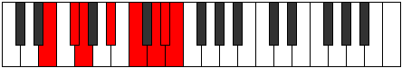

# Mode ASharpSathian

## Links

- [Documentation](index.md)
- [Scales Index](Scales.md)
- [Modes Index](Modes.md)
- [Chords Index](Chords.md)

## Scale

[Epacrian](ScaleEpacrian.md)

## Mode

[ASharpSathian](ModeASharpSathian.md)

## Tonic

A#

## Signature

[CNaturalMajor]

## Perfection

 - 3 Perfect Notes

 - 4 Imperfect Notes

## Notes

- A# (Imperfect)
- B#
- C## (Imperfect)
- D#
- E (Imperfect)
- F# (Imperfect)
- G
- A# (Imperfect)

## Illustration

## Relative Modes

| Number | Mode | Tonic | Notes | Illustration |
|--------|------|-------|-------|--------------|
| [885](https://ianring.com/musictheory/scales/885) | [Sathian](ModeSathian.md) | A# | A#, B#, C##, D#, E, F#, G, A# |  |
| [2715](https://ianring.com/musictheory/scales/2715) | [Kynian](ModeKynian.md) | D# | D#, E, F#, G, A#, B#, C##, D# |  |
| [3405](https://ianring.com/musictheory/scales/3405) | [Stynian](ModeStynian.md) | E | E, F#, G, A#, B#, C##, D#, E |  |
| [1875](https://ianring.com/musictheory/scales/1875) | [Epyphian](ModeEpyphian.md) | F# | F#, G, A#, B#, C##, D#, E, F# |  |
| [2985](https://ianring.com/musictheory/scales/2985) | [Epacrian](ModeEpacrian.md) | G | G, A#, B#, C##, D#, E, F#, G |  |

## Chords

### A#

| Number | Root | Name | Notes | Illustration | Audio |
|--------|------|------|-------|--------------|-------|

### B#

| Number | Root | Name | Notes | Illustration | Audio |
|--------|------|------|-------|--------------|-------|

### C##

| Number | Root | Name | Notes | Illustration | Audio |
|--------|------|------|-------|--------------|-------|

### D#

| Number | Root | Name | Notes | Illustration | Audio |
|--------|------|------|-------|--------------|-------|

### E

| Number | Root | Name | Notes | Illustration | Audio |
|--------|------|------|-------|--------------|-------|

### F#

| Number | Root | Name | Notes | Illustration | Audio |
|--------|------|------|-------|--------------|-------|

### G

| Number | Root | Name | Notes | Illustration | Audio |
|--------|------|------|-------|--------------|-------|

