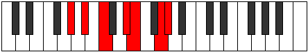

# Mode ASharpSyptimic

## Links

- [Documentation](index.md)
- [Scales Index](Scales.md)
- [Modes Index](Modes.md)
- [Chords Index](Chords.md)

## Scale

[Dynimic](ScaleDynimic.md)

## Mode

[ASharpSyptimic](ModeASharpSyptimic.md)

## Tonic

A#

## Signature

[CNaturalMajor]

## Perfection

 - 3 Perfect Notes

 - 3 Imperfect Notes

## Notes

- A# (Imperfect)
- B#
- C###
- D## (Imperfect)
- E### (Imperfect)
- F###
- A# (Imperfect)

## Illustration

## Relative Modes

| Number | Mode | Tonic | Notes | Illustration |
|--------|------|-------|-------|--------------|
| [691](https://ianring.com/musictheory/scales/691) | [Zydimic](ModeZydimic.md) | D# | D#, E, F##, G#, A#, B#, D# |  |
| [691](https://ianring.com/musictheory/scales/691) | [Zydimic](ModeZydimic.md) | Eb | Eb, Fb, G, Ab, Bb, C, Eb |  |
| [811](https://ianring.com/musictheory/scales/811) | [Radimic](ModeRadimic.md) | G | G, Ab, Bb, C, D#, E, G |  |
| [1433](https://ianring.com/musictheory/scales/1433) | [Dynimic](ModeDynimic.md) | C | C, D#, E, F##, G#, A#, C |  |
| [1637](https://ianring.com/musictheory/scales/1637) | [Syptimic](ModeSyptimic.md) | A# | A#, B#, C###, D##, E###, F###, A# |  |
| [1637](https://ianring.com/musictheory/scales/1637) | [Syptimic](ModeSyptimic.md) | Bb | Bb, C, D#, E, F##, G#, Bb |  |
| [2393](https://ianring.com/musictheory/scales/2393) | [Zathimic](ModeZathimic.md) | E | E, F##, G#, A#, B#, C###, E |  |
| [2453](https://ianring.com/musictheory/scales/2453) | [Stonimic](ModeStonimic.md) | G# | G#, A#, B#, C###, D##, E###, G# |  |
| [2453](https://ianring.com/musictheory/scales/2453) | [Stonimic](ModeStonimic.md) | Ab | Ab, Bb, C, D#, E, F##, Ab |  |

## Chords

### A#

| Number | Root | Name | Notes | Illustration | Audio |
|--------|------|------|-------|--------------|-------|

### B#

| Number | Root | Name | Notes | Illustration | Audio |
|--------|------|------|-------|--------------|-------|

### C###

| Number | Root | Name | Notes | Illustration | Audio |
|--------|------|------|-------|--------------|-------|

### D##

| Number | Root | Name | Notes | Illustration | Audio |
|--------|------|------|-------|--------------|-------|

### E###

| Number | Root | Name | Notes | Illustration | Audio |
|--------|------|------|-------|--------------|-------|

### F###

| Number | Root | Name | Notes | Illustration | Audio |
|--------|------|------|-------|--------------|-------|

