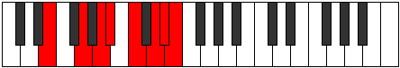

# Mode ASharpThodian

## Links

- [Documentation](index.md)
- [Scales Index](Scales.md)
- [Modes Index](Modes.md)
- [Chords Index](Chords.md)

## Scale

[Thonian](ScaleThonian.md)

## Mode

[ASharpThodian](ModeASharpThodian.md)

## Tonic

A#

## Signature

[CNaturalMajor]

## Perfection

 - 5 Perfect Notes

 - 2 Imperfect Notes

## Notes

- A# (Imperfect)
- B#
- C##
- D#
- E (Imperfect)
- F##
- G##
- A# (Imperfect)

## Illustration

## Relative Modes

| Number | Mode | Tonic | Notes | Illustration |
|--------|------|-------|-------|--------------|
| [941](https://ianring.com/musictheory/scales/941) | [Phrorian](ModePhrorian.md) | G | G, A, Bb, C, D, Eb, Fb, G |  |
| [1259](https://ianring.com/musictheory/scales/1259) | [Stadian](ModeStadian.md) | A | A, Bb, C, D, Eb, Fb, G, A |  |
| [1447](https://ianring.com/musictheory/scales/1447) | [Mixopyrian](ModeMixopyrian.md) | D | D, Eb, Fb, G, A, Bb, C, D |  |
| [1693](https://ianring.com/musictheory/scales/1693) | [Dogian](ModeDogian.md) | C | C, D, Eb, Fb, G, A, Bb, C |  |
| [2677](https://ianring.com/musictheory/scales/2677) | [Thodian](ModeThodian.md) | A# | A#, B#, C##, D#, E, F##, G##, A# |  |
| [2677](https://ianring.com/musictheory/scales/2677) | [Thodian](ModeThodian.md) | Bb | Bb, C, D, Eb, Fb, G, A, Bb |  |
| [2771](https://ianring.com/musictheory/scales/2771) | [Garian](ModeGarian.md) | D# | D#, E, F##, G##, A#, B#, C##, D# |  |
| [2771](https://ianring.com/musictheory/scales/2771) | [Garian](ModeGarian.md) | Eb | Eb, Fb, G, A, Bb, C, D, Eb |  |
| [3433](https://ianring.com/musictheory/scales/3433) | [Thonian](ModeThonian.md) | E | E, F##, G##, A#, B#, C##, D#, E |  |

## Chords

### A#

| Number | Root | Name | Notes | Illustration | Audio |
|--------|------|------|-------|--------------|-------|

### B#

| Number | Root | Name | Notes | Illustration | Audio |
|--------|------|------|-------|--------------|-------|

### C##

| Number | Root | Name | Notes | Illustration | Audio |
|--------|------|------|-------|--------------|-------|

### D#

| Number | Root | Name | Notes | Illustration | Audio |
|--------|------|------|-------|--------------|-------|

### E

| Number | Root | Name | Notes | Illustration | Audio |
|--------|------|------|-------|--------------|-------|

### F##

| Number | Root | Name | Notes | Illustration | Audio |
|--------|------|------|-------|--------------|-------|

### G##

| Number | Root | Name | Notes | Illustration | Audio |
|--------|------|------|-------|--------------|-------|

