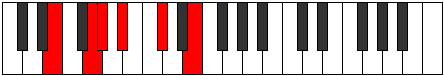

# Mode ASharpThyritonic

## Links

- [Documentation](index.md)
- [Scales Index](Scales.md)
- [Modes Index](Modes.md)
- [Chords Index](Chords.md)

## Scale

[Thyritonic](ScaleThyritonic.md)

## Mode

[ASharpThyritonic](ModeASharpThyritonic.md)

## Tonic

A#

## Signature

[CNaturalMajor]

## Perfection

 - 1 Perfect Notes

 - 4 Imperfect Notes

## Notes

- A# (Imperfect)
- C#
- E (Imperfect)
- G (Imperfect)
- G# (Imperfect)
- A# (Imperfect)

## Illustration

## Relative Modes

| Number | Mode | Tonic | Notes | Illustration |
|--------|------|-------|-------|--------------|
| [587](https://ianring.com/musictheory/scales/587) | [Pathitonic](ModePathitonic.md) | G | G, G#, A#, C#, E, G |  |
| [601](https://ianring.com/musictheory/scales/601) | [Bycritonic](ModeBycritonic.md) | E | E, G, G#, A#, C#, E |  |
| [713](https://ianring.com/musictheory/scales/713) | [Thoptitonic](ModeThoptitonic.md) | C# | C#, E, G, G#, A#, C# |  |
| [713](https://ianring.com/musictheory/scales/713) | [Thoptitonic](ModeThoptitonic.md) | Db | Db, E, G, Ab, Bb, Db |  |
| [1609](https://ianring.com/musictheory/scales/1609) | [Thyritonic](ModeThyritonic.md) | A# | A#, C#, E, G, G#, A# |  |
| [1609](https://ianring.com/musictheory/scales/1609) | [Thyritonic](ModeThyritonic.md) | Bb | Bb, Db, E, G, Ab, Bb |  |
| [2341](https://ianring.com/musictheory/scales/2341) | [Myditonic](ModeMyditonic.md) | G# | G#, A#, C#, E, G, G# |  |
| [2341](https://ianring.com/musictheory/scales/2341) | [Myditonic](ModeMyditonic.md) | Ab | Ab, Bb, Db, E, G, Ab |  |

## Chords

### A#

| Number | Root | Name | Notes | Illustration | Audio |
|--------|------|------|-------|--------------|-------|

### C#

| Number | Root | Name | Notes | Illustration | Audio |
|--------|------|------|-------|--------------|-------|

### E

| Number | Root | Name | Notes | Illustration | Audio |
|--------|------|------|-------|--------------|-------|
| 1168 | E | [Eo](ChordENaturalDiminished.md) | E, G, Bb |  | [midi](ChordENaturalDiminishedRootPosition.mid) [ogg](ChordENaturalDiminishedRootPosition.ogg) |
| 1296 | E | [EMb5](ChordENaturalMajorFlatFifth.md) | E, G#, Bb |  | [midi](ChordENaturalMajorFlatFifthRootPosition.mid) [ogg](ChordENaturalMajorFlatFifthRootPosition.ogg) |
| 274 | E | [EM##5](ChordENaturalMajorDoubleSharpFifth.md) | E, G#, C# |  | [midi](ChordENaturalMajorDoubleSharpFifthRootPosition.mid) [ogg](ChordENaturalMajorDoubleSharpFifthRootPosition.ogg) |
| 1170 | E | [Eo7](ChordENaturalFullDiminishedSeventh.md) | E, G, Bb, Db |  | [midi](ChordENaturalFullDiminishedSeventhRootPosition.mid) [ogg](ChordENaturalFullDiminishedSeventhRootPosition.ogg) |
| 1298 | E | [EM6b5](ChordENaturalMajorSixthFlatFifth.md) | E, G#, Bb, C# |  | [midi](ChordENaturalMajorSixthFlatFifthRootPosition.mid) [ogg](ChordENaturalMajorSixthFlatFifthRootPosition.ogg) |

### G

| Number | Root | Name | Notes | Illustration | Audio |
|--------|------|------|-------|--------------|-------|
| 386 | G | [Gloc](ChordGNaturalLocrian.md) | G, Ab, Db |  | [midi](ChordGNaturalLocrianRootPosition.mid) [ogg](ChordGNaturalLocrianRootPosition.ogg) |
| 1154 | G | [Go](ChordGNaturalDiminished.md) | G, Bb, Db |  | [midi](ChordGNaturalDiminishedRootPosition.mid) [ogg](ChordGNaturalDiminishedRootPosition.ogg) |
| 1170 | G | [Go7](ChordGNaturalFullDiminishedSeventh.md) | G, Bb, Db, Fb |  | [midi](ChordGNaturalFullDiminishedSeventhRootPosition.mid) [ogg](ChordGNaturalFullDiminishedSeventhRootPosition.ogg) |

### G#

| Number | Root | Name | Notes | Illustration | Audio |
|--------|------|------|-------|--------------|-------|

