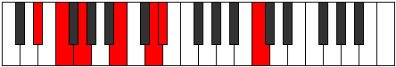
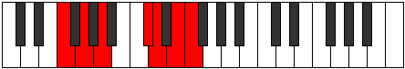
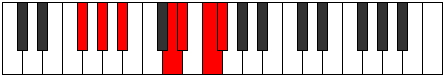

# Mode Aelothimic

## Links

- [Documentation](index.md)
- [Scales Index](Scales.md)
- [Modes Index](Modes.md)
- [Chords Index](Chords.md)

## Parent Scale

[Modimic](ScaleModimic.md)

## Number

[2837](https://ianring.com/musictheory/scales/2837)

## Perfection

- 3 Perfect notes
- 3 Perfect notes

## Perfection Profile

[false true true false true false]

## Permutations

| Tonic | Notes | Signature | Illustration | Audio |
|-------|-------|-----------|--------------|-------|
| [C](ModeCNaturalAelothimic.md) | **C**, D, E, **F###**, G##, **A##**, **C** | C |  | [midi](ModeCNaturalAelothimic.mid) [ogg](ModeCNaturalAelothimic.ogg) |
| [C#](ModeCSharpAelothimic.md) | **C#**, D#, E#, **Cbbb**, Cbb, **Dbb**, **C#** | C |  | [midi](ModeCSharpAelothimic.mid) [ogg](ModeCSharpAelothimic.ogg) |
| [Db](ModeDFlatAelothimic.md) | **Db**, Eb, F, **G##**, A#, **B#**, **Db** | C |  | [midi](ModeDFlatAelothimic.mid) [ogg](ModeDFlatAelothimic.ogg) |
| [D](ModeDNaturalAelothimic.md) | **D**, E, F#, **G###**, A##, **B##**, **D** | C |  | [midi](ModeDNaturalAelothimic.mid) [ogg](ModeDNaturalAelothimic.ogg) |
| [D#](ModeDSharpAelothimic.md) | **D#**, E#, F##, **Cb**, Dbb, **Ebb**, **D#** | C |  | [midi](ModeDSharpAelothimic.mid) [ogg](ModeDSharpAelothimic.ogg) |
| [Eb](ModeEFlatAelothimic.md) | **Eb**, F, G, **A##**, B#, **C##**, **Eb** | C |  | [midi](ModeEFlatAelothimic.mid) [ogg](ModeEFlatAelothimic.ogg) |
| [E](ModeENaturalAelothimic.md) | **E**, F#, G#, **A###**, B##, **C###**, **E** | C |  | [midi](ModeENaturalAelothimic.mid) [ogg](ModeENaturalAelothimic.ogg) |
| [F](ModeFNaturalAelothimic.md) | **F**, G, A, **B##**, C##, **D##**, **F** | C |  | [midi](ModeFNaturalAelothimic.mid) [ogg](ModeFNaturalAelothimic.ogg) |
| [F#](ModeFSharpAelothimic.md) | **F#**, G#, A#, **B###**, C###, **D###**, **F#** | C |  | [midi](ModeFSharpAelothimic.mid) [ogg](ModeFSharpAelothimic.ogg) |
| [Gb](ModeGFlatAelothimic.md) | **Gb**, Ab, Bb, **C##**, D#, **E#**, **Gb** | C |  | [midi](ModeGFlatAelothimic.mid) [ogg](ModeGFlatAelothimic.ogg) |
| [G](ModeGNaturalAelothimic.md) | **G**, A, B, **C###**, D##, **E##**, **G** | C |  | [midi](ModeGNaturalAelothimic.mid) [ogg](ModeGNaturalAelothimic.ogg) |
| [G#](ModeGSharpAelothimic.md) | **G#**, A#, B#, **D##**, E#, **F##**, **G#** | C |  | [midi](ModeGSharpAelothimic.mid) [ogg](ModeGSharpAelothimic.ogg) |
| [Ab](ModeAFlatAelothimic.md) | **Ab**, Bb, C, **D##**, E#, **F##**, **Ab** | C |  | [midi](ModeAFlatAelothimic.mid) [ogg](ModeAFlatAelothimic.ogg) |
| [A](ModeANaturalAelothimic.md) | **A**, B, C#, **D###**, E##, **F###**, **A** | C |  | [midi](ModeANaturalAelothimic.mid) [ogg](ModeANaturalAelothimic.ogg) |
| [A#](ModeASharpAelothimic.md) | **A#**, B#, C##, **E##**, F##, **G##**, **A#** | C |  | [midi](ModeASharpAelothimic.mid) [ogg](ModeASharpAelothimic.ogg) |
| [Bb](ModeBFlatAelothimic.md) | **Bb**, C, D, **E##**, F##, **G##**, **Bb** | C |  | [midi](ModeBFlatAelothimic.mid) [ogg](ModeBFlatAelothimic.ogg) |
| [B](ModeBNaturalAelothimic.md) | **B**, C#, D#, **E###**, F###, **G###**, **B** | C |  | [midi](ModeBNaturalAelothimic.mid) [ogg](ModeBNaturalAelothimic.ogg) |
