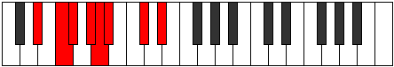

# Mode Aeodian

## Links

- [Documentation](index.md)
- [Scales Index](Scales.md)
- [Modes Index](Modes.md)
- [Chords Index](Chords.md)

## Parent Scale

[Phrolian](ScalePhrolian.md)

## Number

[1261](https://ianring.com/musictheory/scales/1261)

## Interval Pattern

2, 1, 2, 1, 1, 3, 2

## Chord Pattern

i⁰, iii, V⁺, VII

## Perfection

- 5 Perfect notes
- 2 Perfect notes

## Perfection Profile

[true false true true false true true]

## Permutations

| Tonic | Notes | Signature | Illustration | Audio |
|-------|-------|-----------|--------------|-------|
| [C](ModeCNaturalAeodian.md) | C, **D**, Eb, F, **Gb**, Abb, Bb, C | C |  | [midi](https://github.com/edipermadi/music/blob/main/docs/ModeCNaturalAeodian.mid?raw=true) |
| [C#](ModeCSharpAeodian.md) | C#, **D#**, E, F#, **G**, Ab, B, C# | C |  | [midi](https://github.com/edipermadi/music/blob/main/docs/ModeCSharpAeodian.mid?raw=true) |
| [Db](ModeDFlatAeodian.md) | Db, **Eb**, Fb, Gb, **Abb**, Bbbb, Cb, Db | C |  | [midi](https://github.com/edipermadi/music/blob/main/docs/ModeDFlatAeodian.mid?raw=true) |
| [D](ModeDNaturalAeodian.md) | D, **E**, F, G, **Ab**, Bbb, C, D | C |  | [midi](https://github.com/edipermadi/music/blob/main/docs/ModeDNaturalAeodian.mid?raw=true) |
| [D#](ModeDSharpAeodian.md) | D#, **E#**, F#, G#, **A**, Bb, C#, D# | C |  | [midi](https://github.com/edipermadi/music/blob/main/docs/ModeDSharpAeodian.mid?raw=true) |
| [Eb](ModeEFlatAeodian.md) | Eb, **F**, Gb, Ab, **Bbb**, Cbb, Db, Eb | C |  | [midi](https://github.com/edipermadi/music/blob/main/docs/ModeEFlatAeodian.mid?raw=true) |
| [E](ModeENaturalAeodian.md) | E, **F#**, G, A, **Bb**, Cb, D, E | C |  | [midi](https://github.com/edipermadi/music/blob/main/docs/ModeENaturalAeodian.mid?raw=true) |
| [F](ModeFNaturalAeodian.md) | F, **G**, Ab, Bb, **Cb**, Dbb, Eb, F | C |  | [midi](https://github.com/edipermadi/music/blob/main/docs/ModeFNaturalAeodian.mid?raw=true) |
| [F#](ModeFSharpAeodian.md) | F#, **G#**, A, B, **C**, Db, E, F# | C |  | [midi](https://github.com/edipermadi/music/blob/main/docs/ModeFSharpAeodian.mid?raw=true) |
| [Gb](ModeGFlatAeodian.md) | Gb, **Ab**, Bbb, Cb, **Dbb**, Ebbb, Fb, Gb | C |  | [midi](https://github.com/edipermadi/music/blob/main/docs/ModeGFlatAeodian.mid?raw=true) |
| [G](ModeGNaturalAeodian.md) | G, **A**, Bb, C, **Db**, Ebb, F, G | C |  | [midi](https://github.com/edipermadi/music/blob/main/docs/ModeGNaturalAeodian.mid?raw=true) |
| [G#](ModeGSharpAeodian.md) | G#, **A#**, B, C#, **D**, Eb, F#, G# | C |  | [midi](https://github.com/edipermadi/music/blob/main/docs/ModeGSharpAeodian.mid?raw=true) |
| [Ab](ModeAFlatAeodian.md) | Ab, **Bb**, Cb, Db, **Ebb**, Fbb, Gb, Ab | C |  | [midi](https://github.com/edipermadi/music/blob/main/docs/ModeAFlatAeodian.mid?raw=true) |
| [A](ModeANaturalAeodian.md) | A, **B**, C, D, **Eb**, Fb, G, A | C |  | [midi](https://github.com/edipermadi/music/blob/main/docs/ModeANaturalAeodian.mid?raw=true) |
| [A#](ModeASharpAeodian.md) | A#, **B#**, C#, D#, **E**, F, G#, A# | C |  | [midi](https://github.com/edipermadi/music/blob/main/docs/ModeASharpAeodian.mid?raw=true) |
| [Bb](ModeBFlatAeodian.md) | Bb, **C**, Db, Eb, **Fb**, Gbb, Ab, Bb | C |  | [midi](https://github.com/edipermadi/music/blob/main/docs/ModeBFlatAeodian.mid?raw=true) |
| [B](ModeBNaturalAeodian.md) | B, **C#**, D, E, **F**, Gb, A, B | C |  | [midi](https://github.com/edipermadi/music/blob/main/docs/ModeBNaturalAeodian.mid?raw=true) |
