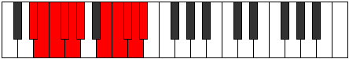

# Mode Aeogyllian

## Links

- [Documentation](index.md)
- [Scales Index](Scales.md)
- [Modes Index](Modes.md)
- [Chords Index](Chords.md)

## Parent Scale

[Katoryllian](ScaleKatoryllian.md)

## Number

[3903](https://ianring.com/musictheory/scales/3903)

## Perfection

- 8 Perfect notes
- 2 Perfect notes

## Perfection Profile

[false true true true true true true true true false]

## Permutations

| Tonic | Notes | Signature | Illustration | Audio |
|-------|-------|-----------|--------------|-------|
| [C](ModeCNaturalAeogyllian.md) | **C**, C#, D, D#, E, F, G#, A, A#, **B**, **C** | C |  | [midi](ModeCNaturalAeogyllian.mid) [ogg](ModeCNaturalAeogyllian.ogg) |
| [C#](ModeCSharpAeogyllian.md) | **C#**, D, D#, E, F, F#, A, A#, B, **C**, **C#** | C |  | [midi](ModeCSharpAeogyllian.mid) [ogg](ModeCSharpAeogyllian.ogg) |
| [Db](ModeDFlatAeogyllian.md) | **Db**, D, Eb, E, F, Gb, A, Bb, B, **C**, **Db** | C |  | [midi](ModeDFlatAeogyllian.mid) [ogg](ModeDFlatAeogyllian.ogg) |
| [D](ModeDNaturalAeogyllian.md) | **D**, D#, E, F, F#, G, A#, B, C, **C#**, **D** | C |  | [midi](ModeDNaturalAeogyllian.mid) [ogg](ModeDNaturalAeogyllian.ogg) |
| [D#](ModeDSharpAeogyllian.md) | **D#**, E, F, F#, G, G#, B, C, C#, **D**, **D#** | C |  | [midi](ModeDSharpAeogyllian.mid) [ogg](ModeDSharpAeogyllian.ogg) |
| [Eb](ModeEFlatAeogyllian.md) | **Eb**, E, F, Gb, G, Ab, B, C, Db, **D**, **Eb** | C |  | [midi](ModeEFlatAeogyllian.mid) [ogg](ModeEFlatAeogyllian.ogg) |
| [E](ModeENaturalAeogyllian.md) | **E**, F, F#, G, G#, A, C, C#, D, **D#**, **E** | C |  | [midi](ModeENaturalAeogyllian.mid) [ogg](ModeENaturalAeogyllian.ogg) |
| [F](ModeFNaturalAeogyllian.md) | **F**, F#, G, G#, A, A#, C#, D, D#, **E**, **F** | C |  | [midi](ModeFNaturalAeogyllian.mid) [ogg](ModeFNaturalAeogyllian.ogg) |
| [F#](ModeFSharpAeogyllian.md) | **F#**, G, G#, A, A#, B, D, D#, E, **F**, **F#** | C |  | [midi](ModeFSharpAeogyllian.mid) [ogg](ModeFSharpAeogyllian.ogg) |
| [Gb](ModeGFlatAeogyllian.md) | **Gb**, G, Ab, A, Bb, B, D, Eb, E, **F**, **Gb** | C |  | [midi](ModeGFlatAeogyllian.mid) [ogg](ModeGFlatAeogyllian.ogg) |
| [G](ModeGNaturalAeogyllian.md) | **G**, G#, A, A#, B, C, D#, E, F, **F#**, **G** | C |  | [midi](ModeGNaturalAeogyllian.mid) [ogg](ModeGNaturalAeogyllian.ogg) |
| [G#](ModeGSharpAeogyllian.md) | **G#**, A, A#, B, C, C#, E, F, F#, **G**, **G#** | C |  | [midi](ModeGSharpAeogyllian.mid) [ogg](ModeGSharpAeogyllian.ogg) |
| [Ab](ModeAFlatAeogyllian.md) | **Ab**, A, Bb, B, C, Db, E, F, Gb, **G**, **Ab** | C |  | [midi](ModeAFlatAeogyllian.mid) [ogg](ModeAFlatAeogyllian.ogg) |
| [A](ModeANaturalAeogyllian.md) | **A**, A#, B, C, C#, D, F, F#, G, **G#**, **A** | C |  | [midi](ModeANaturalAeogyllian.mid) [ogg](ModeANaturalAeogyllian.ogg) |
| [A#](ModeASharpAeogyllian.md) | **A#**, B, C, C#, D, D#, F#, G, G#, **A**, **A#** | C |  | [midi](ModeASharpAeogyllian.mid) [ogg](ModeASharpAeogyllian.ogg) |
| [Bb](ModeBFlatAeogyllian.md) | **Bb**, B, C, Db, D, Eb, Gb, G, Ab, **A**, **Bb** | C |  | [midi](ModeBFlatAeogyllian.mid) [ogg](ModeBFlatAeogyllian.ogg) |
| [B](ModeBNaturalAeogyllian.md) | **B**, C, C#, D, D#, E, G, G#, A, **A#**, **B** | C |  | [midi](ModeBNaturalAeogyllian.mid) [ogg](ModeBNaturalAeogyllian.ogg) |
