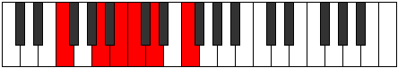

# Mode Aeolacritonic

## Links

- [Documentation](index.md)
- [Scales Index](Scales.md)
- [Modes Index](Modes.md)
- [Chords Index](Chords.md)

## Parent Scale

[Aeolacritonic](ScaleAeolacritonic.md)

## Number

[721](https://ianring.com/musictheory/scales/721)

## Perfection

- 2 Perfect notes
- 3 Perfect notes

## Perfection Profile

[true false false false true]

## Permutations

| Tonic | Notes | Signature | Illustration | Audio |
|-------|-------|-----------|--------------|-------|
| [C](ModeCNaturalAeolacritonic.md) | C, **E**, **F#**, **G**, A, C | C |  | [midi](ModeCNaturalAeolacritonic.mid) [ogg](ModeCNaturalAeolacritonic.ogg) |
| [C#](ModeCSharpAeolacritonic.md) | C#, **F**, **G**, **G#**, A#, C# | C |  | [midi](ModeCSharpAeolacritonic.mid) [ogg](ModeCSharpAeolacritonic.ogg) |
| [Db](ModeDFlatAeolacritonic.md) | Db, **F**, **G**, **Ab**, Bb, Db | C |  | [midi](ModeDFlatAeolacritonic.mid) [ogg](ModeDFlatAeolacritonic.ogg) |
| [D](ModeDNaturalAeolacritonic.md) | D, **F#**, **G#**, **A**, B, D | C |  | [midi](ModeDNaturalAeolacritonic.mid) [ogg](ModeDNaturalAeolacritonic.ogg) |
| [D#](ModeDSharpAeolacritonic.md) | D#, **G**, **A**, **A#**, C, D# | C |  | [midi](ModeDSharpAeolacritonic.mid) [ogg](ModeDSharpAeolacritonic.ogg) |
| [Eb](ModeEFlatAeolacritonic.md) | Eb, **G**, **A**, **Bb**, C, Eb | C |  | [midi](ModeEFlatAeolacritonic.mid) [ogg](ModeEFlatAeolacritonic.ogg) |
| [E](ModeENaturalAeolacritonic.md) | E, **G#**, **A#**, **B**, C#, E | C |  | [midi](ModeENaturalAeolacritonic.mid) [ogg](ModeENaturalAeolacritonic.ogg) |
| [F](ModeFNaturalAeolacritonic.md) | F, **A**, **B**, **C**, D, F | C |  | [midi](ModeFNaturalAeolacritonic.mid) [ogg](ModeFNaturalAeolacritonic.ogg) |
| [F#](ModeFSharpAeolacritonic.md) | F#, **A#**, **C**, **C#**, D#, F# | C |  | [midi](ModeFSharpAeolacritonic.mid) [ogg](ModeFSharpAeolacritonic.ogg) |
| [Gb](ModeGFlatAeolacritonic.md) | Gb, **Bb**, **C**, **Db**, Eb, Gb | C |  | [midi](ModeGFlatAeolacritonic.mid) [ogg](ModeGFlatAeolacritonic.ogg) |
| [G](ModeGNaturalAeolacritonic.md) | G, **B**, **C#**, **D**, E, G | C |  | [midi](ModeGNaturalAeolacritonic.mid) [ogg](ModeGNaturalAeolacritonic.ogg) |
| [G#](ModeGSharpAeolacritonic.md) | G#, **C**, **D**, **D#**, F, G# | C |  | [midi](ModeGSharpAeolacritonic.mid) [ogg](ModeGSharpAeolacritonic.ogg) |
| [Ab](ModeAFlatAeolacritonic.md) | Ab, **C**, **D**, **Eb**, F, Ab | C |  | [midi](ModeAFlatAeolacritonic.mid) [ogg](ModeAFlatAeolacritonic.ogg) |
| [A](ModeANaturalAeolacritonic.md) | A, **C#**, **D#**, **E**, F#, A | C |  | [midi](ModeANaturalAeolacritonic.mid) [ogg](ModeANaturalAeolacritonic.ogg) |
| [A#](ModeASharpAeolacritonic.md) | A#, **D**, **E**, **F**, G, A# | C |  | [midi](ModeASharpAeolacritonic.mid) [ogg](ModeASharpAeolacritonic.ogg) |
| [Bb](ModeBFlatAeolacritonic.md) | Bb, **D**, **E**, **F**, G, Bb | C |  | [midi](ModeBFlatAeolacritonic.mid) [ogg](ModeBFlatAeolacritonic.ogg) |
| [B](ModeBNaturalAeolacritonic.md) | B, **D#**, **F**, **F#**, G#, B | C |  | [midi](ModeBNaturalAeolacritonic.mid) [ogg](ModeBNaturalAeolacritonic.ogg) |
