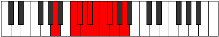

# Mode Aeolacrygic

## Links

- [Documentation](index.md)
- [Scales Index](Scales.md)
- [Modes Index](Modes.md)
- [Chords Index](Chords.md)

## Parent Scale

[Aeolacrygic](ScaleAeolacrygic.md)

## Number

[2041](https://ianring.com/musictheory/scales/2041)

## Perfection

- 6 Perfect notes
- 3 Perfect notes

## Perfection Profile

[true true false true false false true true true]

## Permutations

| Tonic | Notes | Signature | Illustration | Audio |
|-------|-------|-----------|--------------|-------|
| [C](ModeCNaturalAeolacrygic.md) | C, D#, **E**, F, **F#**, **G**, G#, A, A#, C | C |  | [midi](ModeCNaturalAeolacrygic.mid) [ogg](ModeCNaturalAeolacrygic.ogg) |
| [C#](ModeCSharpAeolacrygic.md) | C#, E, **F**, F#, **G**, **G#**, A, A#, B, C# | C |  | [midi](ModeCSharpAeolacrygic.mid) [ogg](ModeCSharpAeolacrygic.ogg) |
| [Db](ModeDFlatAeolacrygic.md) | Db, E, **F**, Gb, **G**, **Ab**, A, Bb, B, Db | C |  | [midi](ModeDFlatAeolacrygic.mid) [ogg](ModeDFlatAeolacrygic.ogg) |
| [D](ModeDNaturalAeolacrygic.md) | D, F, **F#**, G, **G#**, **A**, A#, B, C, D | C |  | [midi](ModeDNaturalAeolacrygic.mid) [ogg](ModeDNaturalAeolacrygic.ogg) |
| [D#](ModeDSharpAeolacrygic.md) | D#, F#, **G**, G#, **A**, **A#**, B, C, C#, D# | C |  | [midi](ModeDSharpAeolacrygic.mid) [ogg](ModeDSharpAeolacrygic.ogg) |
| [Eb](ModeEFlatAeolacrygic.md) | Eb, Gb, **G**, Ab, **A**, **Bb**, B, C, Db, Eb | C |  | [midi](ModeEFlatAeolacrygic.mid) [ogg](ModeEFlatAeolacrygic.ogg) |
| [E](ModeENaturalAeolacrygic.md) | E, G, **G#**, A, **A#**, **B**, C, C#, D, E | C |  | [midi](ModeENaturalAeolacrygic.mid) [ogg](ModeENaturalAeolacrygic.ogg) |
| [F](ModeFNaturalAeolacrygic.md) | F, G#, **A**, A#, **B**, **C**, C#, D, D#, F | C |  | [midi](ModeFNaturalAeolacrygic.mid) [ogg](ModeFNaturalAeolacrygic.ogg) |
| [F#](ModeFSharpAeolacrygic.md) | F#, A, **A#**, B, **C**, **C#**, D, D#, E, F# | C |  | [midi](ModeFSharpAeolacrygic.mid) [ogg](ModeFSharpAeolacrygic.ogg) |
| [Gb](ModeGFlatAeolacrygic.md) | Gb, A, **Bb**, B, **C**, **Db**, D, Eb, E, Gb | C |  | [midi](ModeGFlatAeolacrygic.mid) [ogg](ModeGFlatAeolacrygic.ogg) |
| [G](ModeGNaturalAeolacrygic.md) | G, A#, **B**, C, **C#**, **D**, D#, E, F, G | C |  | [midi](ModeGNaturalAeolacrygic.mid) [ogg](ModeGNaturalAeolacrygic.ogg) |
| [G#](ModeGSharpAeolacrygic.md) | G#, B, **C**, C#, **D**, **D#**, E, F, F#, G# | C |  | [midi](ModeGSharpAeolacrygic.mid) [ogg](ModeGSharpAeolacrygic.ogg) |
| [Ab](ModeAFlatAeolacrygic.md) | Ab, B, **C**, Db, **D**, **Eb**, E, F, Gb, Ab | C |  | [midi](ModeAFlatAeolacrygic.mid) [ogg](ModeAFlatAeolacrygic.ogg) |
| [A](ModeANaturalAeolacrygic.md) | A, C, **C#**, D, **D#**, **E**, F, F#, G, A | C |  | [midi](ModeANaturalAeolacrygic.mid) [ogg](ModeANaturalAeolacrygic.ogg) |
| [A#](ModeASharpAeolacrygic.md) | A#, C#, **D**, D#, **E**, **F**, F#, G, G#, A# | C |  | [midi](ModeASharpAeolacrygic.mid) [ogg](ModeASharpAeolacrygic.ogg) |
| [Bb](ModeBFlatAeolacrygic.md) | Bb, Db, **D**, Eb, **E**, **F**, Gb, G, Ab, Bb | C |  | [midi](ModeBFlatAeolacrygic.mid) [ogg](ModeBFlatAeolacrygic.ogg) |
| [B](ModeBNaturalAeolacrygic.md) | B, D, **D#**, E, **F**, **F#**, G, G#, A, B | C |  | [midi](ModeBNaturalAeolacrygic.mid) [ogg](ModeBNaturalAeolacrygic.ogg) |
