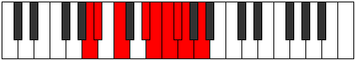

# Mode Aeolacryllic

## Links

- [Documentation](index.md)
- [Scales Index](Scales.md)
- [Modes Index](Modes.md)
- [Chords Index](Chords.md)

## Parent Scale

[Tharyllic](ScaleTharyllic.md)

## Number

[1995](https://ianring.com/musictheory/scales/1995)

## Perfection

- 5 Perfect notes
- 3 Perfect notes

## Interval Pattern

1, 2, 3, 1, 1, 1, 1, 2

## Perfection Profile

[true true true true false true false false]

## Permutations

| Tonic | Notes | Signature | Illustration | Audio |
|-------|-------|-----------|--------------|-------|
| [C](ModeCNaturalAeolacryllic.md) | C, C#, D#, F#, **G**, G#, **A**, **A#**, C | C |  | [midi](https://github.com/edipermadi/music/blob/main/docs/ModeCNaturalAeolacryllic.mid?raw=true) |
| [C#](ModeCSharpAeolacryllic.md) | C#, D, E, G, **G#**, A, **A#**, **B**, C# | C |  | [midi](https://github.com/edipermadi/music/blob/main/docs/ModeCSharpAeolacryllic.mid?raw=true) |
| [Db](ModeDFlatAeolacryllic.md) | Db, D, E, G, **Ab**, A, **Bb**, **B**, Db | C |  | [midi](https://github.com/edipermadi/music/blob/main/docs/ModeDFlatAeolacryllic.mid?raw=true) |
| [D](ModeDNaturalAeolacryllic.md) | D, D#, F, G#, **A**, A#, **B**, **C**, D | C |  | [midi](https://github.com/edipermadi/music/blob/main/docs/ModeDNaturalAeolacryllic.mid?raw=true) |
| [D#](ModeDSharpAeolacryllic.md) | D#, E, F#, A, **A#**, B, **C**, **C#**, D# | C |  | [midi](https://github.com/edipermadi/music/blob/main/docs/ModeDSharpAeolacryllic.mid?raw=true) |
| [Eb](ModeEFlatAeolacryllic.md) | Eb, E, Gb, A, **Bb**, B, **C**, **Db**, Eb | C |  | [midi](https://github.com/edipermadi/music/blob/main/docs/ModeEFlatAeolacryllic.mid?raw=true) |
| [E](ModeENaturalAeolacryllic.md) | E, F, G, A#, **B**, C, **C#**, **D**, E | C |  | [midi](https://github.com/edipermadi/music/blob/main/docs/ModeENaturalAeolacryllic.mid?raw=true) |
| [F](ModeFNaturalAeolacryllic.md) | F, F#, G#, B, **C**, C#, **D**, **D#**, F | C |  | [midi](https://github.com/edipermadi/music/blob/main/docs/ModeFNaturalAeolacryllic.mid?raw=true) |
| [F#](ModeFSharpAeolacryllic.md) | F#, G, A, C, **C#**, D, **D#**, **E**, F# | C |  | [midi](https://github.com/edipermadi/music/blob/main/docs/ModeFSharpAeolacryllic.mid?raw=true) |
| [Gb](ModeGFlatAeolacryllic.md) | Gb, G, A, C, **Db**, D, **Eb**, **E**, Gb | C |  | [midi](https://github.com/edipermadi/music/blob/main/docs/ModeGFlatAeolacryllic.mid?raw=true) |
| [G](ModeGNaturalAeolacryllic.md) | G, G#, A#, C#, **D**, D#, **E**, **F**, G | C |  | [midi](https://github.com/edipermadi/music/blob/main/docs/ModeGNaturalAeolacryllic.mid?raw=true) |
| [G#](ModeGSharpAeolacryllic.md) | G#, A, B, D, **D#**, E, **F**, **F#**, G# | C |  | [midi](https://github.com/edipermadi/music/blob/main/docs/ModeGSharpAeolacryllic.mid?raw=true) |
| [Ab](ModeAFlatAeolacryllic.md) | Ab, A, B, D, **Eb**, E, **F**, **Gb**, Ab | C |  | [midi](https://github.com/edipermadi/music/blob/main/docs/ModeAFlatAeolacryllic.mid?raw=true) |
| [A](ModeANaturalAeolacryllic.md) | A, A#, C, D#, **E**, F, **F#**, **G**, A | C |  | [midi](https://github.com/edipermadi/music/blob/main/docs/ModeANaturalAeolacryllic.mid?raw=true) |
| [A#](ModeASharpAeolacryllic.md) | A#, B, C#, E, **F**, F#, **G**, **G#**, A# | C |  | [midi](https://github.com/edipermadi/music/blob/main/docs/ModeASharpAeolacryllic.mid?raw=true) |
| [Bb](ModeBFlatAeolacryllic.md) | Bb, B, Db, E, **F**, Gb, **G**, **Ab**, Bb | C |  | [midi](https://github.com/edipermadi/music/blob/main/docs/ModeBFlatAeolacryllic.mid?raw=true) |
| [B](ModeBNaturalAeolacryllic.md) | B, C, D, F, **F#**, G, **G#**, **A**, B | C |  | [midi](https://github.com/edipermadi/music/blob/main/docs/ModeBNaturalAeolacryllic.mid?raw=true) |
