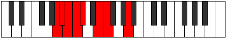

# Mode Aeoladian

## Links

- [Documentation](index.md)
- [Scales Index](Scales.md)
- [Modes Index](Modes.md)
- [Chords Index](Chords.md)

## Parent Scale

[Thycrian](ScaleThycrian.md)

## Number

[415](https://ianring.com/musictheory/scales/415)

## Perfection

- 4 Perfect notes
- 3 Perfect notes

## Perfection Profile

[true true false false false true true]

## Permutations

| Tonic | Notes | Signature | Illustration | Audio |
|-------|-------|-----------|--------------|-------|
| [C](ModeCNaturalAeoladian.md) | C, Db, **Ebb**, **Fbb**, **Gbbb**, Abb, Bbbb, C | C |  | [midi](ModeCNaturalAeoladian.mid) [ogg](ModeCNaturalAeoladian.ogg) |
| [C#](ModeCSharpAeoladian.md) | C#, D, **Eb**, **Fb**, **Gbb**, Ab, Bbb, C# | C |  | [midi](ModeCSharpAeoladian.mid) [ogg](ModeCSharpAeoladian.ogg) |
| [Db](ModeDFlatAeoladian.md) | Db, Ebb, **Fbb**, **Gbbb**, **D###**, F###, G##, Db | C |  | [midi](ModeDFlatAeoladian.mid) [ogg](ModeDFlatAeoladian.ogg) |
| [D](ModeDNaturalAeoladian.md) | D, Eb, **Fb**, **Gbb**, **Abbb**, Bbb, Cbb, D | C |  | [midi](ModeDNaturalAeoladian.mid) [ogg](ModeDNaturalAeoladian.ogg) |
| [D#](ModeDSharpAeoladian.md) | D#, E, **F**, **Gb**, **Abb**, Bb, Cb, D# | C |  | [midi](ModeDSharpAeoladian.mid) [ogg](ModeDSharpAeoladian.ogg) |
| [Eb](ModeEFlatAeoladian.md) | Eb, Fb, **Gbb**, **Abbb**, **E###**, Cbb, Dbbb, Eb | C |  | [midi](ModeEFlatAeoladian.mid) [ogg](ModeEFlatAeoladian.ogg) |
| [E](ModeENaturalAeoladian.md) | E, F, **Gb**, **Abb**, **Bbbb**, Cb, Dbb, E | C |  | [midi](ModeENaturalAeoladian.mid) [ogg](ModeENaturalAeoladian.ogg) |
| [F](ModeFNaturalAeoladian.md) | F, Gb, **Abb**, **Bbbb**, **Cbbb**, Dbb, Ebbb, F | C |  | [midi](ModeFNaturalAeoladian.mid) [ogg](ModeFNaturalAeoladian.ogg) |
| [F#](ModeFSharpAeoladian.md) | F#, G, **Ab**, **Bbb**, **Cbb**, Db, Ebb, F# | C |  | [midi](ModeFSharpAeoladian.mid) [ogg](ModeFSharpAeoladian.ogg) |
| [Gb](ModeGFlatAeoladian.md) | Gb, Abb, **Bbbb**, **Cbbb**, **Cbb**, Db, Ebb, Gb | C |  | [midi](ModeGFlatAeoladian.mid) [ogg](ModeGFlatAeoladian.ogg) |
| [G](ModeGNaturalAeoladian.md) | G, Ab, **Bbb**, **Cbb**, **Dbbb**, Ebb, Fbb, G | C |  | [midi](ModeGNaturalAeoladian.mid) [ogg](ModeGNaturalAeoladian.ogg) |
| [G#](ModeGSharpAeoladian.md) | G#, A, **Bb**, **Cb**, **Dbb**, Eb, Fb, G# | C |  | [midi](ModeGSharpAeoladian.mid) [ogg](ModeGSharpAeoladian.ogg) |
| [Ab](ModeAFlatAeoladian.md) | Ab, Bbb, **Cbb**, **Dbbb**, **Dbb**, Eb, Fb, Ab | C |  | [midi](ModeAFlatAeoladian.mid) [ogg](ModeAFlatAeoladian.ogg) |
| [A](ModeANaturalAeoladian.md) | A, Bb, **Cb**, **Dbb**, **Ebbb**, Fb, Gbb, A | C |  | [midi](ModeANaturalAeoladian.mid) [ogg](ModeANaturalAeoladian.ogg) |
| [A#](ModeASharpAeoladian.md) | A#, B, **C**, **Db**, **Ebb**, F, Gb, A# | C |  | [midi](ModeASharpAeoladian.mid) [ogg](ModeASharpAeoladian.ogg) |
| [Bb](ModeBFlatAeoladian.md) | Bb, Cb, **Dbb**, **Ebbb**, **Fbbb**, Gbb, Abbb, Bb | C |  | [midi](ModeBFlatAeoladian.mid) [ogg](ModeBFlatAeoladian.ogg) |
| [B](ModeBNaturalAeoladian.md) | B, C, **Db**, **Ebb**, **Fbb**, Gb, Abb, B | C |  | [midi](ModeBNaturalAeoladian.mid) [ogg](ModeBNaturalAeoladian.ogg) |
