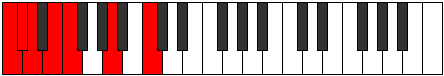
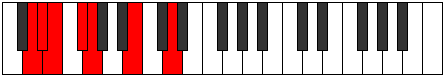
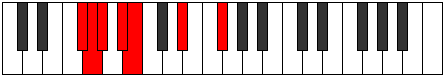
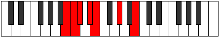

# Mode Aeoladimic

## Links

- [Documentation](index.md)
- [Scales Index](Scales.md)
- [Modes Index](Modes.md)
- [Chords Index](Chords.md)

## Parent Scale

[Bygimic](ScaleBygimic.md)

## Number

[567](https://ianring.com/musictheory/scales/567)

## Interval Pattern

1, 1, 2, 1, 4, 3

## Chord Pattern

II⁺, iii, V, V⁺, vi, VI, VI⁺

## Perfection

- 3 Perfect notes
- 3 Perfect notes

## Perfection Profile

[false false true false true true]

## Permutations

| Tonic | Notes | Signature | Illustration | Audio |
|-------|-------|-----------|--------------|-------|
| [C](ModeCNaturalAeoladimic.md) | **C**, **Db**, Ebb, **Fb**, Gbb, A, **C** | C |  | [midi](https://github.com/edipermadi/music/blob/main/docs/ModeCNaturalAeoladimic.mid?raw=true) |
| [C#](ModeCSharpAeoladimic.md) | **C#**, **D**, Eb, **F**, Gb, A#, **C#** | C |  | [midi](https://github.com/edipermadi/music/blob/main/docs/ModeCSharpAeoladimic.mid?raw=true) |
| [Db](ModeDFlatAeoladimic.md) | **Db**, **Ebb**, Fbb, **Gbb**, Abbb, Bb, **Db** | C |  | [midi](https://github.com/edipermadi/music/blob/main/docs/ModeDFlatAeoladimic.mid?raw=true) |
| [D](ModeDNaturalAeoladimic.md) | **D**, **Eb**, Fb, **Gb**, Abb, B, **D** | C |  | [midi](https://github.com/edipermadi/music/blob/main/docs/ModeDNaturalAeoladimic.mid?raw=true) |
| [D#](ModeDSharpAeoladimic.md) | **D#**, **E**, F, **G**, Ab, B#, **D#** | C |  | [midi](https://github.com/edipermadi/music/blob/main/docs/ModeDSharpAeoladimic.mid?raw=true) |
| [Eb](ModeEFlatAeoladimic.md) | **Eb**, **Fb**, Gbb, **Abb**, Bbbb, C, **Eb** | C |  | [midi](https://github.com/edipermadi/music/blob/main/docs/ModeEFlatAeoladimic.mid?raw=true) |
| [E](ModeENaturalAeoladimic.md) | **E**, **F**, Gb, **Ab**, Bbb, C#, **E** | C |  | [midi](https://github.com/edipermadi/music/blob/main/docs/ModeENaturalAeoladimic.mid?raw=true) |
| [F](ModeFNaturalAeoladimic.md) | **F**, **Gb**, Abb, **Bbb**, Cbb, D, **F** | C |  | [midi](https://github.com/edipermadi/music/blob/main/docs/ModeFNaturalAeoladimic.mid?raw=true) |
| [F#](ModeFSharpAeoladimic.md) | **F#**, **G**, Ab, **Bb**, Cb, D#, **F#** | C |  | [midi](https://github.com/edipermadi/music/blob/main/docs/ModeFSharpAeoladimic.mid?raw=true) |
| [Gb](ModeGFlatAeoladimic.md) | **Gb**, **Abb**, Bbbb, **Cbb**, Dbbb, Eb, **Gb** | C |  | [midi](https://github.com/edipermadi/music/blob/main/docs/ModeGFlatAeoladimic.mid?raw=true) |
| [G](ModeGNaturalAeoladimic.md) | **G**, **Ab**, Bbb, **Cb**, Dbb, E, **G** | C |  | [midi](https://github.com/edipermadi/music/blob/main/docs/ModeGNaturalAeoladimic.mid?raw=true) |
| [G#](ModeGSharpAeoladimic.md) | **G#**, **A**, Bb, **C**, Db, E#, **G#** | C |  | [midi](https://github.com/edipermadi/music/blob/main/docs/ModeGSharpAeoladimic.mid?raw=true) |
| [Ab](ModeAFlatAeoladimic.md) | **Ab**, **Bbb**, Cbb, **Dbb**, Ebbb, F, **Ab** | C |  | [midi](https://github.com/edipermadi/music/blob/main/docs/ModeAFlatAeoladimic.mid?raw=true) |
| [A](ModeANaturalAeoladimic.md) | **A**, **Bb**, Cb, **Db**, Ebb, F#, **A** | C |  | [midi](https://github.com/edipermadi/music/blob/main/docs/ModeANaturalAeoladimic.mid?raw=true) |
| [A#](ModeASharpAeoladimic.md) | **A#**, **B**, C, **D**, Eb, F##, **A#** | C |  | [midi](https://github.com/edipermadi/music/blob/main/docs/ModeASharpAeoladimic.mid?raw=true) |
| [Bb](ModeBFlatAeoladimic.md) | **Bb**, **Cb**, Dbb, **Ebb**, Fbb, G, **Bb** | C |  | [midi](https://github.com/edipermadi/music/blob/main/docs/ModeBFlatAeoladimic.mid?raw=true) |
| [B](ModeBNaturalAeoladimic.md) | **B**, **C**, Db, **Eb**, Fb, G#, **B** | C |  | [midi](https://github.com/edipermadi/music/blob/main/docs/ModeBNaturalAeoladimic.mid?raw=true) |
