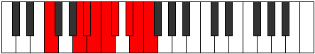

# Mode Aeoladyllic

## Links

- [Documentation](README.md)
- [Scales Index](Scales.md)
- [Modes Index](Modes.md)
- [Chords Index](Chords.md)

## Parent Scale

[Aeoladyllic](ScaleAeoladyllic.md)

## Number

[3569](https://ianring.com/musictheory/scales/3569)

## Luminosity

6

## Transposition

4, 1, 1, 1, 1, 2, 1, 1

## Chord Pattern

## Perfection

- 5 Perfect notes
- 3 Perfect notes

## Perfection Profile

true, true, true, false, false, false, true, true

## Permutations

| Tonic | Notes | Signature | Illustration | Audio |
|-------|-------|-----------|--------------|-------|
| [C](ModeCNaturalAeoladyllic.md) | C, E, F, **F#**, **G**, **G#**, A#, B, C | C |  | [midi](https://github.com/edipermadi/music/blob/main/docs/ModeCNaturalAeoladyllic.mid?raw=true) |
| [C#](ModeCSharpAeoladyllic.md) | C#, F, F#, **G**, **G#**, **A**, B, C, C# | C |  | [midi](https://github.com/edipermadi/music/blob/main/docs/ModeCSharpAeoladyllic.mid?raw=true) |
| [Db](ModeDFlatAeoladyllic.md) | Db, F, Gb, **G**, **Ab**, **A**, B, C, Db | C |  | [midi](https://github.com/edipermadi/music/blob/main/docs/ModeDFlatAeoladyllic.mid?raw=true) |
| [D](ModeDNaturalAeoladyllic.md) | D, F#, G, **G#**, **A**, **A#**, C, C#, D | C |  | [midi](https://github.com/edipermadi/music/blob/main/docs/ModeDNaturalAeoladyllic.mid?raw=true) |
| [D#](ModeDSharpAeoladyllic.md) | D#, G, G#, **A**, **A#**, **B**, C#, D, D# | C |  | [midi](https://github.com/edipermadi/music/blob/main/docs/ModeDSharpAeoladyllic.mid?raw=true) |
| [Eb](ModeEFlatAeoladyllic.md) | Eb, G, Ab, **A**, **Bb**, **B**, Db, D, Eb | C |  | [midi](https://github.com/edipermadi/music/blob/main/docs/ModeEFlatAeoladyllic.mid?raw=true) |
| [E](ModeENaturalAeoladyllic.md) | E, G#, A, **A#**, **B**, **C**, D, D#, E | C |  | [midi](https://github.com/edipermadi/music/blob/main/docs/ModeENaturalAeoladyllic.mid?raw=true) |
| [F](ModeFNaturalAeoladyllic.md) | F, A, A#, **B**, **C**, **C#**, D#, E, F | C |  | [midi](https://github.com/edipermadi/music/blob/main/docs/ModeFNaturalAeoladyllic.mid?raw=true) |
| [F#](ModeFSharpAeoladyllic.md) | F#, A#, B, **C**, **C#**, **D**, E, F, F# | C |  | [midi](https://github.com/edipermadi/music/blob/main/docs/ModeFSharpAeoladyllic.mid?raw=true) |
| [Gb](ModeGFlatAeoladyllic.md) | Gb, Bb, B, **C**, **Db**, **D**, E, F, Gb | C |  | [midi](https://github.com/edipermadi/music/blob/main/docs/ModeGFlatAeoladyllic.mid?raw=true) |
| [G](ModeGNaturalAeoladyllic.md) | G, B, C, **C#**, **D**, **D#**, F, F#, G | C |  | [midi](https://github.com/edipermadi/music/blob/main/docs/ModeGNaturalAeoladyllic.mid?raw=true) |
| [G#](ModeGSharpAeoladyllic.md) | G#, C, C#, **D**, **D#**, **E**, F#, G, G# | C |  | [midi](https://github.com/edipermadi/music/blob/main/docs/ModeGSharpAeoladyllic.mid?raw=true) |
| [Ab](ModeAFlatAeoladyllic.md) | Ab, C, Db, **D**, **Eb**, **E**, Gb, G, Ab | C |  | [midi](https://github.com/edipermadi/music/blob/main/docs/ModeAFlatAeoladyllic.mid?raw=true) |
| [A](ModeANaturalAeoladyllic.md) | A, C#, D, **D#**, **E**, **F**, G, G#, A | C |  | [midi](https://github.com/edipermadi/music/blob/main/docs/ModeANaturalAeoladyllic.mid?raw=true) |
| [A#](ModeASharpAeoladyllic.md) | A#, D, D#, **E**, **F**, **F#**, G#, A, A# | C |  | [midi](https://github.com/edipermadi/music/blob/main/docs/ModeASharpAeoladyllic.mid?raw=true) |
| [Bb](ModeBFlatAeoladyllic.md) | Bb, D, Eb, **E**, **F**, **Gb**, Ab, A, Bb | C |  | [midi](https://github.com/edipermadi/music/blob/main/docs/ModeBFlatAeoladyllic.mid?raw=true) |
| [B](ModeBNaturalAeoladyllic.md) | B, D#, E, **F**, **F#**, **G**, A, A#, B | C |  | [midi](https://github.com/edipermadi/music/blob/main/docs/ModeBNaturalAeoladyllic.mid?raw=true) |
