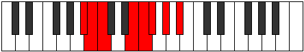

# Mode Aeolagian

## Links

- [Documentation](index.md)
- [Scales Index](Scales.md)
- [Modes Index](Modes.md)
- [Chords Index](Chords.md)

## Parent Scale

[Thacrian](ScaleThacrian.md)

## Number

[1479](https://ianring.com/musictheory/scales/1479)

## Perfection

- 4 Perfect notes
- 3 Perfect notes

## Perfection Profile

[true true false true true false false]

## Permutations

| Tonic | Notes | Signature | Illustration | Audio |
|-------|-------|-----------|--------------|-------|
| [C](ModeCNaturalAeolagian.md) | C, Db, **Ebb**, F#, G, **Ab**, **Bb**, C | C |  | [midi](ModeCNaturalAeolagian.mid) [ogg](ModeCNaturalAeolagian.ogg) |
| [C#](ModeCSharpAeolagian.md) | C#, D, **Eb**, F##, G#, **A**, **B**, C# | C |  | [midi](ModeCSharpAeolagian.mid) [ogg](ModeCSharpAeolagian.ogg) |
| [Db](ModeDFlatAeolagian.md) | Db, Ebb, **Fbb**, G, Ab, **Bbb**, **Cb**, Db | C |  | [midi](ModeDFlatAeolagian.mid) [ogg](ModeDFlatAeolagian.ogg) |
| [D](ModeDNaturalAeolagian.md) | D, Eb, **Fb**, G#, A, **Bb**, **C**, D | C |  | [midi](ModeDNaturalAeolagian.mid) [ogg](ModeDNaturalAeolagian.ogg) |
| [D#](ModeDSharpAeolagian.md) | D#, E, **F**, G##, A#, **B**, **C#**, D# | C |  | [midi](ModeDSharpAeolagian.mid) [ogg](ModeDSharpAeolagian.ogg) |
| [Eb](ModeEFlatAeolagian.md) | Eb, Fb, **Gbb**, A, Bb, **Cb**, **Db**, Eb | C |  | [midi](ModeEFlatAeolagian.mid) [ogg](ModeEFlatAeolagian.ogg) |
| [E](ModeENaturalAeolagian.md) | E, F, **Gb**, A#, B, **C**, **D**, E | C |  | [midi](ModeENaturalAeolagian.mid) [ogg](ModeENaturalAeolagian.ogg) |
| [F](ModeFNaturalAeolagian.md) | F, Gb, **Abb**, B, C, **Db**, **Eb**, F | C |  | [midi](ModeFNaturalAeolagian.mid) [ogg](ModeFNaturalAeolagian.ogg) |
| [F#](ModeFSharpAeolagian.md) | F#, G, **Ab**, B#, C#, **D**, **E**, F# | C |  | [midi](ModeFSharpAeolagian.mid) [ogg](ModeFSharpAeolagian.ogg) |
| [Gb](ModeGFlatAeolagian.md) | Gb, Abb, **Bbbb**, C, Db, **Ebb**, **Fb**, Gb | C |  | [midi](ModeGFlatAeolagian.mid) [ogg](ModeGFlatAeolagian.ogg) |
| [G](ModeGNaturalAeolagian.md) | G, Ab, **Bbb**, C#, D, **Eb**, **F**, G | C |  | [midi](ModeGNaturalAeolagian.mid) [ogg](ModeGNaturalAeolagian.ogg) |
| [G#](ModeGSharpAeolagian.md) | G#, A, **Bb**, C##, D#, **E**, **F#**, G# | C |  | [midi](ModeGSharpAeolagian.mid) [ogg](ModeGSharpAeolagian.ogg) |
| [Ab](ModeAFlatAeolagian.md) | Ab, Bbb, **Cbb**, D, Eb, **Fb**, **Gb**, Ab | C |  | [midi](ModeAFlatAeolagian.mid) [ogg](ModeAFlatAeolagian.ogg) |
| [A](ModeANaturalAeolagian.md) | A, Bb, **Cb**, D#, E, **F**, **G**, A | C |  | [midi](ModeANaturalAeolagian.mid) [ogg](ModeANaturalAeolagian.ogg) |
| [A#](ModeASharpAeolagian.md) | A#, B, **C**, D##, E#, **F#**, **G#**, A# | C |  | [midi](ModeASharpAeolagian.mid) [ogg](ModeASharpAeolagian.ogg) |
| [Bb](ModeBFlatAeolagian.md) | Bb, Cb, **Dbb**, E, F, **Gb**, **Ab**, Bb | C |  | [midi](ModeBFlatAeolagian.mid) [ogg](ModeBFlatAeolagian.ogg) |
| [B](ModeBNaturalAeolagian.md) | B, C, **Db**, E#, F#, **G**, **A**, B | C |  | [midi](ModeBNaturalAeolagian.mid) [ogg](ModeBNaturalAeolagian.ogg) |
