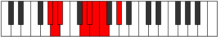

# Mode Aeolanian

## Links

- [Documentation](index.md)
- [Scales Index](Scales.md)
- [Modes Index](Modes.md)
- [Chords Index](Chords.md)

## Parent Scale

[Aeolacrian](ScaleAeolacrian.md)

## Number

[967](https://ianring.com/musictheory/scales/967)

## Perfection

- 5 Perfect notes
- 2 Perfect notes

## Perfection Profile

[true true true true true false false]

## Permutations

| Tonic | Notes | Signature | Illustration | Audio |
|-------|-------|-----------|--------------|-------|
| [C](ModeCNaturalAeolanian.md) | C, Db, Ebb, F#, G, **Ab**, **Bbb**, C | C |  | [midi](ModeCNaturalAeolanian.mid) [ogg](ModeCNaturalAeolanian.ogg) |
| [C#](ModeCSharpAeolanian.md) | C#, D, Eb, F##, G#, **A**, **Bb**, C# | C |  | [midi](ModeCSharpAeolanian.mid) [ogg](ModeCSharpAeolanian.ogg) |
| [Db](ModeDFlatAeolanian.md) | Db, Ebb, Fbb, G, Ab, **Bbb**, **Cbb**, Db | C |  | [midi](ModeDFlatAeolanian.mid) [ogg](ModeDFlatAeolanian.ogg) |
| [D](ModeDNaturalAeolanian.md) | D, Eb, Fb, G#, A, **Bb**, **Cb**, D | C |  | [midi](ModeDNaturalAeolanian.mid) [ogg](ModeDNaturalAeolanian.ogg) |
| [D#](ModeDSharpAeolanian.md) | D#, E, F, G##, A#, **B**, **C**, D# | C |  | [midi](ModeDSharpAeolanian.mid) [ogg](ModeDSharpAeolanian.ogg) |
| [Eb](ModeEFlatAeolanian.md) | Eb, Fb, Gbb, A, Bb, **Cb**, **Dbb**, Eb | C |  | [midi](ModeEFlatAeolanian.mid) [ogg](ModeEFlatAeolanian.ogg) |
| [E](ModeENaturalAeolanian.md) | E, F, Gb, A#, B, **C**, **Db**, E | C |  | [midi](ModeENaturalAeolanian.mid) [ogg](ModeENaturalAeolanian.ogg) |
| [F](ModeFNaturalAeolanian.md) | F, Gb, Abb, B, C, **Db**, **Ebb**, F | C |  | [midi](ModeFNaturalAeolanian.mid) [ogg](ModeFNaturalAeolanian.ogg) |
| [F#](ModeFSharpAeolanian.md) | F#, G, Ab, B#, C#, **D**, **Eb**, F# | C |  | [midi](ModeFSharpAeolanian.mid) [ogg](ModeFSharpAeolanian.ogg) |
| [Gb](ModeGFlatAeolanian.md) | Gb, Abb, Bbbb, C, Db, **Ebb**, **Fbb**, Gb | C |  | [midi](ModeGFlatAeolanian.mid) [ogg](ModeGFlatAeolanian.ogg) |
| [G](ModeGNaturalAeolanian.md) | G, Ab, Bbb, C#, D, **Eb**, **Fb**, G | C |  | [midi](ModeGNaturalAeolanian.mid) [ogg](ModeGNaturalAeolanian.ogg) |
| [G#](ModeGSharpAeolanian.md) | G#, A, Bb, C##, D#, **E**, **F**, G# | C |  | [midi](ModeGSharpAeolanian.mid) [ogg](ModeGSharpAeolanian.ogg) |
| [Ab](ModeAFlatAeolanian.md) | Ab, Bbb, Cbb, D, Eb, **Fb**, **Gbb**, Ab | C |  | [midi](ModeAFlatAeolanian.mid) [ogg](ModeAFlatAeolanian.ogg) |
| [A](ModeANaturalAeolanian.md) | A, Bb, Cb, D#, E, **F**, **Gb**, A | C |  | [midi](ModeANaturalAeolanian.mid) [ogg](ModeANaturalAeolanian.ogg) |
| [A#](ModeASharpAeolanian.md) | A#, B, C, D##, E#, **F#**, **G**, A# | C |  | [midi](ModeASharpAeolanian.mid) [ogg](ModeASharpAeolanian.ogg) |
| [Bb](ModeBFlatAeolanian.md) | Bb, Cb, Dbb, E, F, **Gb**, **Abb**, Bb | C |  | [midi](ModeBFlatAeolanian.mid) [ogg](ModeBFlatAeolanian.ogg) |
| [B](ModeBNaturalAeolanian.md) | B, C, Db, E#, F#, **G**, **Ab**, B | C |  | [midi](ModeBNaturalAeolanian.mid) [ogg](ModeBNaturalAeolanian.ogg) |
