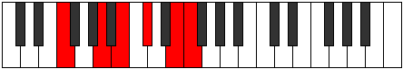
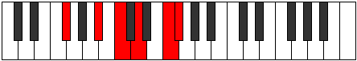
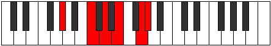

# Mode Aeolanitonic

## Links

- [Documentation](index.md)
- [Scales Index](Scales.md)
- [Modes Index](Modes.md)
- [Chords Index](Chords.md)

## Parent Scale

[Aeolanitonic](ScaleAeolanitonic.md)

## Number

[2385](https://ianring.com/musictheory/scales/2385)

## Perfection

- 2 Perfect notes
- 3 Perfect notes

## Perfection Profile

[false true false false true]

## Permutations

| Tonic | Notes | Signature | Illustration | Audio |
|-------|-------|-----------|--------------|-------|
| [C](ModeCNaturalAeolanitonic.md) | **C**, E, **F#**, **G#**, B, **C** | C |  | [midi](ModeCNaturalAeolanitonic.mid) [ogg](ModeCNaturalAeolanitonic.ogg) |
| [C#](ModeCSharpAeolanitonic.md) | **C#**, F, **G**, **A**, C, **C#** | C |  | [midi](ModeCSharpAeolanitonic.mid) [ogg](ModeCSharpAeolanitonic.ogg) |
| [Db](ModeDFlatAeolanitonic.md) | **Db**, F, **G**, **A**, C, **Db** | C |  | [midi](ModeDFlatAeolanitonic.mid) [ogg](ModeDFlatAeolanitonic.ogg) |
| [D](ModeDNaturalAeolanitonic.md) | **D**, F#, **G#**, **A#**, C#, **D** | C |  | [midi](ModeDNaturalAeolanitonic.mid) [ogg](ModeDNaturalAeolanitonic.ogg) |
| [D#](ModeDSharpAeolanitonic.md) | **D#**, G, **A**, **B**, D, **D#** | C |  | [midi](ModeDSharpAeolanitonic.mid) [ogg](ModeDSharpAeolanitonic.ogg) |
| [Eb](ModeEFlatAeolanitonic.md) | **Eb**, G, **A**, **B**, D, **Eb** | C |  | [midi](ModeEFlatAeolanitonic.mid) [ogg](ModeEFlatAeolanitonic.ogg) |
| [E](ModeENaturalAeolanitonic.md) | **E**, G#, **A#**, **C**, D#, **E** | C |  | [midi](ModeENaturalAeolanitonic.mid) [ogg](ModeENaturalAeolanitonic.ogg) |
| [F](ModeFNaturalAeolanitonic.md) | **F**, A, **B**, **C#**, E, **F** | C |  | [midi](ModeFNaturalAeolanitonic.mid) [ogg](ModeFNaturalAeolanitonic.ogg) |
| [F#](ModeFSharpAeolanitonic.md) | **F#**, A#, **C**, **D**, F, **F#** | C |  | [midi](ModeFSharpAeolanitonic.mid) [ogg](ModeFSharpAeolanitonic.ogg) |
| [Gb](ModeGFlatAeolanitonic.md) | **Gb**, Bb, **C**, **D**, F, **Gb** | C |  | [midi](ModeGFlatAeolanitonic.mid) [ogg](ModeGFlatAeolanitonic.ogg) |
| [G](ModeGNaturalAeolanitonic.md) | **G**, B, **C#**, **D#**, F#, **G** | C |  | [midi](ModeGNaturalAeolanitonic.mid) [ogg](ModeGNaturalAeolanitonic.ogg) |
| [G#](ModeGSharpAeolanitonic.md) | **G#**, C, **D**, **E**, G, **G#** | C |  | [midi](ModeGSharpAeolanitonic.mid) [ogg](ModeGSharpAeolanitonic.ogg) |
| [Ab](ModeAFlatAeolanitonic.md) | **Ab**, C, **D**, **E**, G, **Ab** | C |  | [midi](ModeAFlatAeolanitonic.mid) [ogg](ModeAFlatAeolanitonic.ogg) |
| [A](ModeANaturalAeolanitonic.md) | **A**, C#, **D#**, **F**, G#, **A** | C |  | [midi](ModeANaturalAeolanitonic.mid) [ogg](ModeANaturalAeolanitonic.ogg) |
| [A#](ModeASharpAeolanitonic.md) | **A#**, D, **E**, **F#**, A, **A#** | C |  | [midi](ModeASharpAeolanitonic.mid) [ogg](ModeASharpAeolanitonic.ogg) |
| [Bb](ModeBFlatAeolanitonic.md) | **Bb**, D, **E**, **Gb**, A, **Bb** | C |  | [midi](ModeBFlatAeolanitonic.mid) [ogg](ModeBFlatAeolanitonic.ogg) |
| [B](ModeBNaturalAeolanitonic.md) | **B**, D#, **F**, **G**, A#, **B** | C |  | [midi](ModeBNaturalAeolanitonic.mid) [ogg](ModeBNaturalAeolanitonic.ogg) |
