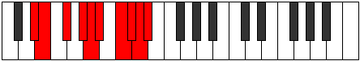

# Mode Aeolanygic

## Links

- [Documentation](index.md)
- [Scales Index](Scales.md)
- [Modes Index](Modes.md)
- [Chords Index](Chords.md)

## Parent Scale

[Porygic](ScalePorygic.md)

## Number

[3819](https://ianring.com/musictheory/scales/3819)

## Perfection

- 6 Perfect notes
- 3 Perfect notes

## Perfection Profile

[true false true true true false false true true]

## Permutations

| Tonic | Notes | Signature | Illustration | Audio |
|-------|-------|-----------|--------------|-------|
| [C](ModeCNaturalAeolanygic.md) | C, **C#**, D#, F, F#, **G**, **A**, A#, B, C | C |  | [midi](ModeCNaturalAeolanygic.mid) [ogg](ModeCNaturalAeolanygic.ogg) |
| [C#](ModeCSharpAeolanygic.md) | C#, **D**, E, F#, G, **G#**, **A#**, B, C, C# | C |  | [midi](ModeCSharpAeolanygic.mid) [ogg](ModeCSharpAeolanygic.ogg) |
| [Db](ModeDFlatAeolanygic.md) | Db, **D**, E, Gb, G, **Ab**, **Bb**, B, C, Db | C |  | [midi](ModeDFlatAeolanygic.mid) [ogg](ModeDFlatAeolanygic.ogg) |
| [D](ModeDNaturalAeolanygic.md) | D, **D#**, F, G, G#, **A**, **B**, C, C#, D | C |  | [midi](ModeDNaturalAeolanygic.mid) [ogg](ModeDNaturalAeolanygic.ogg) |
| [D#](ModeDSharpAeolanygic.md) | D#, **E**, F#, G#, A, **A#**, **C**, C#, D, D# | C |  | [midi](ModeDSharpAeolanygic.mid) [ogg](ModeDSharpAeolanygic.ogg) |
| [Eb](ModeEFlatAeolanygic.md) | Eb, **E**, Gb, Ab, A, **Bb**, **C**, Db, D, Eb | C |  | [midi](ModeEFlatAeolanygic.mid) [ogg](ModeEFlatAeolanygic.ogg) |
| [E](ModeENaturalAeolanygic.md) | E, **F**, G, A, A#, **B**, **C#**, D, D#, E | C |  | [midi](ModeENaturalAeolanygic.mid) [ogg](ModeENaturalAeolanygic.ogg) |
| [F](ModeFNaturalAeolanygic.md) | F, **F#**, G#, A#, B, **C**, **D**, D#, E, F | C |  | [midi](ModeFNaturalAeolanygic.mid) [ogg](ModeFNaturalAeolanygic.ogg) |
| [F#](ModeFSharpAeolanygic.md) | F#, **G**, A, B, C, **C#**, **D#**, E, F, F# | C |  | [midi](ModeFSharpAeolanygic.mid) [ogg](ModeFSharpAeolanygic.ogg) |
| [Gb](ModeGFlatAeolanygic.md) | Gb, **G**, A, B, C, **Db**, **Eb**, E, F, Gb | C |  | [midi](ModeGFlatAeolanygic.mid) [ogg](ModeGFlatAeolanygic.ogg) |
| [G](ModeGNaturalAeolanygic.md) | G, **G#**, A#, C, C#, **D**, **E**, F, F#, G | C |  | [midi](ModeGNaturalAeolanygic.mid) [ogg](ModeGNaturalAeolanygic.ogg) |
| [G#](ModeGSharpAeolanygic.md) | G#, **A**, B, C#, D, **D#**, **F**, F#, G, G# | C |  | [midi](ModeGSharpAeolanygic.mid) [ogg](ModeGSharpAeolanygic.ogg) |
| [Ab](ModeAFlatAeolanygic.md) | Ab, **A**, B, Db, D, **Eb**, **F**, Gb, G, Ab | C |  | [midi](ModeAFlatAeolanygic.mid) [ogg](ModeAFlatAeolanygic.ogg) |
| [A](ModeANaturalAeolanygic.md) | A, **A#**, C, D, D#, **E**, **F#**, G, G#, A | C |  | [midi](ModeANaturalAeolanygic.mid) [ogg](ModeANaturalAeolanygic.ogg) |
| [A#](ModeASharpAeolanygic.md) | A#, **B**, C#, D#, E, **F**, **G**, G#, A, A# | C |  | [midi](ModeASharpAeolanygic.mid) [ogg](ModeASharpAeolanygic.ogg) |
| [Bb](ModeBFlatAeolanygic.md) | Bb, **B**, Db, Eb, E, **F**, **G**, Ab, A, Bb | C |  | [midi](ModeBFlatAeolanygic.mid) [ogg](ModeBFlatAeolanygic.ogg) |
| [B](ModeBNaturalAeolanygic.md) | B, **C**, D, E, F, **F#**, **G#**, A, A#, B | C |  | [midi](ModeBNaturalAeolanygic.mid) [ogg](ModeBNaturalAeolanygic.ogg) |
