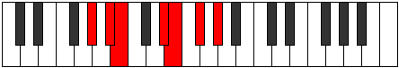

# Mode Aeolaphimic

## Links

- [Documentation](README.md)
- [Scales Index](Scales.md)
- [Modes Index](Modes.md)
- [Chords Index](Chords.md)

## Parent Scale

[Bylimic](ScaleBylimic.md)

## Number

[1421](https://ianring.com/musictheory/scales/1421)

## Transposition

2, 1, 4, 1, 2, 2

## Chord Pattern

iv, V

## Perfection

- 4 Perfect notes
- 2 Perfect notes

## Perfection Profile

[true false true true true false]

## Permutations

| Tonic | Notes | Signature | Illustration | Audio |
|-------|-------|-----------|--------------|-------|
| [C](ModeCNaturalAeolaphimic.md) | C, **D**, Eb, F##, G#, **A#**, C | C |  | [midi](https://github.com/edipermadi/music/blob/main/docs/ModeCNaturalAeolaphimic.mid?raw=true) |
| [C#](ModeCSharpAeolaphimic.md) | C#, **D#**, E, F###, G##, **A##**, C# | C |  | [midi](https://github.com/edipermadi/music/blob/main/docs/ModeCSharpAeolaphimic.mid?raw=true) |
| [Db](ModeDFlatAeolaphimic.md) | Db, **Eb**, Fb, G#, A, **B**, Db | C |  | [midi](https://github.com/edipermadi/music/blob/main/docs/ModeDFlatAeolaphimic.mid?raw=true) |
| [D](ModeDNaturalAeolaphimic.md) | D, **E**, F, G##, A#, **B#**, D | C |  | [midi](https://github.com/edipermadi/music/blob/main/docs/ModeDNaturalAeolaphimic.mid?raw=true) |
| [D#](ModeDSharpAeolaphimic.md) | D#, **E#**, F#, G###, A##, **B##**, D# | C |  | [midi](https://github.com/edipermadi/music/blob/main/docs/ModeDSharpAeolaphimic.mid?raw=true) |
| [Eb](ModeEFlatAeolaphimic.md) | Eb, **F**, Gb, A#, B, **C#**, Eb | C |  | [midi](https://github.com/edipermadi/music/blob/main/docs/ModeEFlatAeolaphimic.mid?raw=true) |
| [E](ModeENaturalAeolaphimic.md) | E, **F#**, G, A##, B#, **C##**, E | C |  | [midi](https://github.com/edipermadi/music/blob/main/docs/ModeENaturalAeolaphimic.mid?raw=true) |
| [F](ModeFNaturalAeolaphimic.md) | F, **G**, Ab, B#, C#, **D#**, F | C |  | [midi](https://github.com/edipermadi/music/blob/main/docs/ModeFNaturalAeolaphimic.mid?raw=true) |
| [F#](ModeFSharpAeolaphimic.md) | F#, **G#**, A, B##, C##, **D##**, F# | C |  | [midi](https://github.com/edipermadi/music/blob/main/docs/ModeFSharpAeolaphimic.mid?raw=true) |
| [Gb](ModeGFlatAeolaphimic.md) | Gb, **Ab**, Bbb, C#, D, **E**, Gb | C |  | [midi](https://github.com/edipermadi/music/blob/main/docs/ModeGFlatAeolaphimic.mid?raw=true) |
| [G](ModeGNaturalAeolaphimic.md) | G, **A**, Bb, C##, D#, **E#**, G | C |  | [midi](https://github.com/edipermadi/music/blob/main/docs/ModeGNaturalAeolaphimic.mid?raw=true) |
| [G#](ModeGSharpAeolaphimic.md) | G#, **A#**, B, C###, D##, **E##**, G# | C |  | [midi](https://github.com/edipermadi/music/blob/main/docs/ModeGSharpAeolaphimic.mid?raw=true) |
| [Ab](ModeAFlatAeolaphimic.md) | Ab, **Bb**, Cb, D#, E, **F#**, Ab | C |  | [midi](https://github.com/edipermadi/music/blob/main/docs/ModeAFlatAeolaphimic.mid?raw=true) |
| [A](ModeANaturalAeolaphimic.md) | A, **B**, C, D##, E#, **F##**, A | C |  | [midi](https://github.com/edipermadi/music/blob/main/docs/ModeANaturalAeolaphimic.mid?raw=true) |
| [A#](ModeASharpAeolaphimic.md) | A#, **B#**, C#, D###, E##, **F###**, A# | C |  | [midi](https://github.com/edipermadi/music/blob/main/docs/ModeASharpAeolaphimic.mid?raw=true) |
| [Bb](ModeBFlatAeolaphimic.md) | Bb, **C**, Db, E#, F#, **G#**, Bb | C |  | [midi](https://github.com/edipermadi/music/blob/main/docs/ModeBFlatAeolaphimic.mid?raw=true) |
| [B](ModeBNaturalAeolaphimic.md) | B, **C#**, D, E##, F##, **G##**, B | C |  | [midi](https://github.com/edipermadi/music/blob/main/docs/ModeBNaturalAeolaphimic.mid?raw=true) |
