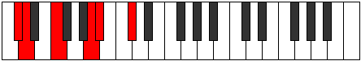
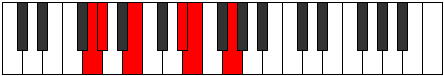

# Mode Aeolapritonic

## Links

- [Documentation](index.md)
- [Scales Index](Scales.md)
- [Modes Index](Modes.md)
- [Chords Index](Chords.md)

## Parent Scale

[Zothitonic](ScaleZothitonic.md)

## Number

[787](https://ianring.com/musictheory/scales/787)

## Perfection

- 2 Perfect notes
- 3 Perfect notes

## Perfection Profile

[false true false false true]

## Permutations

| Tonic | Notes | Signature | Illustration | Audio |
|-------|-------|-----------|--------------|-------|
| [C](ModeCNaturalAeolapritonic.md) | **C**, C#, **E**, **G#**, A, **C** | C |  | [midi](ModeCNaturalAeolapritonic.mid) [ogg](ModeCNaturalAeolapritonic.ogg) |
| [C#](ModeCSharpAeolapritonic.md) | **C#**, D, **F**, **A**, A#, **C#** | C |  | [midi](ModeCSharpAeolapritonic.mid) [ogg](ModeCSharpAeolapritonic.ogg) |
| [Db](ModeDFlatAeolapritonic.md) | **Db**, D, **F**, **A**, Bb, **Db** | C |  | [midi](ModeDFlatAeolapritonic.mid) [ogg](ModeDFlatAeolapritonic.ogg) |
| [D](ModeDNaturalAeolapritonic.md) | **D**, D#, **F#**, **A#**, B, **D** | C |  | [midi](ModeDNaturalAeolapritonic.mid) [ogg](ModeDNaturalAeolapritonic.ogg) |
| [D#](ModeDSharpAeolapritonic.md) | **D#**, E, **G**, **B**, C, **D#** | C |  | [midi](ModeDSharpAeolapritonic.mid) [ogg](ModeDSharpAeolapritonic.ogg) |
| [Eb](ModeEFlatAeolapritonic.md) | **Eb**, E, **G**, **B**, C, **Eb** | C |  | [midi](ModeEFlatAeolapritonic.mid) [ogg](ModeEFlatAeolapritonic.ogg) |
| [E](ModeENaturalAeolapritonic.md) | **E**, F, **G#**, **C**, C#, **E** | C |  | [midi](ModeENaturalAeolapritonic.mid) [ogg](ModeENaturalAeolapritonic.ogg) |
| [F](ModeFNaturalAeolapritonic.md) | **F**, F#, **A**, **C#**, D, **F** | C |  | [midi](ModeFNaturalAeolapritonic.mid) [ogg](ModeFNaturalAeolapritonic.ogg) |
| [F#](ModeFSharpAeolapritonic.md) | **F#**, G, **A#**, **D**, D#, **F#** | C |  | [midi](ModeFSharpAeolapritonic.mid) [ogg](ModeFSharpAeolapritonic.ogg) |
| [Gb](ModeGFlatAeolapritonic.md) | **Gb**, G, **Bb**, **D**, Eb, **Gb** | C |  | [midi](ModeGFlatAeolapritonic.mid) [ogg](ModeGFlatAeolapritonic.ogg) |
| [G](ModeGNaturalAeolapritonic.md) | **G**, G#, **B**, **D#**, E, **G** | C |  | [midi](ModeGNaturalAeolapritonic.mid) [ogg](ModeGNaturalAeolapritonic.ogg) |
| [G#](ModeGSharpAeolapritonic.md) | **G#**, A, **C**, **E**, F, **G#** | C |  | [midi](ModeGSharpAeolapritonic.mid) [ogg](ModeGSharpAeolapritonic.ogg) |
| [Ab](ModeAFlatAeolapritonic.md) | **Ab**, A, **C**, **E**, F, **Ab** | C |  | [midi](ModeAFlatAeolapritonic.mid) [ogg](ModeAFlatAeolapritonic.ogg) |
| [A](ModeANaturalAeolapritonic.md) | **A**, A#, **C#**, **F**, F#, **A** | C |  | [midi](ModeANaturalAeolapritonic.mid) [ogg](ModeANaturalAeolapritonic.ogg) |
| [A#](ModeASharpAeolapritonic.md) | **A#**, B, **D**, **F#**, G, **A#** | C |  | [midi](ModeASharpAeolapritonic.mid) [ogg](ModeASharpAeolapritonic.ogg) |
| [Bb](ModeBFlatAeolapritonic.md) | **Bb**, B, **D**, **Gb**, G, **Bb** | C |  | [midi](ModeBFlatAeolapritonic.mid) [ogg](ModeBFlatAeolapritonic.ogg) |
| [B](ModeBNaturalAeolapritonic.md) | **B**, C, **D#**, **G**, G#, **B** | C |  | [midi](ModeBNaturalAeolapritonic.mid) [ogg](ModeBNaturalAeolapritonic.ogg) |
