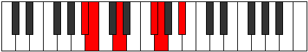

# Mode Aeolapritonic

## Links

- [Documentation](README.md)
- [Scales Index](Scales.md)
- [Modes Index](Modes.md)
- [Chords Index](Chords.md)

## Parent Scale

[Zothitonic](ScaleZothitonic.md)

## Number

[787](https://ianring.com/musictheory/scales/787)

## Transposition

1, 3, 4, 1, 3

## Chord Pattern

IV⁺

## Perfection

- 2 Perfect notes
- 3 Perfect notes

## Perfection Profile

[false true false false true]

## Permutations

| Tonic | Notes | Signature | Illustration | Audio |
|-------|-------|-----------|--------------|-------|
| [C](ModeCNaturalAeolapritonic.md) | **C**, C#, **E**, **G#**, A, **C** | C |  | [midi](https://github.com/edipermadi/music/blob/main/docs/ModeCNaturalAeolapritonic.mid?raw=true) |
| [C#](ModeCSharpAeolapritonic.md) | **C#**, D, **F**, **A**, A#, **C#** | C |  | [midi](https://github.com/edipermadi/music/blob/main/docs/ModeCSharpAeolapritonic.mid?raw=true) |
| [Db](ModeDFlatAeolapritonic.md) | **Db**, D, **F**, **A**, Bb, **Db** | C |  | [midi](https://github.com/edipermadi/music/blob/main/docs/ModeDFlatAeolapritonic.mid?raw=true) |
| [D](ModeDNaturalAeolapritonic.md) | **D**, D#, **F#**, **A#**, B, **D** | C |  | [midi](https://github.com/edipermadi/music/blob/main/docs/ModeDNaturalAeolapritonic.mid?raw=true) |
| [D#](ModeDSharpAeolapritonic.md) | **D#**, E, **G**, **B**, C, **D#** | C |  | [midi](https://github.com/edipermadi/music/blob/main/docs/ModeDSharpAeolapritonic.mid?raw=true) |
| [Eb](ModeEFlatAeolapritonic.md) | **Eb**, E, **G**, **B**, C, **Eb** | C |  | [midi](https://github.com/edipermadi/music/blob/main/docs/ModeEFlatAeolapritonic.mid?raw=true) |
| [E](ModeENaturalAeolapritonic.md) | **E**, F, **G#**, **C**, C#, **E** | C |  | [midi](https://github.com/edipermadi/music/blob/main/docs/ModeENaturalAeolapritonic.mid?raw=true) |
| [F](ModeFNaturalAeolapritonic.md) | **F**, F#, **A**, **C#**, D, **F** | C |  | [midi](https://github.com/edipermadi/music/blob/main/docs/ModeFNaturalAeolapritonic.mid?raw=true) |
| [F#](ModeFSharpAeolapritonic.md) | **F#**, G, **A#**, **D**, D#, **F#** | C |  | [midi](https://github.com/edipermadi/music/blob/main/docs/ModeFSharpAeolapritonic.mid?raw=true) |
| [Gb](ModeGFlatAeolapritonic.md) | **Gb**, G, **Bb**, **D**, Eb, **Gb** | C |  | [midi](https://github.com/edipermadi/music/blob/main/docs/ModeGFlatAeolapritonic.mid?raw=true) |
| [G](ModeGNaturalAeolapritonic.md) | **G**, G#, **B**, **D#**, E, **G** | C |  | [midi](https://github.com/edipermadi/music/blob/main/docs/ModeGNaturalAeolapritonic.mid?raw=true) |
| [G#](ModeGSharpAeolapritonic.md) | **G#**, A, **C**, **E**, F, **G#** | C |  | [midi](https://github.com/edipermadi/music/blob/main/docs/ModeGSharpAeolapritonic.mid?raw=true) |
| [Ab](ModeAFlatAeolapritonic.md) | **Ab**, A, **C**, **E**, F, **Ab** | C |  | [midi](https://github.com/edipermadi/music/blob/main/docs/ModeAFlatAeolapritonic.mid?raw=true) |
| [A](ModeANaturalAeolapritonic.md) | **A**, A#, **C#**, **F**, F#, **A** | C |  | [midi](https://github.com/edipermadi/music/blob/main/docs/ModeANaturalAeolapritonic.mid?raw=true) |
| [A#](ModeASharpAeolapritonic.md) | **A#**, B, **D**, **F#**, G, **A#** | C |  | [midi](https://github.com/edipermadi/music/blob/main/docs/ModeASharpAeolapritonic.mid?raw=true) |
| [Bb](ModeBFlatAeolapritonic.md) | **Bb**, B, **D**, **Gb**, G, **Bb** | C |  | [midi](https://github.com/edipermadi/music/blob/main/docs/ModeBFlatAeolapritonic.mid?raw=true) |
| [B](ModeBNaturalAeolapritonic.md) | **B**, C, **D#**, **G**, G#, **B** | C |  | [midi](https://github.com/edipermadi/music/blob/main/docs/ModeBNaturalAeolapritonic.mid?raw=true) |
