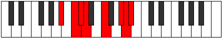

# Mode Aeolaptian

## Links

- [Documentation](index.md)
- [Scales Index](Scales.md)
- [Modes Index](Modes.md)
- [Chords Index](Chords.md)

## Parent Scale

[Stalian](ScaleStalian.md)

## Number

[3229](https://ianring.com/musictheory/scales/3229)

## Perfection

- 4 Perfect notes
- 3 Perfect notes

## Perfection Profile

[true false true true true false false]

## Permutations

| Tonic | Notes | Signature | Illustration | Audio |
|-------|-------|-----------|--------------|-------|
| [C](ModeCNaturalAeolaptian.md) | C, **D**, Eb, Fb, G, **A#**, **B**, C | C |  | [midi](ModeCNaturalAeolaptian.mid) [ogg](ModeCNaturalAeolaptian.ogg) |
| [C#](ModeCSharpAeolaptian.md) | C#, **D#**, E, F, G#, **A##**, **B#**, C# | C |  | [midi](ModeCSharpAeolaptian.mid) [ogg](ModeCSharpAeolaptian.ogg) |
| [Db](ModeDFlatAeolaptian.md) | Db, **Eb**, Fb, Gbb, Ab, **B**, **C**, Db | C |  | [midi](ModeDFlatAeolaptian.mid) [ogg](ModeDFlatAeolaptian.ogg) |
| [D](ModeDNaturalAeolaptian.md) | D, **E**, F, Gb, A, **B#**, **C#**, D | C |  | [midi](ModeDNaturalAeolaptian.mid) [ogg](ModeDNaturalAeolaptian.ogg) |
| [D#](ModeDSharpAeolaptian.md) | D#, **E#**, F#, G, A#, **B##**, **C##**, D# | C |  | [midi](ModeDSharpAeolaptian.mid) [ogg](ModeDSharpAeolaptian.ogg) |
| [Eb](ModeEFlatAeolaptian.md) | Eb, **F**, Gb, Abb, Bb, **C#**, **D**, Eb | C |  | [midi](ModeEFlatAeolaptian.mid) [ogg](ModeEFlatAeolaptian.ogg) |
| [E](ModeENaturalAeolaptian.md) | E, **F#**, G, Ab, B, **C##**, **D#**, E | C |  | [midi](ModeENaturalAeolaptian.mid) [ogg](ModeENaturalAeolaptian.ogg) |
| [F](ModeFNaturalAeolaptian.md) | F, **G**, Ab, Bbb, C, **D#**, **E**, F | C |  | [midi](ModeFNaturalAeolaptian.mid) [ogg](ModeFNaturalAeolaptian.ogg) |
| [F#](ModeFSharpAeolaptian.md) | F#, **G#**, A, Bb, C#, **D##**, **E#**, F# | C |  | [midi](ModeFSharpAeolaptian.mid) [ogg](ModeFSharpAeolaptian.ogg) |
| [Gb](ModeGFlatAeolaptian.md) | Gb, **Ab**, Bbb, Cbb, Db, **E**, **F**, Gb | C |  | [midi](ModeGFlatAeolaptian.mid) [ogg](ModeGFlatAeolaptian.ogg) |
| [G](ModeGNaturalAeolaptian.md) | G, **A**, Bb, Cb, D, **E#**, **F#**, G | C |  | [midi](ModeGNaturalAeolaptian.mid) [ogg](ModeGNaturalAeolaptian.ogg) |
| [G#](ModeGSharpAeolaptian.md) | G#, **A#**, B, C, D#, **E##**, **F##**, G# | C |  | [midi](ModeGSharpAeolaptian.mid) [ogg](ModeGSharpAeolaptian.ogg) |
| [Ab](ModeAFlatAeolaptian.md) | Ab, **Bb**, Cb, Dbb, Eb, **F#**, **G**, Ab | C |  | [midi](ModeAFlatAeolaptian.mid) [ogg](ModeAFlatAeolaptian.ogg) |
| [A](ModeANaturalAeolaptian.md) | A, **B**, C, Db, E, **F##**, **G#**, A | C |  | [midi](ModeANaturalAeolaptian.mid) [ogg](ModeANaturalAeolaptian.ogg) |
| [A#](ModeASharpAeolaptian.md) | A#, **B#**, C#, D, E#, **F###**, **G##**, A# | C |  | [midi](ModeASharpAeolaptian.mid) [ogg](ModeASharpAeolaptian.ogg) |
| [Bb](ModeBFlatAeolaptian.md) | Bb, **C**, Db, Ebb, F, **G#**, **A**, Bb | C |  | [midi](ModeBFlatAeolaptian.mid) [ogg](ModeBFlatAeolaptian.ogg) |
| [B](ModeBNaturalAeolaptian.md) | B, **C#**, D, Eb, F#, **G##**, **A#**, B | C |  | [midi](ModeBNaturalAeolaptian.mid) [ogg](ModeBNaturalAeolaptian.ogg) |
