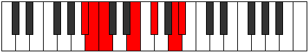

# Mode Aeolaptimic

## Links

- [Documentation](README.md)
- [Scales Index](Scales.md)
- [Modes Index](Modes.md)
- [Chords Index](Chords.md)

## Parent Scale

[Stalimic](ScaleStalimic.md)

## Number

[2375](https://ianring.com/musictheory/scales/2375)

## Transposition

1, 1, 4, 2, 3, 1

## Chord Pattern

Vb5

## Perfection

- 3 Perfect notes
- 3 Perfect notes

## Perfection Profile

false, true, false, true, false, true

## Permutations

| Tonic | Notes | Signature | Illustration | Audio |
|-------|-------|-----------|--------------|-------|
| [C](ModeCNaturalAeolaptimic.md) | **C**, Db, **Ebb**, F#, **G#**, A##, **C** | C |  | [midi](https://github.com/edipermadi/music/blob/main/docs/ModeCNaturalAeolaptimic.mid?raw=true) |
| [C#](ModeCSharpAeolaptimic.md) | **C#**, D, **Eb**, F##, **G##**, A###, **C#** | C |  | [midi](https://github.com/edipermadi/music/blob/main/docs/ModeCSharpAeolaptimic.mid?raw=true) |
| [Db](ModeDFlatAeolaptimic.md) | **Db**, Ebb, **Fbb**, G, **A**, B#, **Db** | C |  | [midi](https://github.com/edipermadi/music/blob/main/docs/ModeDFlatAeolaptimic.mid?raw=true) |
| [D](ModeDNaturalAeolaptimic.md) | **D**, Eb, **Fb**, G#, **A#**, B##, **D** | C |  | [midi](https://github.com/edipermadi/music/blob/main/docs/ModeDNaturalAeolaptimic.mid?raw=true) |
| [D#](ModeDSharpAeolaptimic.md) | **D#**, E, **F**, G##, **A##**, B###, **D#** | C |  | [midi](https://github.com/edipermadi/music/blob/main/docs/ModeDSharpAeolaptimic.mid?raw=true) |
| [Eb](ModeEFlatAeolaptimic.md) | **Eb**, Fb, **Gbb**, A, **B**, C##, **Eb** | C |  | [midi](https://github.com/edipermadi/music/blob/main/docs/ModeEFlatAeolaptimic.mid?raw=true) |
| [E](ModeENaturalAeolaptimic.md) | **E**, F, **Gb**, A#, **B#**, C###, **E** | C |  | [midi](https://github.com/edipermadi/music/blob/main/docs/ModeENaturalAeolaptimic.mid?raw=true) |
| [F](ModeFNaturalAeolaptimic.md) | **F**, Gb, **Abb**, B, **C#**, D##, **F** | C |  | [midi](https://github.com/edipermadi/music/blob/main/docs/ModeFNaturalAeolaptimic.mid?raw=true) |
| [F#](ModeFSharpAeolaptimic.md) | **F#**, G, **Ab**, B#, **C##**, D###, **F#** | C |  | [midi](https://github.com/edipermadi/music/blob/main/docs/ModeFSharpAeolaptimic.mid?raw=true) |
| [Gb](ModeGFlatAeolaptimic.md) | **Gb**, Abb, **Bbbb**, C, **D**, E#, **Gb** | C |  | [midi](https://github.com/edipermadi/music/blob/main/docs/ModeGFlatAeolaptimic.mid?raw=true) |
| [G](ModeGNaturalAeolaptimic.md) | **G**, Ab, **Bbb**, C#, **D#**, E##, **G** | C |  | [midi](https://github.com/edipermadi/music/blob/main/docs/ModeGNaturalAeolaptimic.mid?raw=true) |
| [G#](ModeGSharpAeolaptimic.md) | **G#**, A, **Bb**, C##, **D##**, E###, **G#** | C |  | [midi](https://github.com/edipermadi/music/blob/main/docs/ModeGSharpAeolaptimic.mid?raw=true) |
| [Ab](ModeAFlatAeolaptimic.md) | **Ab**, Bbb, **Cbb**, D, **E**, F##, **Ab** | C |  | [midi](https://github.com/edipermadi/music/blob/main/docs/ModeAFlatAeolaptimic.mid?raw=true) |
| [A](ModeANaturalAeolaptimic.md) | **A**, Bb, **Cb**, D#, **E#**, F###, **A** | C |  | [midi](https://github.com/edipermadi/music/blob/main/docs/ModeANaturalAeolaptimic.mid?raw=true) |
| [A#](ModeASharpAeolaptimic.md) | **A#**, B, **C**, D##, **E##**, Cbbb, **A#** | C |  | [midi](https://github.com/edipermadi/music/blob/main/docs/ModeASharpAeolaptimic.mid?raw=true) |
| [Bb](ModeBFlatAeolaptimic.md) | **Bb**, Cb, **Dbb**, E, **F#**, G##, **Bb** | C |  | [midi](https://github.com/edipermadi/music/blob/main/docs/ModeBFlatAeolaptimic.mid?raw=true) |
| [B](ModeBNaturalAeolaptimic.md) | **B**, C, **Db**, E#, **F##**, G###, **B** | C |  | [midi](https://github.com/edipermadi/music/blob/main/docs/ModeBNaturalAeolaptimic.mid?raw=true) |
