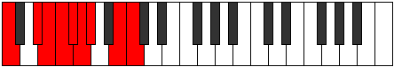

# Mode Aeolaptyllic

## Links

- [Documentation](index.md)
- [Scales Index](Scales.md)
- [Modes Index](Modes.md)
- [Chords Index](Chords.md)

## Parent Scale

[Ioniptyllic](ScaleIoniptyllic.md)

## Number

[2553](https://ianring.com/musictheory/scales/2553)

## Perfection

- 5 Perfect notes
- 3 Perfect notes

## Perfection Profile

[true false true true false false true true]

## Permutations

| Tonic | Notes | Signature | Illustration | Audio |
|-------|-------|-----------|--------------|-------|
| [C](ModeCNaturalAeolaptyllic.md) | C, **D#**, E, F, **F#**, **G**, G#, B, C | C |  | [midi](ModeCNaturalAeolaptyllic.mid) [ogg](ModeCNaturalAeolaptyllic.ogg) |
| [C#](ModeCSharpAeolaptyllic.md) | C#, **E**, F, F#, **G**, **G#**, A, C, C# | C |  | [midi](ModeCSharpAeolaptyllic.mid) [ogg](ModeCSharpAeolaptyllic.ogg) |
| [Db](ModeDFlatAeolaptyllic.md) | Db, **E**, F, Gb, **G**, **Ab**, A, C, Db | C |  | [midi](ModeDFlatAeolaptyllic.mid) [ogg](ModeDFlatAeolaptyllic.ogg) |
| [D](ModeDNaturalAeolaptyllic.md) | D, **F**, F#, G, **G#**, **A**, A#, C#, D | C |  | [midi](ModeDNaturalAeolaptyllic.mid) [ogg](ModeDNaturalAeolaptyllic.ogg) |
| [D#](ModeDSharpAeolaptyllic.md) | D#, **F#**, G, G#, **A**, **A#**, B, D, D# | C |  | [midi](ModeDSharpAeolaptyllic.mid) [ogg](ModeDSharpAeolaptyllic.ogg) |
| [Eb](ModeEFlatAeolaptyllic.md) | Eb, **Gb**, G, Ab, **A**, **Bb**, B, D, Eb | C |  | [midi](ModeEFlatAeolaptyllic.mid) [ogg](ModeEFlatAeolaptyllic.ogg) |
| [E](ModeENaturalAeolaptyllic.md) | E, **G**, G#, A, **A#**, **B**, C, D#, E | C |  | [midi](ModeENaturalAeolaptyllic.mid) [ogg](ModeENaturalAeolaptyllic.ogg) |
| [F](ModeFNaturalAeolaptyllic.md) | F, **G#**, A, A#, **B**, **C**, C#, E, F | C |  | [midi](ModeFNaturalAeolaptyllic.mid) [ogg](ModeFNaturalAeolaptyllic.ogg) |
| [F#](ModeFSharpAeolaptyllic.md) | F#, **A**, A#, B, **C**, **C#**, D, F, F# | C |  | [midi](ModeFSharpAeolaptyllic.mid) [ogg](ModeFSharpAeolaptyllic.ogg) |
| [Gb](ModeGFlatAeolaptyllic.md) | Gb, **A**, Bb, B, **C**, **Db**, D, F, Gb | C |  | [midi](ModeGFlatAeolaptyllic.mid) [ogg](ModeGFlatAeolaptyllic.ogg) |
| [G](ModeGNaturalAeolaptyllic.md) | G, **A#**, B, C, **C#**, **D**, D#, F#, G | C |  | [midi](ModeGNaturalAeolaptyllic.mid) [ogg](ModeGNaturalAeolaptyllic.ogg) |
| [G#](ModeGSharpAeolaptyllic.md) | G#, **B**, C, C#, **D**, **D#**, E, G, G# | C |  | [midi](ModeGSharpAeolaptyllic.mid) [ogg](ModeGSharpAeolaptyllic.ogg) |
| [Ab](ModeAFlatAeolaptyllic.md) | Ab, **B**, C, Db, **D**, **Eb**, E, G, Ab | C |  | [midi](ModeAFlatAeolaptyllic.mid) [ogg](ModeAFlatAeolaptyllic.ogg) |
| [A](ModeANaturalAeolaptyllic.md) | A, **C**, C#, D, **D#**, **E**, F, G#, A | C |  | [midi](ModeANaturalAeolaptyllic.mid) [ogg](ModeANaturalAeolaptyllic.ogg) |
| [A#](ModeASharpAeolaptyllic.md) | A#, **C#**, D, D#, **E**, **F**, F#, A, A# | C |  | [midi](ModeASharpAeolaptyllic.mid) [ogg](ModeASharpAeolaptyllic.ogg) |
| [Bb](ModeBFlatAeolaptyllic.md) | Bb, **Db**, D, Eb, **E**, **F**, Gb, A, Bb | C |  | [midi](ModeBFlatAeolaptyllic.mid) [ogg](ModeBFlatAeolaptyllic.ogg) |
| [B](ModeBNaturalAeolaptyllic.md) | B, **D**, D#, E, **F**, **F#**, G, A#, B | C |  | [midi](ModeBNaturalAeolaptyllic.mid) [ogg](ModeBNaturalAeolaptyllic.ogg) |
