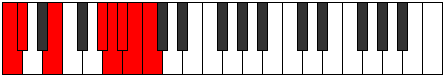

# Mode Aeolarian

## Links

- [Documentation](README.md)
- [Scales Index](Scales.md)
- [Modes Index](Modes.md)
- [Chords Index](Chords.md)

## Parent Scale

[Katyptian](ScaleKatyptian.md)

## Number

[3859](https://ianring.com/musictheory/scales/3859)

## Interval Pattern

1, 3, 4, 1, 1, 1, 1

## Chord Pattern

vi⁰b3

## Perfection

- 3 Perfect notes
- 4 Perfect notes

## Perfection Profile

[false true true false true false false]

## Permutations

| Tonic | Notes | Signature | Illustration | Audio |
|-------|-------|-----------|--------------|-------|
| [C](ModeCNaturalAeolarian.md) | **C**, Db, E, **F###**, G##, **A#**, **B**, **C** | C |  | [midi](https://github.com/edipermadi/music/blob/main/docs/ModeCNaturalAeolarian.mid?raw=true) |
| [C#](ModeCSharpAeolarian.md) | **C#**, D, E#, **Cbbb**, Cbb, **Dbbb**, **Dbb**, **C#** | C |  | [midi](https://github.com/edipermadi/music/blob/main/docs/ModeCSharpAeolarian.mid?raw=true) |
| [Db](ModeDFlatAeolarian.md) | **Db**, Ebb, F, **G##**, A#, **B**, **C**, **Db** | C |  | [midi](https://github.com/edipermadi/music/blob/main/docs/ModeDFlatAeolarian.mid?raw=true) |
| [D](ModeDNaturalAeolarian.md) | **D**, Eb, F#, **G###**, A##, **B#**, **C#**, **D** | C |  | [midi](https://github.com/edipermadi/music/blob/main/docs/ModeDNaturalAeolarian.mid?raw=true) |
| [D#](ModeDSharpAeolarian.md) | **D#**, E, F##, **Cb**, Dbb, **Ebbb**, **Fbbb**, **D#** | C |  | [midi](https://github.com/edipermadi/music/blob/main/docs/ModeDSharpAeolarian.mid?raw=true) |
| [Eb](ModeEFlatAeolarian.md) | **Eb**, Fb, G, **A##**, B#, **C#**, **D**, **Eb** | C |  | [midi](https://github.com/edipermadi/music/blob/main/docs/ModeEFlatAeolarian.mid?raw=true) |
| [E](ModeENaturalAeolarian.md) | **E**, F, G#, **A###**, B##, **C##**, **D#**, **E** | C |  | [midi](https://github.com/edipermadi/music/blob/main/docs/ModeENaturalAeolarian.mid?raw=true) |
| [F](ModeFNaturalAeolarian.md) | **F**, Gb, A, **B##**, C##, **D#**, **E**, **F** | C |  | [midi](https://github.com/edipermadi/music/blob/main/docs/ModeFNaturalAeolarian.mid?raw=true) |
| [F#](ModeFSharpAeolarian.md) | **F#**, G, A#, **B###**, C###, **D##**, **E#**, **F#** | C |  | [midi](https://github.com/edipermadi/music/blob/main/docs/ModeFSharpAeolarian.mid?raw=true) |
| [Gb](ModeGFlatAeolarian.md) | **Gb**, Abb, Bb, **C##**, D#, **E**, **F**, **Gb** | C |  | [midi](https://github.com/edipermadi/music/blob/main/docs/ModeGFlatAeolarian.mid?raw=true) |
| [G](ModeGNaturalAeolarian.md) | **G**, Ab, B, **C###**, D##, **E#**, **F#**, **G** | C |  | [midi](https://github.com/edipermadi/music/blob/main/docs/ModeGNaturalAeolarian.mid?raw=true) |
| [G#](ModeGSharpAeolarian.md) | **G#**, A, B#, **D##**, E#, **F#**, **G**, **G#** | C |  | [midi](https://github.com/edipermadi/music/blob/main/docs/ModeGSharpAeolarian.mid?raw=true) |
| [Ab](ModeAFlatAeolarian.md) | **Ab**, Bbb, C, **D##**, E#, **F#**, **G**, **Ab** | C |  | [midi](https://github.com/edipermadi/music/blob/main/docs/ModeAFlatAeolarian.mid?raw=true) |
| [A](ModeANaturalAeolarian.md) | **A**, Bb, C#, **D###**, E##, **F##**, **G#**, **A** | C |  | [midi](https://github.com/edipermadi/music/blob/main/docs/ModeANaturalAeolarian.mid?raw=true) |
| [A#](ModeASharpAeolarian.md) | **A#**, B, C##, **E##**, F##, **G#**, **A**, **A#** | C |  | [midi](https://github.com/edipermadi/music/blob/main/docs/ModeASharpAeolarian.mid?raw=true) |
| [Bb](ModeBFlatAeolarian.md) | **Bb**, Cb, D, **E##**, F##, **G#**, **A**, **Bb** | C |  | [midi](https://github.com/edipermadi/music/blob/main/docs/ModeBFlatAeolarian.mid?raw=true) |
| [B](ModeBNaturalAeolarian.md) | **B**, C, D#, **E###**, F###, **G##**, **A#**, **B** | C |  | [midi](https://github.com/edipermadi/music/blob/main/docs/ModeBNaturalAeolarian.mid?raw=true) |
