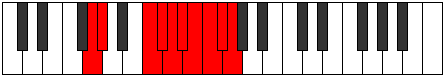

# Mode Aeolarygic

## Links

- [Documentation](index.md)
- [Scales Index](Scales.md)
- [Modes Index](Modes.md)
- [Chords Index](Chords.md)

## Parent Scale

[Manygic](ScaleManygic.md)

## Number

[4067](https://ianring.com/musictheory/scales/4067)

## Perfection

- 6 Perfect notes
- 3 Perfect notes

## Perfection Profile

[true true true true false false false true true]

## Permutations

| Tonic | Notes | Signature | Illustration | Audio |
|-------|-------|-----------|--------------|-------|
| [C](ModeCNaturalAeolarygic.md) | C, C#, F, F#, **G**, **G#**, **A**, A#, B, C | C |  | [midi](ModeCNaturalAeolarygic.mid) [ogg](ModeCNaturalAeolarygic.ogg) |
| [C#](ModeCSharpAeolarygic.md) | C#, D, F#, G, **G#**, **A**, **A#**, B, C, C# | C |  | [midi](ModeCSharpAeolarygic.mid) [ogg](ModeCSharpAeolarygic.ogg) |
| [Db](ModeDFlatAeolarygic.md) | Db, D, Gb, G, **Ab**, **A**, **Bb**, B, C, Db | C |  | [midi](ModeDFlatAeolarygic.mid) [ogg](ModeDFlatAeolarygic.ogg) |
| [D](ModeDNaturalAeolarygic.md) | D, D#, G, G#, **A**, **A#**, **B**, C, C#, D | C |  | [midi](ModeDNaturalAeolarygic.mid) [ogg](ModeDNaturalAeolarygic.ogg) |
| [D#](ModeDSharpAeolarygic.md) | D#, E, G#, A, **A#**, **B**, **C**, C#, D, D# | C |  | [midi](ModeDSharpAeolarygic.mid) [ogg](ModeDSharpAeolarygic.ogg) |
| [Eb](ModeEFlatAeolarygic.md) | Eb, E, Ab, A, **Bb**, **B**, **C**, Db, D, Eb | C |  | [midi](ModeEFlatAeolarygic.mid) [ogg](ModeEFlatAeolarygic.ogg) |
| [E](ModeENaturalAeolarygic.md) | E, F, A, A#, **B**, **C**, **C#**, D, D#, E | C |  | [midi](ModeENaturalAeolarygic.mid) [ogg](ModeENaturalAeolarygic.ogg) |
| [F](ModeFNaturalAeolarygic.md) | F, F#, A#, B, **C**, **C#**, **D**, D#, E, F | C |  | [midi](ModeFNaturalAeolarygic.mid) [ogg](ModeFNaturalAeolarygic.ogg) |
| [F#](ModeFSharpAeolarygic.md) | F#, G, B, C, **C#**, **D**, **D#**, E, F, F# | C |  | [midi](ModeFSharpAeolarygic.mid) [ogg](ModeFSharpAeolarygic.ogg) |
| [Gb](ModeGFlatAeolarygic.md) | Gb, G, B, C, **Db**, **D**, **Eb**, E, F, Gb | C |  | [midi](ModeGFlatAeolarygic.mid) [ogg](ModeGFlatAeolarygic.ogg) |
| [G](ModeGNaturalAeolarygic.md) | G, G#, C, C#, **D**, **D#**, **E**, F, F#, G | C |  | [midi](ModeGNaturalAeolarygic.mid) [ogg](ModeGNaturalAeolarygic.ogg) |
| [G#](ModeGSharpAeolarygic.md) | G#, A, C#, D, **D#**, **E**, **F**, F#, G, G# | C |  | [midi](ModeGSharpAeolarygic.mid) [ogg](ModeGSharpAeolarygic.ogg) |
| [Ab](ModeAFlatAeolarygic.md) | Ab, A, Db, D, **Eb**, **E**, **F**, Gb, G, Ab | C |  | [midi](ModeAFlatAeolarygic.mid) [ogg](ModeAFlatAeolarygic.ogg) |
| [A](ModeANaturalAeolarygic.md) | A, A#, D, D#, **E**, **F**, **F#**, G, G#, A | C |  | [midi](ModeANaturalAeolarygic.mid) [ogg](ModeANaturalAeolarygic.ogg) |
| [A#](ModeASharpAeolarygic.md) | A#, B, D#, E, **F**, **F#**, **G**, G#, A, A# | C |  | [midi](ModeASharpAeolarygic.mid) [ogg](ModeASharpAeolarygic.ogg) |
| [Bb](ModeBFlatAeolarygic.md) | Bb, B, Eb, E, **F**, **Gb**, **G**, Ab, A, Bb | C |  | [midi](ModeBFlatAeolarygic.mid) [ogg](ModeBFlatAeolarygic.ogg) |
| [B](ModeBNaturalAeolarygic.md) | B, C, E, F, **F#**, **G**, **G#**, A, A#, B | C |  | [midi](ModeBNaturalAeolarygic.mid) [ogg](ModeBNaturalAeolarygic.ogg) |
