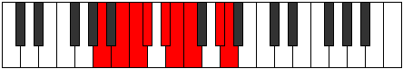

# Mode Aeolaryllic

## Links

- [Documentation](index.md)
- [Scales Index](Scales.md)
- [Modes Index](Modes.md)
- [Chords Index](Chords.md)

## Parent Scale

[Thyptyllic](ScaleThyptyllic.md)

## Number

[2525](https://ianring.com/musictheory/scales/2525)

## Perfection

- 5 Perfect notes
- 3 Perfect notes

## Perfection Profile

[true false false true false true true true]

## Permutations

| Tonic | Notes | Signature | Illustration | Audio |
|-------|-------|-----------|--------------|-------|
| [C](ModeCNaturalAeolaryllic.md) | C, **D**, **D#**, E, **F#**, G, G#, B, C | C |  | [midi](https://github.com/edipermadi/music/blob/main/docs/ModeCNaturalAeolaryllic.mid?raw=true) |
| [C#](ModeCSharpAeolaryllic.md) | C#, **D#**, **E**, F, **G**, G#, A, C, C# | C |  | [midi](https://github.com/edipermadi/music/blob/main/docs/ModeCSharpAeolaryllic.mid?raw=true) |
| [Db](ModeDFlatAeolaryllic.md) | Db, **Eb**, **E**, F, **G**, Ab, A, C, Db | C |  | [midi](https://github.com/edipermadi/music/blob/main/docs/ModeDFlatAeolaryllic.mid?raw=true) |
| [D](ModeDNaturalAeolaryllic.md) | D, **E**, **F**, F#, **G#**, A, A#, C#, D | C |  | [midi](https://github.com/edipermadi/music/blob/main/docs/ModeDNaturalAeolaryllic.mid?raw=true) |
| [D#](ModeDSharpAeolaryllic.md) | D#, **F**, **F#**, G, **A**, A#, B, D, D# | C |  | [midi](https://github.com/edipermadi/music/blob/main/docs/ModeDSharpAeolaryllic.mid?raw=true) |
| [Eb](ModeEFlatAeolaryllic.md) | Eb, **F**, **Gb**, G, **A**, Bb, B, D, Eb | C |  | [midi](https://github.com/edipermadi/music/blob/main/docs/ModeEFlatAeolaryllic.mid?raw=true) |
| [E](ModeENaturalAeolaryllic.md) | E, **F#**, **G**, G#, **A#**, B, C, D#, E | C |  | [midi](https://github.com/edipermadi/music/blob/main/docs/ModeENaturalAeolaryllic.mid?raw=true) |
| [F](ModeFNaturalAeolaryllic.md) | F, **G**, **G#**, A, **B**, C, C#, E, F | C |  | [midi](https://github.com/edipermadi/music/blob/main/docs/ModeFNaturalAeolaryllic.mid?raw=true) |
| [F#](ModeFSharpAeolaryllic.md) | F#, **G#**, **A**, A#, **C**, C#, D, F, F# | C |  | [midi](https://github.com/edipermadi/music/blob/main/docs/ModeFSharpAeolaryllic.mid?raw=true) |
| [Gb](ModeGFlatAeolaryllic.md) | Gb, **Ab**, **A**, Bb, **C**, Db, D, F, Gb | C |  | [midi](https://github.com/edipermadi/music/blob/main/docs/ModeGFlatAeolaryllic.mid?raw=true) |
| [G](ModeGNaturalAeolaryllic.md) | G, **A**, **A#**, B, **C#**, D, D#, F#, G | C |  | [midi](https://github.com/edipermadi/music/blob/main/docs/ModeGNaturalAeolaryllic.mid?raw=true) |
| [G#](ModeGSharpAeolaryllic.md) | G#, **A#**, **B**, C, **D**, D#, E, G, G# | C |  | [midi](https://github.com/edipermadi/music/blob/main/docs/ModeGSharpAeolaryllic.mid?raw=true) |
| [Ab](ModeAFlatAeolaryllic.md) | Ab, **Bb**, **B**, C, **D**, Eb, E, G, Ab | C |  | [midi](https://github.com/edipermadi/music/blob/main/docs/ModeAFlatAeolaryllic.mid?raw=true) |
| [A](ModeANaturalAeolaryllic.md) | A, **B**, **C**, C#, **D#**, E, F, G#, A | C |  | [midi](https://github.com/edipermadi/music/blob/main/docs/ModeANaturalAeolaryllic.mid?raw=true) |
| [A#](ModeASharpAeolaryllic.md) | A#, **C**, **C#**, D, **E**, F, F#, A, A# | C |  | [midi](https://github.com/edipermadi/music/blob/main/docs/ModeASharpAeolaryllic.mid?raw=true) |
| [Bb](ModeBFlatAeolaryllic.md) | Bb, **C**, **Db**, D, **E**, F, Gb, A, Bb | C |  | [midi](https://github.com/edipermadi/music/blob/main/docs/ModeBFlatAeolaryllic.mid?raw=true) |
| [B](ModeBNaturalAeolaryllic.md) | B, **C#**, **D**, D#, **F**, F#, G, A#, B | C |  | [midi](https://github.com/edipermadi/music/blob/main/docs/ModeBNaturalAeolaryllic.mid?raw=true) |
