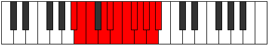

# Mode Aeolatic

## Links

- [Documentation](index.md)
- [Scales Index](Scales.md)
- [Modes Index](Modes.md)
- [Chords Index](Chords.md)

## Parent Scale

[Aerycratic](ScaleAerycratic.md)

## Number

[4087](https://ianring.com/musictheory/scales/4087)

## Interval Pattern

1, 1, 2, 1, 1, 1, 1, 1, 1, 1, 1

## Chord Pattern

## Perfection

- 10 Perfect notes
- 1 Perfect notes

## Perfection Profile

[true true true true true true true false true true true]

## Permutations

| Tonic | Notes | Signature | Illustration | Audio |
|-------|-------|-----------|--------------|-------|
| [C](ModeCNaturalAeolatic.md) | C, C#, D, E, F, F#, G, **G#**, A, A#, B, C | C |  | [midi](https://github.com/edipermadi/music/blob/main/docs/ModeCNaturalAeolatic.mid?raw=true) |
| [C#](ModeCSharpAeolatic.md) | C#, D, D#, F, F#, G, G#, **A**, A#, B, C, C# | C |  | [midi](https://github.com/edipermadi/music/blob/main/docs/ModeCSharpAeolatic.mid?raw=true) |
| [Db](ModeDFlatAeolatic.md) | Db, D, Eb, F, Gb, G, Ab, **A**, Bb, B, C, Db | C |  | [midi](https://github.com/edipermadi/music/blob/main/docs/ModeDFlatAeolatic.mid?raw=true) |
| [D](ModeDNaturalAeolatic.md) | D, D#, E, F#, G, G#, A, **A#**, B, C, C#, D | C |  | [midi](https://github.com/edipermadi/music/blob/main/docs/ModeDNaturalAeolatic.mid?raw=true) |
| [D#](ModeDSharpAeolatic.md) | D#, E, F, G, G#, A, A#, **B**, C, C#, D, D# | C |  | [midi](https://github.com/edipermadi/music/blob/main/docs/ModeDSharpAeolatic.mid?raw=true) |
| [Eb](ModeEFlatAeolatic.md) | Eb, E, F, G, Ab, A, Bb, **B**, C, Db, D, Eb | C |  | [midi](https://github.com/edipermadi/music/blob/main/docs/ModeEFlatAeolatic.mid?raw=true) |
| [E](ModeENaturalAeolatic.md) | E, F, F#, G#, A, A#, B, **C**, C#, D, D#, E | C |  | [midi](https://github.com/edipermadi/music/blob/main/docs/ModeENaturalAeolatic.mid?raw=true) |
| [F](ModeFNaturalAeolatic.md) | F, F#, G, A, A#, B, C, **C#**, D, D#, E, F | C |  | [midi](https://github.com/edipermadi/music/blob/main/docs/ModeFNaturalAeolatic.mid?raw=true) |
| [F#](ModeFSharpAeolatic.md) | F#, G, G#, A#, B, C, C#, **D**, D#, E, F, F# | C |  | [midi](https://github.com/edipermadi/music/blob/main/docs/ModeFSharpAeolatic.mid?raw=true) |
| [Gb](ModeGFlatAeolatic.md) | Gb, G, Ab, Bb, B, C, Db, **D**, Eb, E, F, Gb | C |  | [midi](https://github.com/edipermadi/music/blob/main/docs/ModeGFlatAeolatic.mid?raw=true) |
| [G](ModeGNaturalAeolatic.md) | G, G#, A, B, C, C#, D, **D#**, E, F, F#, G | C |  | [midi](https://github.com/edipermadi/music/blob/main/docs/ModeGNaturalAeolatic.mid?raw=true) |
| [G#](ModeGSharpAeolatic.md) | G#, A, A#, C, C#, D, D#, **E**, F, F#, G, G# | C |  | [midi](https://github.com/edipermadi/music/blob/main/docs/ModeGSharpAeolatic.mid?raw=true) |
| [Ab](ModeAFlatAeolatic.md) | Ab, A, Bb, C, Db, D, Eb, **E**, F, Gb, G, Ab | C |  | [midi](https://github.com/edipermadi/music/blob/main/docs/ModeAFlatAeolatic.mid?raw=true) |
| [A](ModeANaturalAeolatic.md) | A, A#, B, C#, D, D#, E, **F**, F#, G, G#, A | C |  | [midi](https://github.com/edipermadi/music/blob/main/docs/ModeANaturalAeolatic.mid?raw=true) |
| [A#](ModeASharpAeolatic.md) | A#, B, C, D, D#, E, F, **F#**, G, G#, A, A# | C |  | [midi](https://github.com/edipermadi/music/blob/main/docs/ModeASharpAeolatic.mid?raw=true) |
| [Bb](ModeBFlatAeolatic.md) | Bb, B, C, D, Eb, E, F, **Gb**, G, Ab, A, Bb | C |  | [midi](https://github.com/edipermadi/music/blob/main/docs/ModeBFlatAeolatic.mid?raw=true) |
| [B](ModeBNaturalAeolatic.md) | B, C, C#, D#, E, F, F#, **G**, G#, A, A#, B | C |  | [midi](https://github.com/edipermadi/music/blob/main/docs/ModeBNaturalAeolatic.mid?raw=true) |
