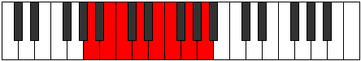
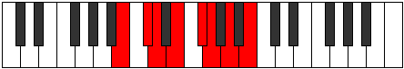

# Mode Aeolian

## Links

- [Documentation](README.md)
- [Scales Index](Scales.md)
- [Modes Index](Modes.md)
- [Chords Index](Chords.md)

## Parent Scale

[Lydian](ScaleLydian.md)

## Number

[1453](https://ianring.com/musictheory/scales/1453)

## Transposition

2, 1, 2, 2, 1, 2, 2

## Chord Pattern

i, ii⁰, III, III, iv, v, VI, VI, VII, VII

## Perfection

- 6 Perfect notes
- 1 Perfect notes

## Perfection Profile

[true false true true true true true]

## Permutations

| Tonic | Notes | Signature | Illustration | Audio |
|-------|-------|-----------|--------------|-------|
| [C](ModeCNaturalAeolian.md) | C, **D**, Eb, F, G, Ab, Bb, C | Eb |  | [midi](https://github.com/edipermadi/music/blob/main/docs/ModeCNaturalAeolian.mid?raw=true) |
| [C#](ModeCSharpAeolian.md) | C#, **D#**, E, F#, G#, A, B, C# | E |  | [midi](https://github.com/edipermadi/music/blob/main/docs/ModeCSharpAeolian.mid?raw=true) |
| [Db](ModeDFlatAeolian.md) | Db, **Eb**, Fb, Gb, Ab, Bbb, Cb, Db | E |  | [midi](https://github.com/edipermadi/music/blob/main/docs/ModeDFlatAeolian.mid?raw=true) |
| [D](ModeDNaturalAeolian.md) | D, **E**, F, G, A, Bb, C, D | F |  | [midi](https://github.com/edipermadi/music/blob/main/docs/ModeDNaturalAeolian.mid?raw=true) |
| [D#](ModeDSharpAeolian.md) | D#, **E#**, F#, G#, A#, B, C#, D# | F#, Gb |  | [midi](https://github.com/edipermadi/music/blob/main/docs/ModeDSharpAeolian.mid?raw=true) |
| [Eb](ModeEFlatAeolian.md) | Eb, **F**, Gb, Ab, Bb, Cb, Db, Eb | F#, Gb |  | [midi](https://github.com/edipermadi/music/blob/main/docs/ModeEFlatAeolian.mid?raw=true) |
| [E](ModeENaturalAeolian.md) | E, **F#**, G, A, B, C, D, E | G |  | [midi](https://github.com/edipermadi/music/blob/main/docs/ModeENaturalAeolian.mid?raw=true) |
| [F](ModeFNaturalAeolian.md) | F, **G**, Ab, Bb, C, Db, Eb, F | Ab |  | [midi](https://github.com/edipermadi/music/blob/main/docs/ModeFNaturalAeolian.mid?raw=true) |
| [F#](ModeFSharpAeolian.md) | F#, **G#**, A, B, C#, D, E, F# | A |  | [midi](https://github.com/edipermadi/music/blob/main/docs/ModeFSharpAeolian.mid?raw=true) |
| [Gb](ModeGFlatAeolian.md) | Gb, **Ab**, Bbb, Cb, Db, Ebb, Fb, Gb | A |  | [midi](https://github.com/edipermadi/music/blob/main/docs/ModeGFlatAeolian.mid?raw=true) |
| [G](ModeGNaturalAeolian.md) | G, **A**, Bb, C, D, Eb, F, G | Bb |  | [midi](https://github.com/edipermadi/music/blob/main/docs/ModeGNaturalAeolian.mid?raw=true) |
| [G#](ModeGSharpAeolian.md) | G#, **A#**, B, C#, D#, E, F#, G# | B |  | [midi](https://github.com/edipermadi/music/blob/main/docs/ModeGSharpAeolian.mid?raw=true) |
| [Ab](ModeAFlatAeolian.md) | Ab, **Bb**, Cb, Db, Eb, Fb, Gb, Ab | B |  | [midi](https://github.com/edipermadi/music/blob/main/docs/ModeAFlatAeolian.mid?raw=true) |
| [A](ModeANaturalAeolian.md) | A, **B**, C, D, E, F, G, A | C |  | [midi](https://github.com/edipermadi/music/blob/main/docs/ModeANaturalAeolian.mid?raw=true) |
| [A#](ModeASharpAeolian.md) | A#, **B#**, C#, D#, E#, F#, G#, A# | Db, C# |  | [midi](https://github.com/edipermadi/music/blob/main/docs/ModeASharpAeolian.mid?raw=true) |
| [Bb](ModeBFlatAeolian.md) | Bb, **C**, Db, Eb, F, Gb, Ab, Bb | Db, C# |  | [midi](https://github.com/edipermadi/music/blob/main/docs/ModeBFlatAeolian.mid?raw=true) |
| [B](ModeBNaturalAeolian.md) | B, **C#**, D, E, F#, G, A, B | D |  | [midi](https://github.com/edipermadi/music/blob/main/docs/ModeBNaturalAeolian.mid?raw=true) |
