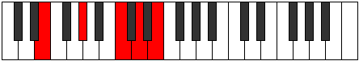

# Mode Aeolic

## Links

- [Documentation](README.md)
- [Scales Index](Scales.md)
- [Modes Index](Modes.md)
- [Chords Index](Chords.md)

## Parent Scale

[Aeolic](ScaleAeolic.md)

## Number

[1297](https://ianring.com/musictheory/scales/1297)

## Transposition

4, 4, 2, 2

## Chord Pattern

## Perfection

- 0 Perfect notes
- 4 Perfect notes

## Perfection Profile

false, false, false, false

## Permutations

| Tonic | Notes | Signature | Illustration | Audio |
|-------|-------|-----------|--------------|-------|
| [C](ModeCNaturalAeolic.md) | **C**, **E**, **G#**, **A#**, **C** | C |  | [midi](https://github.com/edipermadi/music/blob/main/docs/ModeCNaturalAeolic.mid?raw=true) |
| [C#](ModeCSharpAeolic.md) | **C#**, **F**, **A**, **B**, **C#** | C |  | [midi](https://github.com/edipermadi/music/blob/main/docs/ModeCSharpAeolic.mid?raw=true) |
| [Db](ModeDFlatAeolic.md) | **Db**, **F**, **A**, **B**, **Db** | C |  | [midi](https://github.com/edipermadi/music/blob/main/docs/ModeDFlatAeolic.mid?raw=true) |
| [D](ModeDNaturalAeolic.md) | **D**, **F#**, **A#**, **C**, **D** | C |  | [midi](https://github.com/edipermadi/music/blob/main/docs/ModeDNaturalAeolic.mid?raw=true) |
| [D#](ModeDSharpAeolic.md) | **D#**, **G**, **B**, **C#**, **D#** | C |  | [midi](https://github.com/edipermadi/music/blob/main/docs/ModeDSharpAeolic.mid?raw=true) |
| [Eb](ModeEFlatAeolic.md) | **Eb**, **G**, **B**, **Db**, **Eb** | C |  | [midi](https://github.com/edipermadi/music/blob/main/docs/ModeEFlatAeolic.mid?raw=true) |
| [E](ModeENaturalAeolic.md) | **E**, **G#**, **C**, **D**, **E** | C |  | [midi](https://github.com/edipermadi/music/blob/main/docs/ModeENaturalAeolic.mid?raw=true) |
| [F](ModeFNaturalAeolic.md) | **F**, **A**, **C#**, **D#**, **F** | C |  | [midi](https://github.com/edipermadi/music/blob/main/docs/ModeFNaturalAeolic.mid?raw=true) |
| [F#](ModeFSharpAeolic.md) | **F#**, **A#**, **D**, **E**, **F#** | C |  | [midi](https://github.com/edipermadi/music/blob/main/docs/ModeFSharpAeolic.mid?raw=true) |
| [Gb](ModeGFlatAeolic.md) | **Gb**, **Bb**, **D**, **E**, **Gb** | C |  | [midi](https://github.com/edipermadi/music/blob/main/docs/ModeGFlatAeolic.mid?raw=true) |
| [G](ModeGNaturalAeolic.md) | **G**, **B**, **D#**, **F**, **G** | C |  | [midi](https://github.com/edipermadi/music/blob/main/docs/ModeGNaturalAeolic.mid?raw=true) |
| [G#](ModeGSharpAeolic.md) | **G#**, **C**, **E**, **F#**, **G#** | C |  | [midi](https://github.com/edipermadi/music/blob/main/docs/ModeGSharpAeolic.mid?raw=true) |
| [Ab](ModeAFlatAeolic.md) | **Ab**, **C**, **E**, **Gb**, **Ab** | C |  | [midi](https://github.com/edipermadi/music/blob/main/docs/ModeAFlatAeolic.mid?raw=true) |
| [A](ModeANaturalAeolic.md) | **A**, **C#**, **F**, **G**, **A** | C |  | [midi](https://github.com/edipermadi/music/blob/main/docs/ModeANaturalAeolic.mid?raw=true) |
| [A#](ModeASharpAeolic.md) | **A#**, **D**, **F#**, **G#**, **A#** | C |  | [midi](https://github.com/edipermadi/music/blob/main/docs/ModeASharpAeolic.mid?raw=true) |
| [Bb](ModeBFlatAeolic.md) | **Bb**, **D**, **Gb**, **Ab**, **Bb** | C |  | [midi](https://github.com/edipermadi/music/blob/main/docs/ModeBFlatAeolic.mid?raw=true) |
| [B](ModeBNaturalAeolic.md) | **B**, **D#**, **G**, **A**, **B** | C |  | [midi](https://github.com/edipermadi/music/blob/main/docs/ModeBNaturalAeolic.mid?raw=true) |
