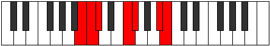

# Mode Aeolimic

## Links

- [Documentation](index.md)
- [Scales Index](Scales.md)
- [Modes Index](Modes.md)
- [Chords Index](Chords.md)

## Parent Scale

[Daptimic](ScaleDaptimic.md)

## Number

[2247](https://ianring.com/musictheory/scales/2247)

## Interval Pattern

1, 1, 4, 1, 4, 1

## Chord Pattern

V, vi

## Perfection

- 4 Perfect notes
- 2 Perfect notes

## Perfection Profile

[true false false true true true]

## Permutations

| Tonic | Notes | Signature | Illustration | Audio |
|-------|-------|-----------|--------------|-------|
| [C](ModeCNaturalAeolimic.md) | C, **Db**, **Ebb**, F#, G, A##, C | C |  | [midi](https://github.com/edipermadi/music/blob/main/docs/ModeCNaturalAeolimic.mid?raw=true) |
| [C#](ModeCSharpAeolimic.md) | C#, **D**, **Eb**, F##, G#, A###, C# | C |  | [midi](https://github.com/edipermadi/music/blob/main/docs/ModeCSharpAeolimic.mid?raw=true) |
| [Db](ModeDFlatAeolimic.md) | Db, **Ebb**, **Fbb**, G, Ab, B#, Db | C |  | [midi](https://github.com/edipermadi/music/blob/main/docs/ModeDFlatAeolimic.mid?raw=true) |
| [D](ModeDNaturalAeolimic.md) | D, **Eb**, **Fb**, G#, A, B##, D | C |  | [midi](https://github.com/edipermadi/music/blob/main/docs/ModeDNaturalAeolimic.mid?raw=true) |
| [D#](ModeDSharpAeolimic.md) | D#, **E**, **F**, G##, A#, B###, D# | C |  | [midi](https://github.com/edipermadi/music/blob/main/docs/ModeDSharpAeolimic.mid?raw=true) |
| [Eb](ModeEFlatAeolimic.md) | Eb, **Fb**, **Gbb**, A, Bb, C##, Eb | C |  | [midi](https://github.com/edipermadi/music/blob/main/docs/ModeEFlatAeolimic.mid?raw=true) |
| [E](ModeENaturalAeolimic.md) | E, **F**, **Gb**, A#, B, C###, E | C |  | [midi](https://github.com/edipermadi/music/blob/main/docs/ModeENaturalAeolimic.mid?raw=true) |
| [F](ModeFNaturalAeolimic.md) | F, **Gb**, **Abb**, B, C, D##, F | C |  | [midi](https://github.com/edipermadi/music/blob/main/docs/ModeFNaturalAeolimic.mid?raw=true) |
| [F#](ModeFSharpAeolimic.md) | F#, **G**, **Ab**, B#, C#, D###, F# | C |  | [midi](https://github.com/edipermadi/music/blob/main/docs/ModeFSharpAeolimic.mid?raw=true) |
| [Gb](ModeGFlatAeolimic.md) | Gb, **Abb**, **Bbbb**, C, Db, E#, Gb | C |  | [midi](https://github.com/edipermadi/music/blob/main/docs/ModeGFlatAeolimic.mid?raw=true) |
| [G](ModeGNaturalAeolimic.md) | G, **Ab**, **Bbb**, C#, D, E##, G | C |  | [midi](https://github.com/edipermadi/music/blob/main/docs/ModeGNaturalAeolimic.mid?raw=true) |
| [G#](ModeGSharpAeolimic.md) | G#, **A**, **Bb**, C##, D#, E###, G# | C |  | [midi](https://github.com/edipermadi/music/blob/main/docs/ModeGSharpAeolimic.mid?raw=true) |
| [Ab](ModeAFlatAeolimic.md) | Ab, **Bbb**, **Cbb**, D, Eb, F##, Ab | C |  | [midi](https://github.com/edipermadi/music/blob/main/docs/ModeAFlatAeolimic.mid?raw=true) |
| [A](ModeANaturalAeolimic.md) | A, **Bb**, **Cb**, D#, E, F###, A | C |  | [midi](https://github.com/edipermadi/music/blob/main/docs/ModeANaturalAeolimic.mid?raw=true) |
| [A#](ModeASharpAeolimic.md) | A#, **B**, **C**, D##, E#, Cbbb, A# | C |  | [midi](https://github.com/edipermadi/music/blob/main/docs/ModeASharpAeolimic.mid?raw=true) |
| [Bb](ModeBFlatAeolimic.md) | Bb, **Cb**, **Dbb**, E, F, G##, Bb | C |  | [midi](https://github.com/edipermadi/music/blob/main/docs/ModeBFlatAeolimic.mid?raw=true) |
| [B](ModeBNaturalAeolimic.md) | B, **C**, **Db**, E#, F#, G###, B | C |  | [midi](https://github.com/edipermadi/music/blob/main/docs/ModeBNaturalAeolimic.mid?raw=true) |
