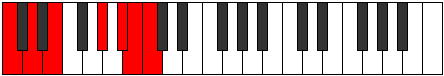

# Mode Aeolocrimic

## Links

- [Documentation](index.md)
- [Scales Index](Scales.md)
- [Modes Index](Modes.md)
- [Chords Index](Chords.md)

## Parent Scale

[Gacrimic](ScaleGacrimic.md)

## Number

[3349](https://ianring.com/musictheory/scales/3349)

## Perfection

- 1 Perfect notes
- 5 Perfect notes

## Perfection Profile

[false false true false false false]

## Permutations

| Tonic | Notes | Signature | Illustration | Audio |
|-------|-------|-----------|--------------|-------|
| [C](ModeCNaturalAeolocrimic.md) | **C**, **D**, E, **F###**, **G###**, **A##**, **C** | C |  | [midi](ModeCNaturalAeolocrimic.mid) [ogg](ModeCNaturalAeolocrimic.ogg) |
| [C#](ModeCSharpAeolocrimic.md) | **C#**, **D#**, E#, **Cbbb**, **Dbbb**, **Dbb**, **C#** | C |  | [midi](ModeCSharpAeolocrimic.mid) [ogg](ModeCSharpAeolocrimic.ogg) |
| [Db](ModeDFlatAeolocrimic.md) | **Db**, **Eb**, F, **G##**, **A##**, **B#**, **Db** | C |  | [midi](ModeDFlatAeolocrimic.mid) [ogg](ModeDFlatAeolocrimic.ogg) |
| [D](ModeDNaturalAeolocrimic.md) | **D**, **E**, F#, **G###**, **A###**, **B##**, **D** | C |  | [midi](ModeDNaturalAeolocrimic.mid) [ogg](ModeDNaturalAeolocrimic.ogg) |
| [D#](ModeDSharpAeolocrimic.md) | **D#**, **E#**, F##, **Cb**, **Db**, **Ebb**, **D#** | C |  | [midi](ModeDSharpAeolocrimic.mid) [ogg](ModeDSharpAeolocrimic.ogg) |
| [Eb](ModeEFlatAeolocrimic.md) | **Eb**, **F**, G, **A##**, **B##**, **C##**, **Eb** | C |  | [midi](ModeEFlatAeolocrimic.mid) [ogg](ModeEFlatAeolocrimic.ogg) |
| [E](ModeENaturalAeolocrimic.md) | **E**, **F#**, G#, **A###**, **B###**, **C###**, **E** | C |  | [midi](ModeENaturalAeolocrimic.mid) [ogg](ModeENaturalAeolocrimic.ogg) |
| [F](ModeFNaturalAeolocrimic.md) | **F**, **G**, A, **B##**, **C###**, **D##**, **F** | C |  | [midi](ModeFNaturalAeolocrimic.mid) [ogg](ModeFNaturalAeolocrimic.ogg) |
| [F#](ModeFSharpAeolocrimic.md) | **F#**, **G#**, A#, **B###**, **D##**, **E#**, **F#** | C |  | [midi](ModeFSharpAeolocrimic.mid) [ogg](ModeFSharpAeolocrimic.ogg) |
| [Gb](ModeGFlatAeolocrimic.md) | **Gb**, **Ab**, Bb, **C##**, **D##**, **E#**, **Gb** | C |  | [midi](ModeGFlatAeolocrimic.mid) [ogg](ModeGFlatAeolocrimic.ogg) |
| [G](ModeGNaturalAeolocrimic.md) | **G**, **A**, B, **C###**, **D###**, **E##**, **G** | C |  | [midi](ModeGNaturalAeolocrimic.mid) [ogg](ModeGNaturalAeolocrimic.ogg) |
| [G#](ModeGSharpAeolocrimic.md) | **G#**, **A#**, B#, **D##**, **E##**, **F##**, **G#** | C |  | [midi](ModeGSharpAeolocrimic.mid) [ogg](ModeGSharpAeolocrimic.ogg) |
| [Ab](ModeAFlatAeolocrimic.md) | **Ab**, **Bb**, C, **D##**, **E##**, **F##**, **Ab** | C |  | [midi](ModeAFlatAeolocrimic.mid) [ogg](ModeAFlatAeolocrimic.ogg) |
| [A](ModeANaturalAeolocrimic.md) | **A**, **B**, C#, **D###**, **E###**, **F###**, **A** | C |  | [midi](ModeANaturalAeolocrimic.mid) [ogg](ModeANaturalAeolocrimic.ogg) |
| [A#](ModeASharpAeolocrimic.md) | **A#**, **B#**, C##, **E##**, **F###**, **G##**, **A#** | C |  | [midi](ModeASharpAeolocrimic.mid) [ogg](ModeASharpAeolocrimic.ogg) |
| [Bb](ModeBFlatAeolocrimic.md) | **Bb**, **C**, D, **E##**, **F###**, **G##**, **Bb** | C |  | [midi](ModeBFlatAeolocrimic.mid) [ogg](ModeBFlatAeolocrimic.ogg) |
| [B](ModeBNaturalAeolocrimic.md) | **B**, **C#**, D#, **E###**, **Cbbb**, **Cbb**, **B** | C |  | [midi](ModeBNaturalAeolocrimic.mid) [ogg](ModeBNaturalAeolocrimic.ogg) |
