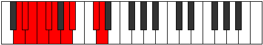

# Mode Aeolocrygic

## Links

- [Documentation](index.md)
- [Scales Index](Scales.md)
- [Modes Index](Modes.md)
- [Chords Index](Chords.md)

## Parent Scale

[Zothygic](ScaleZothygic.md)

## Number

[2495](https://ianring.com/musictheory/scales/2495)

## Perfection

- 6 Perfect notes
- 3 Perfect notes

## Perfection Profile

[true true false false true true true true false]

## Permutations

| Tonic | Notes | Signature | Illustration | Audio |
|-------|-------|-----------|--------------|-------|
| [C](ModeCNaturalAeolocrygic.md) | C, C#, **D**, **D#**, E, F, G, G#, **B**, C | C |  | [midi](ModeCNaturalAeolocrygic.mid) [ogg](ModeCNaturalAeolocrygic.ogg) |
| [C#](ModeCSharpAeolocrygic.md) | C#, D, **D#**, **E**, F, F#, G#, A, **C**, C# | C |  | [midi](ModeCSharpAeolocrygic.mid) [ogg](ModeCSharpAeolocrygic.ogg) |
| [Db](ModeDFlatAeolocrygic.md) | Db, D, **Eb**, **E**, F, Gb, Ab, A, **C**, Db | C |  | [midi](ModeDFlatAeolocrygic.mid) [ogg](ModeDFlatAeolocrygic.ogg) |
| [D](ModeDNaturalAeolocrygic.md) | D, D#, **E**, **F**, F#, G, A, A#, **C#**, D | C |  | [midi](ModeDNaturalAeolocrygic.mid) [ogg](ModeDNaturalAeolocrygic.ogg) |
| [D#](ModeDSharpAeolocrygic.md) | D#, E, **F**, **F#**, G, G#, A#, B, **D**, D# | C |  | [midi](ModeDSharpAeolocrygic.mid) [ogg](ModeDSharpAeolocrygic.ogg) |
| [Eb](ModeEFlatAeolocrygic.md) | Eb, E, **F**, **Gb**, G, Ab, Bb, B, **D**, Eb | C |  | [midi](ModeEFlatAeolocrygic.mid) [ogg](ModeEFlatAeolocrygic.ogg) |
| [E](ModeENaturalAeolocrygic.md) | E, F, **F#**, **G**, G#, A, B, C, **D#**, E | C |  | [midi](ModeENaturalAeolocrygic.mid) [ogg](ModeENaturalAeolocrygic.ogg) |
| [F](ModeFNaturalAeolocrygic.md) | F, F#, **G**, **G#**, A, A#, C, C#, **E**, F | C |  | [midi](ModeFNaturalAeolocrygic.mid) [ogg](ModeFNaturalAeolocrygic.ogg) |
| [F#](ModeFSharpAeolocrygic.md) | F#, G, **G#**, **A**, A#, B, C#, D, **F**, F# | C |  | [midi](ModeFSharpAeolocrygic.mid) [ogg](ModeFSharpAeolocrygic.ogg) |
| [Gb](ModeGFlatAeolocrygic.md) | Gb, G, **Ab**, **A**, Bb, B, Db, D, **F**, Gb | C |  | [midi](ModeGFlatAeolocrygic.mid) [ogg](ModeGFlatAeolocrygic.ogg) |
| [G](ModeGNaturalAeolocrygic.md) | G, G#, **A**, **A#**, B, C, D, D#, **F#**, G | C |  | [midi](ModeGNaturalAeolocrygic.mid) [ogg](ModeGNaturalAeolocrygic.ogg) |
| [G#](ModeGSharpAeolocrygic.md) | G#, A, **A#**, **B**, C, C#, D#, E, **G**, G# | C |  | [midi](ModeGSharpAeolocrygic.mid) [ogg](ModeGSharpAeolocrygic.ogg) |
| [Ab](ModeAFlatAeolocrygic.md) | Ab, A, **Bb**, **B**, C, Db, Eb, E, **G**, Ab | C |  | [midi](ModeAFlatAeolocrygic.mid) [ogg](ModeAFlatAeolocrygic.ogg) |
| [A](ModeANaturalAeolocrygic.md) | A, A#, **B**, **C**, C#, D, E, F, **G#**, A | C |  | [midi](ModeANaturalAeolocrygic.mid) [ogg](ModeANaturalAeolocrygic.ogg) |
| [A#](ModeASharpAeolocrygic.md) | A#, B, **C**, **C#**, D, D#, F, F#, **A**, A# | C |  | [midi](ModeASharpAeolocrygic.mid) [ogg](ModeASharpAeolocrygic.ogg) |
| [Bb](ModeBFlatAeolocrygic.md) | Bb, B, **C**, **Db**, D, Eb, F, Gb, **A**, Bb | C |  | [midi](ModeBFlatAeolocrygic.mid) [ogg](ModeBFlatAeolocrygic.ogg) |
| [B](ModeBNaturalAeolocrygic.md) | B, C, **C#**, **D**, D#, E, F#, G, **A#**, B | C |  | [midi](ModeBNaturalAeolocrygic.mid) [ogg](ModeBNaturalAeolocrygic.ogg) |
