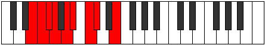

# Mode Aeolocryllic

## Links

- [Documentation](index.md)
- [Scales Index](Scales.md)
- [Modes Index](Modes.md)
- [Chords Index](Chords.md)

## Parent Scale

[Aeolathyllic](ScaleAeolathyllic.md)

## Number

[879](https://ianring.com/musictheory/scales/879)

## Perfection

- 5 Perfect notes
- 3 Perfect notes

## Perfection Profile

[false true true false true true true false]

## Permutations

| Tonic | Notes | Signature | Illustration | Audio |
|-------|-------|-----------|--------------|-------|
| [C](ModeCNaturalAeolocryllic.md) | **C**, C#, D, **D#**, F, F#, G#, **A**, **C** | C |  | [midi](ModeCNaturalAeolocryllic.mid) [ogg](ModeCNaturalAeolocryllic.ogg) |
| [C#](ModeCSharpAeolocryllic.md) | **C#**, D, D#, **E**, F#, G, A, **A#**, **C#** | C |  | [midi](ModeCSharpAeolocryllic.mid) [ogg](ModeCSharpAeolocryllic.ogg) |
| [Db](ModeDFlatAeolocryllic.md) | **Db**, D, Eb, **E**, Gb, G, A, **Bb**, **Db** | C |  | [midi](ModeDFlatAeolocryllic.mid) [ogg](ModeDFlatAeolocryllic.ogg) |
| [D](ModeDNaturalAeolocryllic.md) | **D**, D#, E, **F**, G, G#, A#, **B**, **D** | C |  | [midi](ModeDNaturalAeolocryllic.mid) [ogg](ModeDNaturalAeolocryllic.ogg) |
| [D#](ModeDSharpAeolocryllic.md) | **D#**, E, F, **F#**, G#, A, B, **C**, **D#** | C |  | [midi](ModeDSharpAeolocryllic.mid) [ogg](ModeDSharpAeolocryllic.ogg) |
| [Eb](ModeEFlatAeolocryllic.md) | **Eb**, E, F, **Gb**, Ab, A, B, **C**, **Eb** | C |  | [midi](ModeEFlatAeolocryllic.mid) [ogg](ModeEFlatAeolocryllic.ogg) |
| [E](ModeENaturalAeolocryllic.md) | **E**, F, F#, **G**, A, A#, C, **C#**, **E** | C |  | [midi](ModeENaturalAeolocryllic.mid) [ogg](ModeENaturalAeolocryllic.ogg) |
| [F](ModeFNaturalAeolocryllic.md) | **F**, F#, G, **G#**, A#, B, C#, **D**, **F** | C |  | [midi](ModeFNaturalAeolocryllic.mid) [ogg](ModeFNaturalAeolocryllic.ogg) |
| [F#](ModeFSharpAeolocryllic.md) | **F#**, G, G#, **A**, B, C, D, **D#**, **F#** | C |  | [midi](ModeFSharpAeolocryllic.mid) [ogg](ModeFSharpAeolocryllic.ogg) |
| [Gb](ModeGFlatAeolocryllic.md) | **Gb**, G, Ab, **A**, B, C, D, **Eb**, **Gb** | C |  | [midi](ModeGFlatAeolocryllic.mid) [ogg](ModeGFlatAeolocryllic.ogg) |
| [G](ModeGNaturalAeolocryllic.md) | **G**, G#, A, **A#**, C, C#, D#, **E**, **G** | C |  | [midi](ModeGNaturalAeolocryllic.mid) [ogg](ModeGNaturalAeolocryllic.ogg) |
| [G#](ModeGSharpAeolocryllic.md) | **G#**, A, A#, **B**, C#, D, E, **F**, **G#** | C |  | [midi](ModeGSharpAeolocryllic.mid) [ogg](ModeGSharpAeolocryllic.ogg) |
| [Ab](ModeAFlatAeolocryllic.md) | **Ab**, A, Bb, **B**, Db, D, E, **F**, **Ab** | C |  | [midi](ModeAFlatAeolocryllic.mid) [ogg](ModeAFlatAeolocryllic.ogg) |
| [A](ModeANaturalAeolocryllic.md) | **A**, A#, B, **C**, D, D#, F, **F#**, **A** | C |  | [midi](ModeANaturalAeolocryllic.mid) [ogg](ModeANaturalAeolocryllic.ogg) |
| [A#](ModeASharpAeolocryllic.md) | **A#**, B, C, **C#**, D#, E, F#, **G**, **A#** | C |  | [midi](ModeASharpAeolocryllic.mid) [ogg](ModeASharpAeolocryllic.ogg) |
| [Bb](ModeBFlatAeolocryllic.md) | **Bb**, B, C, **Db**, Eb, E, Gb, **G**, **Bb** | C |  | [midi](ModeBFlatAeolocryllic.mid) [ogg](ModeBFlatAeolocryllic.ogg) |
| [B](ModeBNaturalAeolocryllic.md) | **B**, C, C#, **D**, E, F, G, **G#**, **B** | C |  | [midi](ModeBNaturalAeolocryllic.mid) [ogg](ModeBNaturalAeolocryllic.ogg) |
