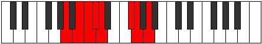

# Mode Aeolodian

## Links

- [Documentation](README.md)
- [Scales Index](Scales.md)
- [Modes Index](Modes.md)
- [Chords Index](Chords.md)

## Parent Scale

[Ionythian](ScaleIonythian.md)

## Number

[1597](https://ianring.com/musictheory/scales/1597)

## Luminosity

4

## Transposition

2, 1, 1, 1, 4, 1, 2

## Chord Pattern

vi⁰, VIIb5

## Perfection

- 5 Perfect notes
- 2 Perfect notes

## Perfection Profile

false, true, true, false, true, true, true

## Permutations

| Tonic | Notes | Signature | Illustration | Audio |
|-------|-------|-----------|--------------|-------|
| [C](ModeCNaturalAeolodian.md) | **C**, D, Eb, **Fb**, Gbb, A, Bb, **C** | C |  | [midi](https://github.com/edipermadi/music/blob/main/docs/ModeCNaturalAeolodian.mid?raw=true) |
| [C#](ModeCSharpAeolodian.md) | **C#**, D#, E, **F**, Gb, A#, B, **C#** | C |  | [midi](https://github.com/edipermadi/music/blob/main/docs/ModeCSharpAeolodian.mid?raw=true) |
| [Db](ModeDFlatAeolodian.md) | **Db**, Eb, Fb, **Gbb**, Abbb, Bb, Cb, **Db** | C |  | [midi](https://github.com/edipermadi/music/blob/main/docs/ModeDFlatAeolodian.mid?raw=true) |
| [D](ModeDNaturalAeolodian.md) | **D**, E, F, **Gb**, Abb, B, C, **D** | C |  | [midi](https://github.com/edipermadi/music/blob/main/docs/ModeDNaturalAeolodian.mid?raw=true) |
| [D#](ModeDSharpAeolodian.md) | **D#**, E#, F#, **G**, Ab, B#, C#, **D#** | C |  | [midi](https://github.com/edipermadi/music/blob/main/docs/ModeDSharpAeolodian.mid?raw=true) |
| [Eb](ModeEFlatAeolodian.md) | **Eb**, F, Gb, **Abb**, Bbbb, C, Db, **Eb** | C |  | [midi](https://github.com/edipermadi/music/blob/main/docs/ModeEFlatAeolodian.mid?raw=true) |
| [E](ModeENaturalAeolodian.md) | **E**, F#, G, **Ab**, Bbb, C#, D, **E** | C |  | [midi](https://github.com/edipermadi/music/blob/main/docs/ModeENaturalAeolodian.mid?raw=true) |
| [F](ModeFNaturalAeolodian.md) | **F**, G, Ab, **Bbb**, Cbb, D, Eb, **F** | C |  | [midi](https://github.com/edipermadi/music/blob/main/docs/ModeFNaturalAeolodian.mid?raw=true) |
| [F#](ModeFSharpAeolodian.md) | **F#**, G#, A, **Bb**, Cb, D#, E, **F#** | C |  | [midi](https://github.com/edipermadi/music/blob/main/docs/ModeFSharpAeolodian.mid?raw=true) |
| [Gb](ModeGFlatAeolodian.md) | **Gb**, Ab, Bbb, **Cbb**, Dbbb, Eb, Fb, **Gb** | C |  | [midi](https://github.com/edipermadi/music/blob/main/docs/ModeGFlatAeolodian.mid?raw=true) |
| [G](ModeGNaturalAeolodian.md) | **G**, A, Bb, **Cb**, Dbb, E, F, **G** | C |  | [midi](https://github.com/edipermadi/music/blob/main/docs/ModeGNaturalAeolodian.mid?raw=true) |
| [G#](ModeGSharpAeolodian.md) | **G#**, A#, B, **C**, Db, E#, F#, **G#** | C |  | [midi](https://github.com/edipermadi/music/blob/main/docs/ModeGSharpAeolodian.mid?raw=true) |
| [Ab](ModeAFlatAeolodian.md) | **Ab**, Bb, Cb, **Dbb**, Ebbb, F, Gb, **Ab** | C |  | [midi](https://github.com/edipermadi/music/blob/main/docs/ModeAFlatAeolodian.mid?raw=true) |
| [A](ModeANaturalAeolodian.md) | **A**, B, C, **Db**, Ebb, F#, G, **A** | C |  | [midi](https://github.com/edipermadi/music/blob/main/docs/ModeANaturalAeolodian.mid?raw=true) |
| [A#](ModeASharpAeolodian.md) | **A#**, B#, C#, **D**, Eb, F##, G#, **A#** | C |  | [midi](https://github.com/edipermadi/music/blob/main/docs/ModeASharpAeolodian.mid?raw=true) |
| [Bb](ModeBFlatAeolodian.md) | **Bb**, C, Db, **Ebb**, Fbb, G, Ab, **Bb** | C |  | [midi](https://github.com/edipermadi/music/blob/main/docs/ModeBFlatAeolodian.mid?raw=true) |
| [B](ModeBNaturalAeolodian.md) | **B**, C#, D, **Eb**, Fb, G#, A, **B** | C |  | [midi](https://github.com/edipermadi/music/blob/main/docs/ModeBNaturalAeolodian.mid?raw=true) |
