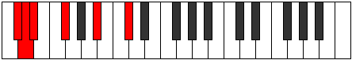
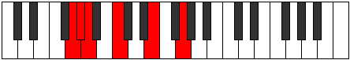
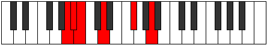

# Mode Aeoloditonic

## Links

- [Documentation](README.md)
- [Scales Index](Scales.md)
- [Modes Index](Modes.md)
- [Chords Index](Chords.md)

## Parent Scale

[Aeolyritonic](ScaleAeolyritonic.md)

## Number

[551](https://ianring.com/musictheory/scales/551)

## Transposition

1, 1, 3, 4, 3

## Chord Pattern

V⁺

## Perfection

- 2 Perfect notes
- 3 Perfect notes

## Perfection Profile

false, false, true, true, false

## Permutations

| Tonic | Notes | Signature | Illustration | Audio |
|-------|-------|-----------|--------------|-------|
| [C](ModeCNaturalAeoloditonic.md) | **C**, **C#**, D, F, **A**, **C** | C |  | [midi](https://github.com/edipermadi/music/blob/main/docs/ModeCNaturalAeoloditonic.mid?raw=true) |
| [C#](ModeCSharpAeoloditonic.md) | **C#**, **D**, D#, F#, **A#**, **C#** | C |  | [midi](https://github.com/edipermadi/music/blob/main/docs/ModeCSharpAeoloditonic.mid?raw=true) |
| [Db](ModeDFlatAeoloditonic.md) | **Db**, **D**, Eb, Gb, **Bb**, **Db** | C |  | [midi](https://github.com/edipermadi/music/blob/main/docs/ModeDFlatAeoloditonic.mid?raw=true) |
| [D](ModeDNaturalAeoloditonic.md) | **D**, **D#**, E, G, **B**, **D** | C |  | [midi](https://github.com/edipermadi/music/blob/main/docs/ModeDNaturalAeoloditonic.mid?raw=true) |
| [D#](ModeDSharpAeoloditonic.md) | **D#**, **E**, F, G#, **C**, **D#** | C |  | [midi](https://github.com/edipermadi/music/blob/main/docs/ModeDSharpAeoloditonic.mid?raw=true) |
| [Eb](ModeEFlatAeoloditonic.md) | **Eb**, **E**, F, Ab, **C**, **Eb** | C |  | [midi](https://github.com/edipermadi/music/blob/main/docs/ModeEFlatAeoloditonic.mid?raw=true) |
| [E](ModeENaturalAeoloditonic.md) | **E**, **F**, F#, A, **C#**, **E** | C |  | [midi](https://github.com/edipermadi/music/blob/main/docs/ModeENaturalAeoloditonic.mid?raw=true) |
| [F](ModeFNaturalAeoloditonic.md) | **F**, **F#**, G, A#, **D**, **F** | C |  | [midi](https://github.com/edipermadi/music/blob/main/docs/ModeFNaturalAeoloditonic.mid?raw=true) |
| [F#](ModeFSharpAeoloditonic.md) | **F#**, **G**, G#, B, **D#**, **F#** | C |  | [midi](https://github.com/edipermadi/music/blob/main/docs/ModeFSharpAeoloditonic.mid?raw=true) |
| [Gb](ModeGFlatAeoloditonic.md) | **Gb**, **G**, Ab, B, **Eb**, **Gb** | C |  | [midi](https://github.com/edipermadi/music/blob/main/docs/ModeGFlatAeoloditonic.mid?raw=true) |
| [G](ModeGNaturalAeoloditonic.md) | **G**, **G#**, A, C, **E**, **G** | C |  | [midi](https://github.com/edipermadi/music/blob/main/docs/ModeGNaturalAeoloditonic.mid?raw=true) |
| [G#](ModeGSharpAeoloditonic.md) | **G#**, **A**, A#, C#, **F**, **G#** | C |  | [midi](https://github.com/edipermadi/music/blob/main/docs/ModeGSharpAeoloditonic.mid?raw=true) |
| [Ab](ModeAFlatAeoloditonic.md) | **Ab**, **A**, Bb, Db, **F**, **Ab** | C |  | [midi](https://github.com/edipermadi/music/blob/main/docs/ModeAFlatAeoloditonic.mid?raw=true) |
| [A](ModeANaturalAeoloditonic.md) | **A**, **A#**, B, D, **F#**, **A** | C |  | [midi](https://github.com/edipermadi/music/blob/main/docs/ModeANaturalAeoloditonic.mid?raw=true) |
| [A#](ModeASharpAeoloditonic.md) | **A#**, **B**, C, D#, **G**, **A#** | C |  | [midi](https://github.com/edipermadi/music/blob/main/docs/ModeASharpAeoloditonic.mid?raw=true) |
| [Bb](ModeBFlatAeoloditonic.md) | **Bb**, **B**, C, Eb, **G**, **Bb** | C |  | [midi](https://github.com/edipermadi/music/blob/main/docs/ModeBFlatAeoloditonic.mid?raw=true) |
| [B](ModeBNaturalAeoloditonic.md) | **B**, **C**, C#, E, **G#**, **B** | C |  | [midi](https://github.com/edipermadi/music/blob/main/docs/ModeBNaturalAeoloditonic.mid?raw=true) |
