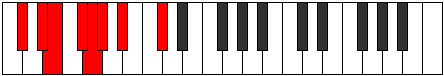

# Mode Aeologian

## Links

- [Documentation](index.md)
- [Scales Index](Scales.md)
- [Modes Index](Modes.md)
- [Chords Index](Chords.md)

## Parent Scale

[Ionopian](ScaleIonopian.md)

## Number

[749](https://ianring.com/musictheory/scales/749)

## Perfection

- 4 Perfect notes
- 3 Perfect notes

## Perfection Profile

[true true false true false true false]

## Permutations

| Tonic | Notes | Signature | Illustration | Audio |
|-------|-------|-----------|--------------|-------|
| [C](ModeCNaturalAeologian.md) | C, D, **Eb**, F, **Gb**, Abb, **Bbb**, C | C |  | [midi](ModeCNaturalAeologian.mid) [ogg](ModeCNaturalAeologian.ogg) |
| [C#](ModeCSharpAeologian.md) | C#, D#, **E**, F#, **G**, Ab, **Bb**, C# | C |  | [midi](ModeCSharpAeologian.mid) [ogg](ModeCSharpAeologian.ogg) |
| [Db](ModeDFlatAeologian.md) | Db, Eb, **Fb**, Gb, **Abb**, Bbbb, **Cbb**, Db | C |  | [midi](ModeDFlatAeologian.mid) [ogg](ModeDFlatAeologian.ogg) |
| [D](ModeDNaturalAeologian.md) | D, E, **F**, G, **Ab**, Bbb, **Cb**, D | C |  | [midi](ModeDNaturalAeologian.mid) [ogg](ModeDNaturalAeologian.ogg) |
| [D#](ModeDSharpAeologian.md) | D#, E#, **F#**, G#, **A**, Bb, **C**, D# | C |  | [midi](ModeDSharpAeologian.mid) [ogg](ModeDSharpAeologian.ogg) |
| [Eb](ModeEFlatAeologian.md) | Eb, F, **Gb**, Ab, **Bbb**, Cbb, **Dbb**, Eb | C |  | [midi](ModeEFlatAeologian.mid) [ogg](ModeEFlatAeologian.ogg) |
| [E](ModeENaturalAeologian.md) | E, F#, **G**, A, **Bb**, Cb, **Db**, E | C |  | [midi](ModeENaturalAeologian.mid) [ogg](ModeENaturalAeologian.ogg) |
| [F](ModeFNaturalAeologian.md) | F, G, **Ab**, Bb, **Cb**, Dbb, **Ebb**, F | C |  | [midi](ModeFNaturalAeologian.mid) [ogg](ModeFNaturalAeologian.ogg) |
| [F#](ModeFSharpAeologian.md) | F#, G#, **A**, B, **C**, Db, **Eb**, F# | C |  | [midi](ModeFSharpAeologian.mid) [ogg](ModeFSharpAeologian.ogg) |
| [Gb](ModeGFlatAeologian.md) | Gb, Ab, **Bbb**, Cb, **Dbb**, Ebbb, **Fbb**, Gb | C |  | [midi](ModeGFlatAeologian.mid) [ogg](ModeGFlatAeologian.ogg) |
| [G](ModeGNaturalAeologian.md) | G, A, **Bb**, C, **Db**, Ebb, **Fb**, G | C |  | [midi](ModeGNaturalAeologian.mid) [ogg](ModeGNaturalAeologian.ogg) |
| [G#](ModeGSharpAeologian.md) | G#, A#, **B**, C#, **D**, Eb, **F**, G# | C |  | [midi](ModeGSharpAeologian.mid) [ogg](ModeGSharpAeologian.ogg) |
| [Ab](ModeAFlatAeologian.md) | Ab, Bb, **Cb**, Db, **Ebb**, Fbb, **Gbb**, Ab | C |  | [midi](ModeAFlatAeologian.mid) [ogg](ModeAFlatAeologian.ogg) |
| [A](ModeANaturalAeologian.md) | A, B, **C**, D, **Eb**, Fb, **Gb**, A | C |  | [midi](ModeANaturalAeologian.mid) [ogg](ModeANaturalAeologian.ogg) |
| [A#](ModeASharpAeologian.md) | A#, B#, **C#**, D#, **E**, F, **G**, A# | C |  | [midi](ModeASharpAeologian.mid) [ogg](ModeASharpAeologian.ogg) |
| [Bb](ModeBFlatAeologian.md) | Bb, C, **Db**, Eb, **Fb**, Gbb, **Abb**, Bb | C |  | [midi](ModeBFlatAeologian.mid) [ogg](ModeBFlatAeologian.ogg) |
| [B](ModeBNaturalAeologian.md) | B, C#, **D**, E, **F**, Gb, **Ab**, B | C |  | [midi](ModeBNaturalAeologian.mid) [ogg](ModeBNaturalAeologian.ogg) |
