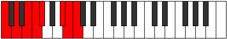

# Mode Aeolonian

## Links

- [Documentation](index.md)
- [Scales Index](Scales.md)
- [Modes Index](Modes.md)
- [Chords Index](Chords.md)

## Parent Scale

[Thacrian](ScaleThacrian.md)

## Number

[3189](https://ianring.com/musictheory/scales/3189)

## Perfection

- 4 Perfect notes
- 3 Perfect notes

## Perfection Profile

[false false true true false true true]

## Permutations

| Tonic | Notes | Signature | Illustration | Audio |
|-------|-------|-----------|--------------|-------|
| [C](ModeCNaturalAeolonian.md) | **C**, **D**, E, F, **Gb**, A#, B, **C** | C |  | [midi](ModeCNaturalAeolonian.mid) [ogg](ModeCNaturalAeolonian.ogg) |
| [C#](ModeCSharpAeolonian.md) | **C#**, **D#**, E#, F#, **G**, A##, B#, **C#** | C |  | [midi](ModeCSharpAeolonian.mid) [ogg](ModeCSharpAeolonian.ogg) |
| [Db](ModeDFlatAeolonian.md) | **Db**, **Eb**, F, Gb, **Abb**, B, C, **Db** | C |  | [midi](ModeDFlatAeolonian.mid) [ogg](ModeDFlatAeolonian.ogg) |
| [D](ModeDNaturalAeolonian.md) | **D**, **E**, F#, G, **Ab**, B#, C#, **D** | C |  | [midi](ModeDNaturalAeolonian.mid) [ogg](ModeDNaturalAeolonian.ogg) |
| [D#](ModeDSharpAeolonian.md) | **D#**, **E#**, F##, G#, **A**, B##, C##, **D#** | C |  | [midi](ModeDSharpAeolonian.mid) [ogg](ModeDSharpAeolonian.ogg) |
| [Eb](ModeEFlatAeolonian.md) | **Eb**, **F**, G, Ab, **Bbb**, C#, D, **Eb** | C |  | [midi](ModeEFlatAeolonian.mid) [ogg](ModeEFlatAeolonian.ogg) |
| [E](ModeENaturalAeolonian.md) | **E**, **F#**, G#, A, **Bb**, C##, D#, **E** | C |  | [midi](ModeENaturalAeolonian.mid) [ogg](ModeENaturalAeolonian.ogg) |
| [F](ModeFNaturalAeolonian.md) | **F**, **G**, A, Bb, **Cb**, D#, E, **F** | C |  | [midi](ModeFNaturalAeolonian.mid) [ogg](ModeFNaturalAeolonian.ogg) |
| [F#](ModeFSharpAeolonian.md) | **F#**, **G#**, A#, B, **C**, D##, E#, **F#** | C |  | [midi](ModeFSharpAeolonian.mid) [ogg](ModeFSharpAeolonian.ogg) |
| [Gb](ModeGFlatAeolonian.md) | **Gb**, **Ab**, Bb, Cb, **Dbb**, E, F, **Gb** | C |  | [midi](ModeGFlatAeolonian.mid) [ogg](ModeGFlatAeolonian.ogg) |
| [G](ModeGNaturalAeolonian.md) | **G**, **A**, B, C, **Db**, E#, F#, **G** | C |  | [midi](ModeGNaturalAeolonian.mid) [ogg](ModeGNaturalAeolonian.ogg) |
| [G#](ModeGSharpAeolonian.md) | **G#**, **A#**, B#, C#, **D**, E##, F##, **G#** | C |  | [midi](ModeGSharpAeolonian.mid) [ogg](ModeGSharpAeolonian.ogg) |
| [Ab](ModeAFlatAeolonian.md) | **Ab**, **Bb**, C, Db, **Ebb**, F#, G, **Ab** | C |  | [midi](ModeAFlatAeolonian.mid) [ogg](ModeAFlatAeolonian.ogg) |
| [A](ModeANaturalAeolonian.md) | **A**, **B**, C#, D, **Eb**, F##, G#, **A** | C |  | [midi](ModeANaturalAeolonian.mid) [ogg](ModeANaturalAeolonian.ogg) |
| [A#](ModeASharpAeolonian.md) | **A#**, **B#**, C##, D#, **E**, F###, G##, **A#** | C |  | [midi](ModeASharpAeolonian.mid) [ogg](ModeASharpAeolonian.ogg) |
| [Bb](ModeBFlatAeolonian.md) | **Bb**, **C**, D, Eb, **Fb**, G#, A, **Bb** | C |  | [midi](ModeBFlatAeolonian.mid) [ogg](ModeBFlatAeolonian.ogg) |
| [B](ModeBNaturalAeolonian.md) | **B**, **C#**, D#, E, **F**, G##, A#, **B** | C |  | [midi](ModeBNaturalAeolonian.mid) [ogg](ModeBNaturalAeolonian.ogg) |
