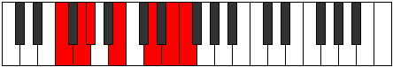
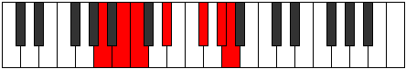

# Mode Aeolonimic

## Links

- [Documentation](README.md)
- [Scales Index](Scales.md)
- [Modes Index](Modes.md)
- [Chords Index](Chords.md)

## Parent Scale

[Thoptimic](ScaleThoptimic.md)

## Number

[2637](https://ianring.com/musictheory/scales/2637)

## Transposition

2, 1, 3, 3, 2, 1

## Chord Pattern

v⁰, vi

## Perfection

- 2 Perfect notes
- 4 Perfect notes

## Perfection Profile

[false true false false false true]

## Permutations

| Tonic | Notes | Signature | Illustration | Audio |
|-------|-------|-----------|--------------|-------|
| [C](ModeCNaturalAeolonimic.md) | **C**, D, **Eb**, **F#**, **G##**, A##, **C** | C |  | [midi](https://github.com/edipermadi/music/blob/main/docs/ModeCNaturalAeolonimic.mid?raw=true) |
| [C#](ModeCSharpAeolonimic.md) | **C#**, D#, **E**, **F##**, **G###**, A###, **C#** | C |  | [midi](https://github.com/edipermadi/music/blob/main/docs/ModeCSharpAeolonimic.mid?raw=true) |
| [Db](ModeDFlatAeolonimic.md) | **Db**, Eb, **Fb**, **G**, **A#**, B#, **Db** | C |  | [midi](https://github.com/edipermadi/music/blob/main/docs/ModeDFlatAeolonimic.mid?raw=true) |
| [D](ModeDNaturalAeolonimic.md) | **D**, E, **F**, **G#**, **A##**, B##, **D** | C |  | [midi](https://github.com/edipermadi/music/blob/main/docs/ModeDNaturalAeolonimic.mid?raw=true) |
| [D#](ModeDSharpAeolonimic.md) | **D#**, E#, **F#**, **G##**, **A###**, B###, **D#** | C |  | [midi](https://github.com/edipermadi/music/blob/main/docs/ModeDSharpAeolonimic.mid?raw=true) |
| [Eb](ModeEFlatAeolonimic.md) | **Eb**, F, **Gb**, **A**, **B#**, C##, **Eb** | C |  | [midi](https://github.com/edipermadi/music/blob/main/docs/ModeEFlatAeolonimic.mid?raw=true) |
| [E](ModeENaturalAeolonimic.md) | **E**, F#, **G**, **A#**, **B##**, C###, **E** | C |  | [midi](https://github.com/edipermadi/music/blob/main/docs/ModeENaturalAeolonimic.mid?raw=true) |
| [F](ModeFNaturalAeolonimic.md) | **F**, G, **Ab**, **B**, **C##**, D##, **F** | C |  | [midi](https://github.com/edipermadi/music/blob/main/docs/ModeFNaturalAeolonimic.mid?raw=true) |
| [F#](ModeFSharpAeolonimic.md) | **F#**, G#, **A**, **B#**, **C###**, D###, **F#** | C |  | [midi](https://github.com/edipermadi/music/blob/main/docs/ModeFSharpAeolonimic.mid?raw=true) |
| [Gb](ModeGFlatAeolonimic.md) | **Gb**, Ab, **Bbb**, **C**, **D#**, E#, **Gb** | C |  | [midi](https://github.com/edipermadi/music/blob/main/docs/ModeGFlatAeolonimic.mid?raw=true) |
| [G](ModeGNaturalAeolonimic.md) | **G**, A, **Bb**, **C#**, **D##**, E##, **G** | C |  | [midi](https://github.com/edipermadi/music/blob/main/docs/ModeGNaturalAeolonimic.mid?raw=true) |
| [G#](ModeGSharpAeolonimic.md) | **G#**, A#, **B**, **C##**, **D###**, E###, **G#** | C |  | [midi](https://github.com/edipermadi/music/blob/main/docs/ModeGSharpAeolonimic.mid?raw=true) |
| [Ab](ModeAFlatAeolonimic.md) | **Ab**, Bb, **Cb**, **D**, **E#**, F##, **Ab** | C |  | [midi](https://github.com/edipermadi/music/blob/main/docs/ModeAFlatAeolonimic.mid?raw=true) |
| [A](ModeANaturalAeolonimic.md) | **A**, B, **C**, **D#**, **E##**, F###, **A** | C |  | [midi](https://github.com/edipermadi/music/blob/main/docs/ModeANaturalAeolonimic.mid?raw=true) |
| [A#](ModeASharpAeolonimic.md) | **A#**, B#, **C#**, **D##**, **E###**, Cbbb, **A#** | C |  | [midi](https://github.com/edipermadi/music/blob/main/docs/ModeASharpAeolonimic.mid?raw=true) |
| [Bb](ModeBFlatAeolonimic.md) | **Bb**, C, **Db**, **E**, **F##**, G##, **Bb** | C |  | [midi](https://github.com/edipermadi/music/blob/main/docs/ModeBFlatAeolonimic.mid?raw=true) |
| [B](ModeBNaturalAeolonimic.md) | **B**, C#, **D**, **E#**, **F###**, G###, **B** | C |  | [midi](https://github.com/edipermadi/music/blob/main/docs/ModeBNaturalAeolonimic.mid?raw=true) |
