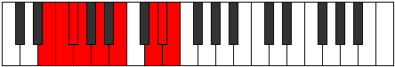

# Mode Aeolonyllic

## Links

- [Documentation](index.md)
- [Scales Index](Scales.md)
- [Modes Index](Modes.md)
- [Chords Index](Chords.md)

## Parent Scale

[Kataryllic](ScaleKataryllic.md)

## Number

[3247](https://ianring.com/musictheory/scales/3247)

## Perfection

- 5 Perfect notes
- 3 Perfect notes

## Perfection Profile

[true false false true true true true false]

## Permutations

| Tonic | Notes | Signature | Illustration | Audio |
|-------|-------|-----------|--------------|-------|
| [C](ModeCNaturalAeolonyllic.md) | C, **C#**, **D**, D#, F, G, A#, **B**, C | C |  | [midi](ModeCNaturalAeolonyllic.mid) [ogg](ModeCNaturalAeolonyllic.ogg) |
| [C#](ModeCSharpAeolonyllic.md) | C#, **D**, **D#**, E, F#, G#, B, **C**, C# | C |  | [midi](ModeCSharpAeolonyllic.mid) [ogg](ModeCSharpAeolonyllic.ogg) |
| [Db](ModeDFlatAeolonyllic.md) | Db, **D**, **Eb**, E, Gb, Ab, B, **C**, Db | C |  | [midi](ModeDFlatAeolonyllic.mid) [ogg](ModeDFlatAeolonyllic.ogg) |
| [D](ModeDNaturalAeolonyllic.md) | D, **D#**, **E**, F, G, A, C, **C#**, D | C |  | [midi](ModeDNaturalAeolonyllic.mid) [ogg](ModeDNaturalAeolonyllic.ogg) |
| [D#](ModeDSharpAeolonyllic.md) | D#, **E**, **F**, F#, G#, A#, C#, **D**, D# | C |  | [midi](ModeDSharpAeolonyllic.mid) [ogg](ModeDSharpAeolonyllic.ogg) |
| [Eb](ModeEFlatAeolonyllic.md) | Eb, **E**, **F**, Gb, Ab, Bb, Db, **D**, Eb | C |  | [midi](ModeEFlatAeolonyllic.mid) [ogg](ModeEFlatAeolonyllic.ogg) |
| [E](ModeENaturalAeolonyllic.md) | E, **F**, **F#**, G, A, B, D, **D#**, E | C |  | [midi](ModeENaturalAeolonyllic.mid) [ogg](ModeENaturalAeolonyllic.ogg) |
| [F](ModeFNaturalAeolonyllic.md) | F, **F#**, **G**, G#, A#, C, D#, **E**, F | C |  | [midi](ModeFNaturalAeolonyllic.mid) [ogg](ModeFNaturalAeolonyllic.ogg) |
| [F#](ModeFSharpAeolonyllic.md) | F#, **G**, **G#**, A, B, C#, E, **F**, F# | C |  | [midi](ModeFSharpAeolonyllic.mid) [ogg](ModeFSharpAeolonyllic.ogg) |
| [Gb](ModeGFlatAeolonyllic.md) | Gb, **G**, **Ab**, A, B, Db, E, **F**, Gb | C |  | [midi](ModeGFlatAeolonyllic.mid) [ogg](ModeGFlatAeolonyllic.ogg) |
| [G](ModeGNaturalAeolonyllic.md) | G, **G#**, **A**, A#, C, D, F, **F#**, G | C |  | [midi](ModeGNaturalAeolonyllic.mid) [ogg](ModeGNaturalAeolonyllic.ogg) |
| [G#](ModeGSharpAeolonyllic.md) | G#, **A**, **A#**, B, C#, D#, F#, **G**, G# | C |  | [midi](ModeGSharpAeolonyllic.mid) [ogg](ModeGSharpAeolonyllic.ogg) |
| [Ab](ModeAFlatAeolonyllic.md) | Ab, **A**, **Bb**, B, Db, Eb, Gb, **G**, Ab | C |  | [midi](ModeAFlatAeolonyllic.mid) [ogg](ModeAFlatAeolonyllic.ogg) |
| [A](ModeANaturalAeolonyllic.md) | A, **A#**, **B**, C, D, E, G, **G#**, A | C |  | [midi](ModeANaturalAeolonyllic.mid) [ogg](ModeANaturalAeolonyllic.ogg) |
| [A#](ModeASharpAeolonyllic.md) | A#, **B**, **C**, C#, D#, F, G#, **A**, A# | C |  | [midi](ModeASharpAeolonyllic.mid) [ogg](ModeASharpAeolonyllic.ogg) |
| [Bb](ModeBFlatAeolonyllic.md) | Bb, **B**, **C**, Db, Eb, F, Ab, **A**, Bb | C |  | [midi](ModeBFlatAeolonyllic.mid) [ogg](ModeBFlatAeolonyllic.ogg) |
| [B](ModeBNaturalAeolonyllic.md) | B, **C**, **C#**, D, E, F#, A, **A#**, B | C |  | [midi](ModeBNaturalAeolonyllic.mid) [ogg](ModeBNaturalAeolonyllic.ogg) |
