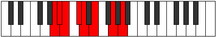

# Mode Aeoloptian

## Links

- [Documentation](index.md)
- [Scales Index](Scales.md)
- [Modes Index](Modes.md)
- [Chords Index](Chords.md)

## Parent Scale

[Rythian](ScaleRythian.md)

## Number

[1207](https://ianring.com/musictheory/scales/1207)

## Interval Pattern

1, 1, 2, 1, 2, 3, 2

## Chord Pattern

I, ii⁰, iv⁰, vi⁰, vi, vii⁰, vii, VII

## Perfection

- 4 Perfect notes
- 3 Perfect notes

## Perfection Profile

[true false false false true true true]

## Permutations

| Tonic | Notes | Signature | Illustration | Audio |
|-------|-------|-----------|--------------|-------|
| [C](ModeCNaturalAeoloptian.md) | C, **Db**, **Ebb**, **Fb**, Gbb, Abb, Bb, C | C |  | [midi](https://github.com/edipermadi/music/blob/main/docs/ModeCNaturalAeoloptian.mid?raw=true) |
| [C#](ModeCSharpAeoloptian.md) | C#, **D**, **Eb**, **F**, Gb, Ab, B, C# | C |  | [midi](https://github.com/edipermadi/music/blob/main/docs/ModeCSharpAeoloptian.mid?raw=true) |
| [Db](ModeDFlatAeoloptian.md) | Db, **Ebb**, **Fbb**, **Gbb**, Abbb, Bbbb, Cb, Db | C |  | [midi](https://github.com/edipermadi/music/blob/main/docs/ModeDFlatAeoloptian.mid?raw=true) |
| [D](ModeDNaturalAeoloptian.md) | D, **Eb**, **Fb**, **Gb**, Abb, Bbb, C, D | C |  | [midi](https://github.com/edipermadi/music/blob/main/docs/ModeDNaturalAeoloptian.mid?raw=true) |
| [D#](ModeDSharpAeoloptian.md) | D#, **E**, **F**, **G**, Ab, Bb, C#, D# | C |  | [midi](https://github.com/edipermadi/music/blob/main/docs/ModeDSharpAeoloptian.mid?raw=true) |
| [Eb](ModeEFlatAeoloptian.md) | Eb, **Fb**, **Gbb**, **Abb**, Bbbb, Cbb, Db, Eb | C |  | [midi](https://github.com/edipermadi/music/blob/main/docs/ModeEFlatAeoloptian.mid?raw=true) |
| [E](ModeENaturalAeoloptian.md) | E, **F**, **Gb**, **Ab**, Bbb, Cb, D, E | C |  | [midi](https://github.com/edipermadi/music/blob/main/docs/ModeENaturalAeoloptian.mid?raw=true) |
| [F](ModeFNaturalAeoloptian.md) | F, **Gb**, **Abb**, **Bbb**, Cbb, Dbb, Eb, F | C |  | [midi](https://github.com/edipermadi/music/blob/main/docs/ModeFNaturalAeoloptian.mid?raw=true) |
| [F#](ModeFSharpAeoloptian.md) | F#, **G**, **Ab**, **Bb**, Cb, Db, E, F# | C |  | [midi](https://github.com/edipermadi/music/blob/main/docs/ModeFSharpAeoloptian.mid?raw=true) |
| [Gb](ModeGFlatAeoloptian.md) | Gb, **Abb**, **Bbbb**, **Cbb**, Dbbb, Ebbb, Fb, Gb | C |  | [midi](https://github.com/edipermadi/music/blob/main/docs/ModeGFlatAeoloptian.mid?raw=true) |
| [G](ModeGNaturalAeoloptian.md) | G, **Ab**, **Bbb**, **Cb**, Dbb, Ebb, F, G | C |  | [midi](https://github.com/edipermadi/music/blob/main/docs/ModeGNaturalAeoloptian.mid?raw=true) |
| [G#](ModeGSharpAeoloptian.md) | G#, **A**, **Bb**, **C**, Db, Eb, F#, G# | C |  | [midi](https://github.com/edipermadi/music/blob/main/docs/ModeGSharpAeoloptian.mid?raw=true) |
| [Ab](ModeAFlatAeoloptian.md) | Ab, **Bbb**, **Cbb**, **Dbb**, Ebbb, Fbb, Gb, Ab | C |  | [midi](https://github.com/edipermadi/music/blob/main/docs/ModeAFlatAeoloptian.mid?raw=true) |
| [A](ModeANaturalAeoloptian.md) | A, **Bb**, **Cb**, **Db**, Ebb, Fb, G, A | C |  | [midi](https://github.com/edipermadi/music/blob/main/docs/ModeANaturalAeoloptian.mid?raw=true) |
| [A#](ModeASharpAeoloptian.md) | A#, **B**, **C**, **D**, Eb, F, G#, A# | C |  | [midi](https://github.com/edipermadi/music/blob/main/docs/ModeASharpAeoloptian.mid?raw=true) |
| [Bb](ModeBFlatAeoloptian.md) | Bb, **Cb**, **Dbb**, **Ebb**, Fbb, Gbb, Ab, Bb | C |  | [midi](https://github.com/edipermadi/music/blob/main/docs/ModeBFlatAeoloptian.mid?raw=true) |
| [B](ModeBNaturalAeoloptian.md) | B, **C**, **Db**, **Eb**, Fb, Gb, A, B | C |  | [midi](https://github.com/edipermadi/music/blob/main/docs/ModeBNaturalAeoloptian.mid?raw=true) |
