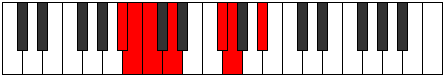

# Mode Aeoloptimic

## Links

- [Documentation](index.md)
- [Scales Index](Scales.md)
- [Modes Index](Modes.md)
- [Chords Index](Chords.md)

## Parent Scale

[Thogimic](ScaleThogimic.md)

## Number

[791](https://ianring.com/musictheory/scales/791)

## Perfection

- 3 Perfect notes
- 3 Perfect notes

## Perfection Profile

[false true true false false true]

## Permutations

| Tonic | Notes | Signature | Illustration | Audio |
|-------|-------|-----------|--------------|-------|
| [C](ModeCNaturalAeoloptimic.md) | **C**, Db, Ebb, **Fb**, **G#**, A, **C** | C |  | [midi](ModeCNaturalAeoloptimic.mid) [ogg](ModeCNaturalAeoloptimic.ogg) |
| [C#](ModeCSharpAeoloptimic.md) | **C#**, D, Eb, **F**, **G##**, A#, **C#** | C |  | [midi](ModeCSharpAeoloptimic.mid) [ogg](ModeCSharpAeoloptimic.ogg) |
| [Db](ModeDFlatAeoloptimic.md) | **Db**, Ebb, Fbb, **Gbb**, **A**, Bb, **Db** | C |  | [midi](ModeDFlatAeoloptimic.mid) [ogg](ModeDFlatAeoloptimic.ogg) |
| [D](ModeDNaturalAeoloptimic.md) | **D**, Eb, Fb, **Gb**, **A#**, B, **D** | C |  | [midi](ModeDNaturalAeoloptimic.mid) [ogg](ModeDNaturalAeoloptimic.ogg) |
| [D#](ModeDSharpAeoloptimic.md) | **D#**, E, F, **G**, **A##**, B#, **D#** | C |  | [midi](ModeDSharpAeoloptimic.mid) [ogg](ModeDSharpAeoloptimic.ogg) |
| [Eb](ModeEFlatAeoloptimic.md) | **Eb**, Fb, Gbb, **Abb**, **B**, C, **Eb** | C |  | [midi](ModeEFlatAeoloptimic.mid) [ogg](ModeEFlatAeoloptimic.ogg) |
| [E](ModeENaturalAeoloptimic.md) | **E**, F, Gb, **Ab**, **B#**, C#, **E** | C |  | [midi](ModeENaturalAeoloptimic.mid) [ogg](ModeENaturalAeoloptimic.ogg) |
| [F](ModeFNaturalAeoloptimic.md) | **F**, Gb, Abb, **Bbb**, **C#**, D, **F** | C |  | [midi](ModeFNaturalAeoloptimic.mid) [ogg](ModeFNaturalAeoloptimic.ogg) |
| [F#](ModeFSharpAeoloptimic.md) | **F#**, G, Ab, **Bb**, **C##**, D#, **F#** | C |  | [midi](ModeFSharpAeoloptimic.mid) [ogg](ModeFSharpAeoloptimic.ogg) |
| [Gb](ModeGFlatAeoloptimic.md) | **Gb**, Abb, Bbbb, **Cbb**, **D**, Eb, **Gb** | C |  | [midi](ModeGFlatAeoloptimic.mid) [ogg](ModeGFlatAeoloptimic.ogg) |
| [G](ModeGNaturalAeoloptimic.md) | **G**, Ab, Bbb, **Cb**, **D#**, E, **G** | C |  | [midi](ModeGNaturalAeoloptimic.mid) [ogg](ModeGNaturalAeoloptimic.ogg) |
| [G#](ModeGSharpAeoloptimic.md) | **G#**, A, Bb, **C**, **D##**, E#, **G#** | C |  | [midi](ModeGSharpAeoloptimic.mid) [ogg](ModeGSharpAeoloptimic.ogg) |
| [Ab](ModeAFlatAeoloptimic.md) | **Ab**, Bbb, Cbb, **Dbb**, **E**, F, **Ab** | C |  | [midi](ModeAFlatAeoloptimic.mid) [ogg](ModeAFlatAeoloptimic.ogg) |
| [A](ModeANaturalAeoloptimic.md) | **A**, Bb, Cb, **Db**, **E#**, F#, **A** | C |  | [midi](ModeANaturalAeoloptimic.mid) [ogg](ModeANaturalAeoloptimic.ogg) |
| [A#](ModeASharpAeoloptimic.md) | **A#**, B, C, **D**, **E##**, F##, **A#** | C |  | [midi](ModeASharpAeoloptimic.mid) [ogg](ModeASharpAeoloptimic.ogg) |
| [Bb](ModeBFlatAeoloptimic.md) | **Bb**, Cb, Dbb, **Ebb**, **F#**, G, **Bb** | C |  | [midi](ModeBFlatAeoloptimic.mid) [ogg](ModeBFlatAeoloptimic.ogg) |
| [B](ModeBNaturalAeoloptimic.md) | **B**, C, Db, **Eb**, **F##**, G#, **B** | C |  | [midi](ModeBNaturalAeoloptimic.mid) [ogg](ModeBNaturalAeoloptimic.ogg) |
