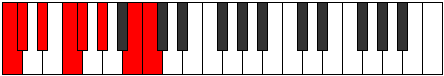

# Mode Aeolorian

## Links

- [Documentation](README.md)
- [Scales Index](Scales.md)
- [Modes Index](Modes.md)
- [Chords Index](Chords.md)

## Parent Scale

[Ionycrian](ScaleIonycrian.md)

## Number

[2411](https://ianring.com/musictheory/scales/2411)

## Luminosity

6

## Transposition

1, 2, 2, 1, 2, 3, 1

## Chord Pattern

i⁰, II, iv, VI, vii⁰b3

## Perfection

- 5 Perfect notes
- 2 Perfect notes

## Perfection Profile

false, true, false, true, true, true, true

## Permutations

| Tonic | Notes | Signature | Illustration | Audio |
|-------|-------|-----------|--------------|-------|
| [C](ModeCNaturalAeolorian.md) | **C**, Db, **Eb**, F, Gb, Ab, B, **C** | C |  | [midi](https://github.com/edipermadi/music/blob/main/docs/ModeCNaturalAeolorian.mid?raw=true) |
| [C#](ModeCSharpAeolorian.md) | **C#**, D, **E**, F#, G, A, B#, **C#** | C |  | [midi](https://github.com/edipermadi/music/blob/main/docs/ModeCSharpAeolorian.mid?raw=true) |
| [Db](ModeDFlatAeolorian.md) | **Db**, Ebb, **Fb**, Gb, Abb, Bbb, C, **Db** | C |  | [midi](https://github.com/edipermadi/music/blob/main/docs/ModeDFlatAeolorian.mid?raw=true) |
| [D](ModeDNaturalAeolorian.md) | **D**, Eb, **F**, G, Ab, Bb, C#, **D** | C |  | [midi](https://github.com/edipermadi/music/blob/main/docs/ModeDNaturalAeolorian.mid?raw=true) |
| [D#](ModeDSharpAeolorian.md) | **D#**, E, **F#**, G#, A, B, C##, **D#** | C |  | [midi](https://github.com/edipermadi/music/blob/main/docs/ModeDSharpAeolorian.mid?raw=true) |
| [Eb](ModeEFlatAeolorian.md) | **Eb**, Fb, **Gb**, Ab, Bbb, Cb, D, **Eb** | C |  | [midi](https://github.com/edipermadi/music/blob/main/docs/ModeEFlatAeolorian.mid?raw=true) |
| [E](ModeENaturalAeolorian.md) | **E**, F, **G**, A, Bb, C, D#, **E** | C |  | [midi](https://github.com/edipermadi/music/blob/main/docs/ModeENaturalAeolorian.mid?raw=true) |
| [F](ModeFNaturalAeolorian.md) | **F**, Gb, **Ab**, Bb, Cb, Db, E, **F** | C |  | [midi](https://github.com/edipermadi/music/blob/main/docs/ModeFNaturalAeolorian.mid?raw=true) |
| [F#](ModeFSharpAeolorian.md) | **F#**, G, **A**, B, C, D, E#, **F#** | C |  | [midi](https://github.com/edipermadi/music/blob/main/docs/ModeFSharpAeolorian.mid?raw=true) |
| [Gb](ModeGFlatAeolorian.md) | **Gb**, Abb, **Bbb**, Cb, Dbb, Ebb, F, **Gb** | C |  | [midi](https://github.com/edipermadi/music/blob/main/docs/ModeGFlatAeolorian.mid?raw=true) |
| [G](ModeGNaturalAeolorian.md) | **G**, Ab, **Bb**, C, Db, Eb, F#, **G** | C |  | [midi](https://github.com/edipermadi/music/blob/main/docs/ModeGNaturalAeolorian.mid?raw=true) |
| [G#](ModeGSharpAeolorian.md) | **G#**, A, **B**, C#, D, E, F##, **G#** | C |  | [midi](https://github.com/edipermadi/music/blob/main/docs/ModeGSharpAeolorian.mid?raw=true) |
| [Ab](ModeAFlatAeolorian.md) | **Ab**, Bbb, **Cb**, Db, Ebb, Fb, G, **Ab** | C |  | [midi](https://github.com/edipermadi/music/blob/main/docs/ModeAFlatAeolorian.mid?raw=true) |
| [A](ModeANaturalAeolorian.md) | **A**, Bb, **C**, D, Eb, F, G#, **A** | C |  | [midi](https://github.com/edipermadi/music/blob/main/docs/ModeANaturalAeolorian.mid?raw=true) |
| [A#](ModeASharpAeolorian.md) | **A#**, B, **C#**, D#, E, F#, G##, **A#** | C |  | [midi](https://github.com/edipermadi/music/blob/main/docs/ModeASharpAeolorian.mid?raw=true) |
| [Bb](ModeBFlatAeolorian.md) | **Bb**, Cb, **Db**, Eb, Fb, Gb, A, **Bb** | C |  | [midi](https://github.com/edipermadi/music/blob/main/docs/ModeBFlatAeolorian.mid?raw=true) |
| [B](ModeBNaturalAeolorian.md) | **B**, C, **D**, E, F, G, A#, **B** | C |  | [midi](https://github.com/edipermadi/music/blob/main/docs/ModeBNaturalAeolorian.mid?raw=true) |
