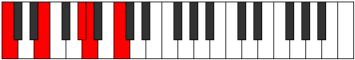

# Mode Aeoloric

## Links

- [Documentation](README.md)
- [Scales Index](Scales.md)
- [Modes Index](Modes.md)
- [Chords Index](Chords.md)

## Parent Scale

[Aeoloric](ScaleAeoloric.md)

## Number

[785](https://ianring.com/musictheory/scales/785)

## Transposition

4, 4, 1, 3

## Chord Pattern

## Perfection

- 1 Perfect notes
- 3 Perfect notes

## Perfection Profile

[false false false true]

## Permutations

| Tonic | Notes | Signature | Illustration | Audio |
|-------|-------|-----------|--------------|-------|
| [C](ModeCNaturalAeoloric.md) | **C**, **E**, **G#**, A, **C** | C |  | [midi](https://github.com/edipermadi/music/blob/main/docs/ModeCNaturalAeoloric.mid?raw=true) |
| [C#](ModeCSharpAeoloric.md) | **C#**, **F**, **A**, A#, **C#** | C |  | [midi](https://github.com/edipermadi/music/blob/main/docs/ModeCSharpAeoloric.mid?raw=true) |
| [Db](ModeDFlatAeoloric.md) | **Db**, **F**, **A**, Bb, **Db** | C |  | [midi](https://github.com/edipermadi/music/blob/main/docs/ModeDFlatAeoloric.mid?raw=true) |
| [D](ModeDNaturalAeoloric.md) | **D**, **F#**, **A#**, B, **D** | C |  | [midi](https://github.com/edipermadi/music/blob/main/docs/ModeDNaturalAeoloric.mid?raw=true) |
| [D#](ModeDSharpAeoloric.md) | **D#**, **G**, **B**, C, **D#** | C |  | [midi](https://github.com/edipermadi/music/blob/main/docs/ModeDSharpAeoloric.mid?raw=true) |
| [Eb](ModeEFlatAeoloric.md) | **Eb**, **G**, **B**, C, **Eb** | C |  | [midi](https://github.com/edipermadi/music/blob/main/docs/ModeEFlatAeoloric.mid?raw=true) |
| [E](ModeENaturalAeoloric.md) | **E**, **G#**, **C**, C#, **E** | C |  | [midi](https://github.com/edipermadi/music/blob/main/docs/ModeENaturalAeoloric.mid?raw=true) |
| [F](ModeFNaturalAeoloric.md) | **F**, **A**, **C#**, D, **F** | C |  | [midi](https://github.com/edipermadi/music/blob/main/docs/ModeFNaturalAeoloric.mid?raw=true) |
| [F#](ModeFSharpAeoloric.md) | **F#**, **A#**, **D**, D#, **F#** | C |  | [midi](https://github.com/edipermadi/music/blob/main/docs/ModeFSharpAeoloric.mid?raw=true) |
| [Gb](ModeGFlatAeoloric.md) | **Gb**, **Bb**, **D**, Eb, **Gb** | C |  | [midi](https://github.com/edipermadi/music/blob/main/docs/ModeGFlatAeoloric.mid?raw=true) |
| [G](ModeGNaturalAeoloric.md) | **G**, **B**, **D#**, E, **G** | C |  | [midi](https://github.com/edipermadi/music/blob/main/docs/ModeGNaturalAeoloric.mid?raw=true) |
| [G#](ModeGSharpAeoloric.md) | **G#**, **C**, **E**, F, **G#** | C |  | [midi](https://github.com/edipermadi/music/blob/main/docs/ModeGSharpAeoloric.mid?raw=true) |
| [Ab](ModeAFlatAeoloric.md) | **Ab**, **C**, **E**, F, **Ab** | C |  | [midi](https://github.com/edipermadi/music/blob/main/docs/ModeAFlatAeoloric.mid?raw=true) |
| [A](ModeANaturalAeoloric.md) | **A**, **C#**, **F**, F#, **A** | C |  | [midi](https://github.com/edipermadi/music/blob/main/docs/ModeANaturalAeoloric.mid?raw=true) |
| [A#](ModeASharpAeoloric.md) | **A#**, **D**, **F#**, G, **A#** | C |  | [midi](https://github.com/edipermadi/music/blob/main/docs/ModeASharpAeoloric.mid?raw=true) |
| [Bb](ModeBFlatAeoloric.md) | **Bb**, **D**, **Gb**, G, **Bb** | C |  | [midi](https://github.com/edipermadi/music/blob/main/docs/ModeBFlatAeoloric.mid?raw=true) |
| [B](ModeBNaturalAeoloric.md) | **B**, **D#**, **G**, G#, **B** | C |  | [midi](https://github.com/edipermadi/music/blob/main/docs/ModeBNaturalAeoloric.mid?raw=true) |
