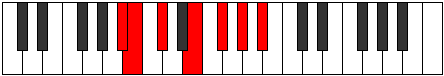

# Mode Aeolorimic

## Links

- [Documentation](index.md)
- [Scales Index](Scales.md)
- [Modes Index](Modes.md)
- [Chords Index](Chords.md)

## Parent Scale

[Darmic](ScaleDarmic.md)

## Number

[1355](https://ianring.com/musictheory/scales/1355)

## Perfection

- 4 Perfect notes
- 2 Perfect notes

## Perfection Profile

[false true true true true false]

## Permutations

| Tonic | Notes | Signature | Illustration | Audio |
|-------|-------|-----------|--------------|-------|
| [C](ModeCNaturalAeolorimic.md) | **C**, Db, Eb, F#, G#, **A#**, **C** | C |  | [midi](https://github.com/edipermadi/music/blob/main/docs/ModeCNaturalAeolorimic.mid?raw=true) |
| [C#](ModeCSharpAeolorimic.md) | **C#**, D, E, F##, G##, **A##**, **C#** | C |  | [midi](https://github.com/edipermadi/music/blob/main/docs/ModeCSharpAeolorimic.mid?raw=true) |
| [Db](ModeDFlatAeolorimic.md) | **Db**, Ebb, Fb, G, A, **B**, **Db** | C |  | [midi](https://github.com/edipermadi/music/blob/main/docs/ModeDFlatAeolorimic.mid?raw=true) |
| [D](ModeDNaturalAeolorimic.md) | **D**, Eb, F, G#, A#, **B#**, **D** | C |  | [midi](https://github.com/edipermadi/music/blob/main/docs/ModeDNaturalAeolorimic.mid?raw=true) |
| [D#](ModeDSharpAeolorimic.md) | **D#**, E, F#, G##, A##, **B##**, **D#** | C |  | [midi](https://github.com/edipermadi/music/blob/main/docs/ModeDSharpAeolorimic.mid?raw=true) |
| [Eb](ModeEFlatAeolorimic.md) | **Eb**, Fb, Gb, A, B, **C#**, **Eb** | C |  | [midi](https://github.com/edipermadi/music/blob/main/docs/ModeEFlatAeolorimic.mid?raw=true) |
| [E](ModeENaturalAeolorimic.md) | **E**, F, G, A#, B#, **C##**, **E** | C |  | [midi](https://github.com/edipermadi/music/blob/main/docs/ModeENaturalAeolorimic.mid?raw=true) |
| [F](ModeFNaturalAeolorimic.md) | **F**, Gb, Ab, B, C#, **D#**, **F** | C |  | [midi](https://github.com/edipermadi/music/blob/main/docs/ModeFNaturalAeolorimic.mid?raw=true) |
| [F#](ModeFSharpAeolorimic.md) | **F#**, G, A, B#, C##, **D##**, **F#** | C |  | [midi](https://github.com/edipermadi/music/blob/main/docs/ModeFSharpAeolorimic.mid?raw=true) |
| [Gb](ModeGFlatAeolorimic.md) | **Gb**, Abb, Bbb, C, D, **E**, **Gb** | C |  | [midi](https://github.com/edipermadi/music/blob/main/docs/ModeGFlatAeolorimic.mid?raw=true) |
| [G](ModeGNaturalAeolorimic.md) | **G**, Ab, Bb, C#, D#, **E#**, **G** | C |  | [midi](https://github.com/edipermadi/music/blob/main/docs/ModeGNaturalAeolorimic.mid?raw=true) |
| [G#](ModeGSharpAeolorimic.md) | **G#**, A, B, C##, D##, **E##**, **G#** | C |  | [midi](https://github.com/edipermadi/music/blob/main/docs/ModeGSharpAeolorimic.mid?raw=true) |
| [Ab](ModeAFlatAeolorimic.md) | **Ab**, Bbb, Cb, D, E, **F#**, **Ab** | C |  | [midi](https://github.com/edipermadi/music/blob/main/docs/ModeAFlatAeolorimic.mid?raw=true) |
| [A](ModeANaturalAeolorimic.md) | **A**, Bb, C, D#, E#, **F##**, **A** | C |  | [midi](https://github.com/edipermadi/music/blob/main/docs/ModeANaturalAeolorimic.mid?raw=true) |
| [A#](ModeASharpAeolorimic.md) | **A#**, B, C#, D##, E##, **F###**, **A#** | C |  | [midi](https://github.com/edipermadi/music/blob/main/docs/ModeASharpAeolorimic.mid?raw=true) |
| [Bb](ModeBFlatAeolorimic.md) | **Bb**, Cb, Db, E, F#, **G#**, **Bb** | C |  | [midi](https://github.com/edipermadi/music/blob/main/docs/ModeBFlatAeolorimic.mid?raw=true) |
| [B](ModeBNaturalAeolorimic.md) | **B**, C, D, E#, F##, **G##**, **B** | C |  | [midi](https://github.com/edipermadi/music/blob/main/docs/ModeBNaturalAeolorimic.mid?raw=true) |
