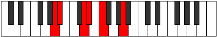

# Mode Aeoloritonic

## Links

- [Documentation](README.md)
- [Scales Index](Scales.md)
- [Modes Index](Modes.md)
- [Chords Index](Chords.md)

## Parent Scale

[Phraditonic](ScalePhraditonic.md)

## Number

[355](https://ianring.com/musictheory/scales/355)

## Luminosity

4

## Transposition

1, 4, 1, 2, 4

## Chord Pattern

## Perfection

- 3 Perfect notes
- 2 Perfect notes

## Perfection Profile

false, true, true, true, false

## Permutations

| Tonic | Notes | Signature | Illustration | Audio |
|-------|-------|-----------|--------------|-------|
| [C](ModeCNaturalAeoloritonic.md) | **C**, C#, F, F#, **G#**, **C** | C |  | [midi](https://github.com/edipermadi/music/blob/main/docs/ModeCNaturalAeoloritonic.mid?raw=true) |
| [C#](ModeCSharpAeoloritonic.md) | **C#**, D, F#, G, **A**, **C#** | C |  | [midi](https://github.com/edipermadi/music/blob/main/docs/ModeCSharpAeoloritonic.mid?raw=true) |
| [Db](ModeDFlatAeoloritonic.md) | **Db**, D, Gb, G, **A**, **Db** | C |  | [midi](https://github.com/edipermadi/music/blob/main/docs/ModeDFlatAeoloritonic.mid?raw=true) |
| [D](ModeDNaturalAeoloritonic.md) | **D**, D#, G, G#, **A#**, **D** | C |  | [midi](https://github.com/edipermadi/music/blob/main/docs/ModeDNaturalAeoloritonic.mid?raw=true) |
| [D#](ModeDSharpAeoloritonic.md) | **D#**, E, G#, A, **B**, **D#** | C |  | [midi](https://github.com/edipermadi/music/blob/main/docs/ModeDSharpAeoloritonic.mid?raw=true) |
| [Eb](ModeEFlatAeoloritonic.md) | **Eb**, E, Ab, A, **B**, **Eb** | C |  | [midi](https://github.com/edipermadi/music/blob/main/docs/ModeEFlatAeoloritonic.mid?raw=true) |
| [E](ModeENaturalAeoloritonic.md) | **E**, F, A, A#, **C**, **E** | C |  | [midi](https://github.com/edipermadi/music/blob/main/docs/ModeENaturalAeoloritonic.mid?raw=true) |
| [F](ModeFNaturalAeoloritonic.md) | **F**, F#, A#, B, **C#**, **F** | C |  | [midi](https://github.com/edipermadi/music/blob/main/docs/ModeFNaturalAeoloritonic.mid?raw=true) |
| [F#](ModeFSharpAeoloritonic.md) | **F#**, G, B, C, **D**, **F#** | C |  | [midi](https://github.com/edipermadi/music/blob/main/docs/ModeFSharpAeoloritonic.mid?raw=true) |
| [Gb](ModeGFlatAeoloritonic.md) | **Gb**, G, B, C, **D**, **Gb** | C |  | [midi](https://github.com/edipermadi/music/blob/main/docs/ModeGFlatAeoloritonic.mid?raw=true) |
| [G](ModeGNaturalAeoloritonic.md) | **G**, G#, C, C#, **D#**, **G** | C |  | [midi](https://github.com/edipermadi/music/blob/main/docs/ModeGNaturalAeoloritonic.mid?raw=true) |
| [G#](ModeGSharpAeoloritonic.md) | **G#**, A, C#, D, **E**, **G#** | C |  | [midi](https://github.com/edipermadi/music/blob/main/docs/ModeGSharpAeoloritonic.mid?raw=true) |
| [Ab](ModeAFlatAeoloritonic.md) | **Ab**, A, Db, D, **E**, **Ab** | C |  | [midi](https://github.com/edipermadi/music/blob/main/docs/ModeAFlatAeoloritonic.mid?raw=true) |
| [A](ModeANaturalAeoloritonic.md) | **A**, A#, D, D#, **F**, **A** | C |  | [midi](https://github.com/edipermadi/music/blob/main/docs/ModeANaturalAeoloritonic.mid?raw=true) |
| [A#](ModeASharpAeoloritonic.md) | **A#**, B, D#, E, **F#**, **A#** | C |  | [midi](https://github.com/edipermadi/music/blob/main/docs/ModeASharpAeoloritonic.mid?raw=true) |
| [Bb](ModeBFlatAeoloritonic.md) | **Bb**, B, Eb, E, **Gb**, **Bb** | C |  | [midi](https://github.com/edipermadi/music/blob/main/docs/ModeBFlatAeoloritonic.mid?raw=true) |
| [B](ModeBNaturalAeoloritonic.md) | **B**, C, E, F, **G**, **B** | C |  | [midi](https://github.com/edipermadi/music/blob/main/docs/ModeBNaturalAeoloritonic.mid?raw=true) |
