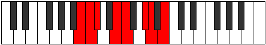

# Mode Aeolothian

## Links

- [Documentation](index.md)
- [Scales Index](Scales.md)
- [Modes Index](Modes.md)
- [Chords Index](Chords.md)

## Parent Scale

[Katathian](ScaleKatathian.md)

## Number

[1639](https://ianring.com/musictheory/scales/1639)

## Interval Pattern

1, 1, 3, 1, 3, 1, 2

## Chord Pattern

II⁺, III⁺, IV, V, vii

## Perfection

- 4 Perfect notes
- 3 Perfect notes

## Perfection Profile

[false false true true true false true]

## Permutations

| Tonic | Notes | Signature | Illustration | Audio |
|-------|-------|-----------|--------------|-------|
| [C](ModeCNaturalAeolothian.md) | **C**, **Db**, Ebb, F, Gb, **A**, Bb, **C** | C |  | [midi](https://github.com/edipermadi/music/blob/main/docs/ModeCNaturalAeolothian.mid?raw=true) |
| [C#](ModeCSharpAeolothian.md) | **C#**, **D**, Eb, F#, G, **A#**, B, **C#** | C |  | [midi](https://github.com/edipermadi/music/blob/main/docs/ModeCSharpAeolothian.mid?raw=true) |
| [Db](ModeDFlatAeolothian.md) | **Db**, **Ebb**, Fbb, Gb, Abb, **Bb**, Cb, **Db** | C |  | [midi](https://github.com/edipermadi/music/blob/main/docs/ModeDFlatAeolothian.mid?raw=true) |
| [D](ModeDNaturalAeolothian.md) | **D**, **Eb**, Fb, G, Ab, **B**, C, **D** | C |  | [midi](https://github.com/edipermadi/music/blob/main/docs/ModeDNaturalAeolothian.mid?raw=true) |
| [D#](ModeDSharpAeolothian.md) | **D#**, **E**, F, G#, A, **B#**, C#, **D#** | C |  | [midi](https://github.com/edipermadi/music/blob/main/docs/ModeDSharpAeolothian.mid?raw=true) |
| [Eb](ModeEFlatAeolothian.md) | **Eb**, **Fb**, Gbb, Ab, Bbb, **C**, Db, **Eb** | C |  | [midi](https://github.com/edipermadi/music/blob/main/docs/ModeEFlatAeolothian.mid?raw=true) |
| [E](ModeENaturalAeolothian.md) | **E**, **F**, Gb, A, Bb, **C#**, D, **E** | C |  | [midi](https://github.com/edipermadi/music/blob/main/docs/ModeENaturalAeolothian.mid?raw=true) |
| [F](ModeFNaturalAeolothian.md) | **F**, **Gb**, Abb, Bb, Cb, **D**, Eb, **F** | C |  | [midi](https://github.com/edipermadi/music/blob/main/docs/ModeFNaturalAeolothian.mid?raw=true) |
| [F#](ModeFSharpAeolothian.md) | **F#**, **G**, Ab, B, C, **D#**, E, **F#** | C |  | [midi](https://github.com/edipermadi/music/blob/main/docs/ModeFSharpAeolothian.mid?raw=true) |
| [Gb](ModeGFlatAeolothian.md) | **Gb**, **Abb**, Bbbb, Cb, Dbb, **Eb**, Fb, **Gb** | C |  | [midi](https://github.com/edipermadi/music/blob/main/docs/ModeGFlatAeolothian.mid?raw=true) |
| [G](ModeGNaturalAeolothian.md) | **G**, **Ab**, Bbb, C, Db, **E**, F, **G** | C |  | [midi](https://github.com/edipermadi/music/blob/main/docs/ModeGNaturalAeolothian.mid?raw=true) |
| [G#](ModeGSharpAeolothian.md) | **G#**, **A**, Bb, C#, D, **E#**, F#, **G#** | C |  | [midi](https://github.com/edipermadi/music/blob/main/docs/ModeGSharpAeolothian.mid?raw=true) |
| [Ab](ModeAFlatAeolothian.md) | **Ab**, **Bbb**, Cbb, Db, Ebb, **F**, Gb, **Ab** | C |  | [midi](https://github.com/edipermadi/music/blob/main/docs/ModeAFlatAeolothian.mid?raw=true) |
| [A](ModeANaturalAeolothian.md) | **A**, **Bb**, Cb, D, Eb, **F#**, G, **A** | C |  | [midi](https://github.com/edipermadi/music/blob/main/docs/ModeANaturalAeolothian.mid?raw=true) |
| [A#](ModeASharpAeolothian.md) | **A#**, **B**, C, D#, E, **F##**, G#, **A#** | C |  | [midi](https://github.com/edipermadi/music/blob/main/docs/ModeASharpAeolothian.mid?raw=true) |
| [Bb](ModeBFlatAeolothian.md) | **Bb**, **Cb**, Dbb, Eb, Fb, **G**, Ab, **Bb** | C |  | [midi](https://github.com/edipermadi/music/blob/main/docs/ModeBFlatAeolothian.mid?raw=true) |
| [B](ModeBNaturalAeolothian.md) | **B**, **C**, Db, E, F, **G#**, A, **B** | C |  | [midi](https://github.com/edipermadi/music/blob/main/docs/ModeBNaturalAeolothian.mid?raw=true) |
