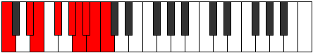

# Mode Aeolothyllic

## Links

- [Documentation](README.md)
- [Scales Index](Scales.md)
- [Modes Index](Modes.md)
- [Chords Index](Chords.md)

## Parent Scale

[Aeolothyllic](ScaleAeolothyllic.md)

## Number

[3929](https://ianring.com/musictheory/scales/3929)

## Interval Pattern

3, 1, 2, 2, 1, 1, 1, 1

## Chord Pattern

I⁺, ii⁰, IIIb5, vi⁰b3, vii⁰b3, VIII

## Perfection

- 5 Perfect notes
- 3 Perfect notes

## Perfection Profile

[false true true false true true false true]

## Permutations

| Tonic | Notes | Signature | Illustration | Audio |
|-------|-------|-----------|--------------|-------|
| [C](ModeCNaturalAeolothyllic.md) | **C**, D#, E, **F#**, G#, A, **A#**, B, **C** | C |  | [midi](https://github.com/edipermadi/music/blob/main/docs/ModeCNaturalAeolothyllic.mid?raw=true) |
| [C#](ModeCSharpAeolothyllic.md) | **C#**, E, F, **G**, A, A#, **B**, C, **C#** | C |  | [midi](https://github.com/edipermadi/music/blob/main/docs/ModeCSharpAeolothyllic.mid?raw=true) |
| [Db](ModeDFlatAeolothyllic.md) | **Db**, E, F, **G**, A, Bb, **B**, C, **Db** | C |  | [midi](https://github.com/edipermadi/music/blob/main/docs/ModeDFlatAeolothyllic.mid?raw=true) |
| [D](ModeDNaturalAeolothyllic.md) | **D**, F, F#, **G#**, A#, B, **C**, C#, **D** | C |  | [midi](https://github.com/edipermadi/music/blob/main/docs/ModeDNaturalAeolothyllic.mid?raw=true) |
| [D#](ModeDSharpAeolothyllic.md) | **D#**, F#, G, **A**, B, C, **C#**, D, **D#** | C |  | [midi](https://github.com/edipermadi/music/blob/main/docs/ModeDSharpAeolothyllic.mid?raw=true) |
| [Eb](ModeEFlatAeolothyllic.md) | **Eb**, Gb, G, **A**, B, C, **Db**, D, **Eb** | C |  | [midi](https://github.com/edipermadi/music/blob/main/docs/ModeEFlatAeolothyllic.mid?raw=true) |
| [E](ModeENaturalAeolothyllic.md) | **E**, G, G#, **A#**, C, C#, **D**, D#, **E** | C |  | [midi](https://github.com/edipermadi/music/blob/main/docs/ModeENaturalAeolothyllic.mid?raw=true) |
| [F](ModeFNaturalAeolothyllic.md) | **F**, G#, A, **B**, C#, D, **D#**, E, **F** | C |  | [midi](https://github.com/edipermadi/music/blob/main/docs/ModeFNaturalAeolothyllic.mid?raw=true) |
| [F#](ModeFSharpAeolothyllic.md) | **F#**, A, A#, **C**, D, D#, **E**, F, **F#** | C |  | [midi](https://github.com/edipermadi/music/blob/main/docs/ModeFSharpAeolothyllic.mid?raw=true) |
| [Gb](ModeGFlatAeolothyllic.md) | **Gb**, A, Bb, **C**, D, Eb, **E**, F, **Gb** | C |  | [midi](https://github.com/edipermadi/music/blob/main/docs/ModeGFlatAeolothyllic.mid?raw=true) |
| [G](ModeGNaturalAeolothyllic.md) | **G**, A#, B, **C#**, D#, E, **F**, F#, **G** | C |  | [midi](https://github.com/edipermadi/music/blob/main/docs/ModeGNaturalAeolothyllic.mid?raw=true) |
| [G#](ModeGSharpAeolothyllic.md) | **G#**, B, C, **D**, E, F, **F#**, G, **G#** | C |  | [midi](https://github.com/edipermadi/music/blob/main/docs/ModeGSharpAeolothyllic.mid?raw=true) |
| [Ab](ModeAFlatAeolothyllic.md) | **Ab**, B, C, **D**, E, F, **Gb**, G, **Ab** | C |  | [midi](https://github.com/edipermadi/music/blob/main/docs/ModeAFlatAeolothyllic.mid?raw=true) |
| [A](ModeANaturalAeolothyllic.md) | **A**, C, C#, **D#**, F, F#, **G**, G#, **A** | C |  | [midi](https://github.com/edipermadi/music/blob/main/docs/ModeANaturalAeolothyllic.mid?raw=true) |
| [A#](ModeASharpAeolothyllic.md) | **A#**, C#, D, **E**, F#, G, **G#**, A, **A#** | C |  | [midi](https://github.com/edipermadi/music/blob/main/docs/ModeASharpAeolothyllic.mid?raw=true) |
| [Bb](ModeBFlatAeolothyllic.md) | **Bb**, Db, D, **E**, Gb, G, **Ab**, A, **Bb** | C |  | [midi](https://github.com/edipermadi/music/blob/main/docs/ModeBFlatAeolothyllic.mid?raw=true) |
| [B](ModeBNaturalAeolothyllic.md) | **B**, D, D#, **F**, G, G#, **A**, A#, **B** | C |  | [midi](https://github.com/edipermadi/music/blob/main/docs/ModeBNaturalAeolothyllic.mid?raw=true) |
