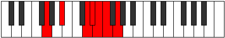

# Mode Aeolycrimic

## Links

- [Documentation](index.md)
- [Scales Index](Scales.md)
- [Modes Index](Modes.md)
- [Chords Index](Chords.md)

## Parent Scale

[Kytrimic](ScaleKytrimic.md)

## Number

[1929](https://ianring.com/musictheory/scales/1929)

## Interval Pattern

3, 4, 1, 1, 1, 2

## Chord Pattern

i, II, IV, v⁰

## Perfection

- 3 Perfect notes
- 3 Perfect notes

## Perfection Profile

[true true false true false false]

## Permutations

| Tonic | Notes | Signature | Illustration | Audio |
|-------|-------|-----------|--------------|-------|
| [C](ModeCNaturalAeolycrimic.md) | C, D#, **E###**, F###, **G##**, **A#**, C | C |  | [midi](https://github.com/edipermadi/music/blob/main/docs/ModeCNaturalAeolycrimic.mid?raw=true) |
| [C#](ModeCSharpAeolycrimic.md) | C#, D##, **F###**, G##, **A#**, **B**, C# | C |  | [midi](https://github.com/edipermadi/music/blob/main/docs/ModeCSharpAeolycrimic.mid?raw=true) |
| [Db](ModeDFlatAeolycrimic.md) | Db, E, **F###**, G##, **A#**, **B**, Db | C |  | [midi](https://github.com/edipermadi/music/blob/main/docs/ModeDFlatAeolycrimic.mid?raw=true) |
| [D](ModeDNaturalAeolycrimic.md) | D, E#, **Cbbb**, Cbb, **Dbbb**, **Dbb**, D | C |  | [midi](https://github.com/edipermadi/music/blob/main/docs/ModeDNaturalAeolycrimic.mid?raw=true) |
| [D#](ModeDSharpAeolycrimic.md) | D#, E##, **Cbb**, Dbbb, **Dbb**, **Ebbb**, D# | C |  | [midi](https://github.com/edipermadi/music/blob/main/docs/ModeDSharpAeolycrimic.mid?raw=true) |
| [Eb](ModeEFlatAeolycrimic.md) | Eb, F#, **G###**, A##, **B#**, **C#**, Eb | C |  | [midi](https://github.com/edipermadi/music/blob/main/docs/ModeEFlatAeolycrimic.mid?raw=true) |
| [E](ModeENaturalAeolycrimic.md) | E, F##, **Cb**, Dbb, **Ebbb**, **Fbbb**, E | C |  | [midi](https://github.com/edipermadi/music/blob/main/docs/ModeENaturalAeolycrimic.mid?raw=true) |
| [F](ModeFNaturalAeolycrimic.md) | F, G#, **A###**, B##, **C##**, **D#**, F | C |  | [midi](https://github.com/edipermadi/music/blob/main/docs/ModeFNaturalAeolycrimic.mid?raw=true) |
| [F#](ModeFSharpAeolycrimic.md) | F#, G##, **Db**, Ebb, **Fbb**, **Gbbb**, F# | C |  | [midi](https://github.com/edipermadi/music/blob/main/docs/ModeFSharpAeolycrimic.mid?raw=true) |
| [Gb](ModeGFlatAeolycrimic.md) | Gb, A, **B##**, C##, **D#**, **E**, Gb | C |  | [midi](https://github.com/edipermadi/music/blob/main/docs/ModeGFlatAeolycrimic.mid?raw=true) |
| [G](ModeGNaturalAeolycrimic.md) | G, A#, **B###**, C###, **D##**, **E#**, G | C |  | [midi](https://github.com/edipermadi/music/blob/main/docs/ModeGNaturalAeolycrimic.mid?raw=true) |
| [G#](ModeGSharpAeolycrimic.md) | G#, A##, **C###**, D##, **E#**, **F#**, G# | C |  | [midi](https://github.com/edipermadi/music/blob/main/docs/ModeGSharpAeolycrimic.mid?raw=true) |
| [Ab](ModeAFlatAeolycrimic.md) | Ab, B, **C###**, D##, **E#**, **F#**, Ab | C |  | [midi](https://github.com/edipermadi/music/blob/main/docs/ModeAFlatAeolycrimic.mid?raw=true) |
| [A](ModeANaturalAeolycrimic.md) | A, B#, **D##**, E#, **F#**, **G**, A | C |  | [midi](https://github.com/edipermadi/music/blob/main/docs/ModeANaturalAeolycrimic.mid?raw=true) |
| [A#](ModeASharpAeolycrimic.md) | A#, B##, **D###**, E##, **F##**, **G#**, A# | C |  | [midi](https://github.com/edipermadi/music/blob/main/docs/ModeASharpAeolycrimic.mid?raw=true) |
| [Bb](ModeBFlatAeolycrimic.md) | Bb, C#, **D###**, E##, **F##**, **G#**, Bb | C |  | [midi](https://github.com/edipermadi/music/blob/main/docs/ModeBFlatAeolycrimic.mid?raw=true) |
| [B](ModeBNaturalAeolycrimic.md) | B, C##, **E##**, F##, **G#**, **A**, B | C |  | [midi](https://github.com/edipermadi/music/blob/main/docs/ModeBNaturalAeolycrimic.mid?raw=true) |
