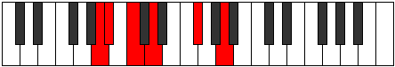

# Mode Aeolycritonic

## Links

- [Documentation](index.md)
- [Scales Index](Scales.md)
- [Modes Index](Modes.md)
- [Chords Index](Chords.md)

## Parent Scale

[Ryphitonic](ScaleRyphitonic.md)

## Number

[555](https://ianring.com/musictheory/scales/555)

## Interval Pattern

1, 2, 2, 4, 3

## Chord Pattern

V⁺

## Perfection

- 1 Perfect notes
- 4 Perfect notes

## Perfection Profile

[false false false true false]

## Permutations

| Tonic | Notes | Signature | Illustration | Audio |
|-------|-------|-----------|--------------|-------|
| [C](ModeCNaturalAeolycritonic.md) | **C**, **C#**, **D#**, F, **A**, **C** | C |  | [midi](https://github.com/edipermadi/music/blob/main/docs/ModeCNaturalAeolycritonic.mid?raw=true) |
| [C#](ModeCSharpAeolycritonic.md) | **C#**, **D**, **E**, F#, **A#**, **C#** | C |  | [midi](https://github.com/edipermadi/music/blob/main/docs/ModeCSharpAeolycritonic.mid?raw=true) |
| [Db](ModeDFlatAeolycritonic.md) | **Db**, **D**, **E**, Gb, **Bb**, **Db** | C |  | [midi](https://github.com/edipermadi/music/blob/main/docs/ModeDFlatAeolycritonic.mid?raw=true) |
| [D](ModeDNaturalAeolycritonic.md) | **D**, **D#**, **F**, G, **B**, **D** | C |  | [midi](https://github.com/edipermadi/music/blob/main/docs/ModeDNaturalAeolycritonic.mid?raw=true) |
| [D#](ModeDSharpAeolycritonic.md) | **D#**, **E**, **F#**, G#, **C**, **D#** | C |  | [midi](https://github.com/edipermadi/music/blob/main/docs/ModeDSharpAeolycritonic.mid?raw=true) |
| [Eb](ModeEFlatAeolycritonic.md) | **Eb**, **E**, **Gb**, Ab, **C**, **Eb** | C |  | [midi](https://github.com/edipermadi/music/blob/main/docs/ModeEFlatAeolycritonic.mid?raw=true) |
| [E](ModeENaturalAeolycritonic.md) | **E**, **F**, **G**, A, **C#**, **E** | C |  | [midi](https://github.com/edipermadi/music/blob/main/docs/ModeENaturalAeolycritonic.mid?raw=true) |
| [F](ModeFNaturalAeolycritonic.md) | **F**, **F#**, **G#**, A#, **D**, **F** | C |  | [midi](https://github.com/edipermadi/music/blob/main/docs/ModeFNaturalAeolycritonic.mid?raw=true) |
| [F#](ModeFSharpAeolycritonic.md) | **F#**, **G**, **A**, B, **D#**, **F#** | C |  | [midi](https://github.com/edipermadi/music/blob/main/docs/ModeFSharpAeolycritonic.mid?raw=true) |
| [Gb](ModeGFlatAeolycritonic.md) | **Gb**, **G**, **A**, B, **Eb**, **Gb** | C |  | [midi](https://github.com/edipermadi/music/blob/main/docs/ModeGFlatAeolycritonic.mid?raw=true) |
| [G](ModeGNaturalAeolycritonic.md) | **G**, **G#**, **A#**, C, **E**, **G** | C |  | [midi](https://github.com/edipermadi/music/blob/main/docs/ModeGNaturalAeolycritonic.mid?raw=true) |
| [G#](ModeGSharpAeolycritonic.md) | **G#**, **A**, **B**, C#, **F**, **G#** | C |  | [midi](https://github.com/edipermadi/music/blob/main/docs/ModeGSharpAeolycritonic.mid?raw=true) |
| [Ab](ModeAFlatAeolycritonic.md) | **Ab**, **A**, **B**, Db, **F**, **Ab** | C |  | [midi](https://github.com/edipermadi/music/blob/main/docs/ModeAFlatAeolycritonic.mid?raw=true) |
| [A](ModeANaturalAeolycritonic.md) | **A**, **A#**, **C**, D, **F#**, **A** | C |  | [midi](https://github.com/edipermadi/music/blob/main/docs/ModeANaturalAeolycritonic.mid?raw=true) |
| [A#](ModeASharpAeolycritonic.md) | **A#**, **B**, **C#**, D#, **G**, **A#** | C |  | [midi](https://github.com/edipermadi/music/blob/main/docs/ModeASharpAeolycritonic.mid?raw=true) |
| [Bb](ModeBFlatAeolycritonic.md) | **Bb**, **B**, **Db**, Eb, **G**, **Bb** | C |  | [midi](https://github.com/edipermadi/music/blob/main/docs/ModeBFlatAeolycritonic.mid?raw=true) |
| [B](ModeBNaturalAeolycritonic.md) | **B**, **C**, **D**, E, **G#**, **B** | C |  | [midi](https://github.com/edipermadi/music/blob/main/docs/ModeBNaturalAeolycritonic.mid?raw=true) |
