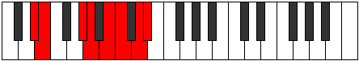

# Mode Aeolydian

## Links

- [Documentation](README.md)
- [Scales Index](Scales.md)
- [Modes Index](Modes.md)
- [Chords Index](Chords.md)

## Parent Scale

[Stygian](ScaleStygian.md)

## Number

[2915](https://ianring.com/musictheory/scales/2915)

## Transposition

1, 4, 1, 2, 1, 2, 1

## Chord Pattern

iii⁰, iv⁰

## Perfection

- 4 Perfect notes
- 3 Perfect notes

## Perfection Profile

[false true true true false false true]

## Permutations

| Tonic | Notes | Signature | Illustration | Audio |
|-------|-------|-----------|--------------|-------|
| [C](ModeCNaturalAeolydian.md) | **C**, Db, E#, F#, **G#**, **A**, B, **C** | C |  | [midi](https://github.com/edipermadi/music/blob/main/docs/ModeCNaturalAeolydian.mid?raw=true) |
| [C#](ModeCSharpAeolydian.md) | **C#**, D, E##, F##, **G##**, **A#**, B#, **C#** | C |  | [midi](https://github.com/edipermadi/music/blob/main/docs/ModeCSharpAeolydian.mid?raw=true) |
| [Db](ModeDFlatAeolydian.md) | **Db**, Ebb, F#, G, **A**, **Bb**, C, **Db** | C |  | [midi](https://github.com/edipermadi/music/blob/main/docs/ModeDFlatAeolydian.mid?raw=true) |
| [D](ModeDNaturalAeolydian.md) | **D**, Eb, F##, G#, **A#**, **B**, C#, **D** | C |  | [midi](https://github.com/edipermadi/music/blob/main/docs/ModeDNaturalAeolydian.mid?raw=true) |
| [D#](ModeDSharpAeolydian.md) | **D#**, E, F###, G##, **A##**, **B#**, C##, **D#** | C |  | [midi](https://github.com/edipermadi/music/blob/main/docs/ModeDSharpAeolydian.mid?raw=true) |
| [Eb](ModeEFlatAeolydian.md) | **Eb**, Fb, G#, A, **B**, **C**, D, **Eb** | C |  | [midi](https://github.com/edipermadi/music/blob/main/docs/ModeEFlatAeolydian.mid?raw=true) |
| [E](ModeENaturalAeolydian.md) | **E**, F, G##, A#, **B#**, **C#**, D#, **E** | C |  | [midi](https://github.com/edipermadi/music/blob/main/docs/ModeENaturalAeolydian.mid?raw=true) |
| [F](ModeFNaturalAeolydian.md) | **F**, Gb, A#, B, **C#**, **D**, E, **F** | C |  | [midi](https://github.com/edipermadi/music/blob/main/docs/ModeFNaturalAeolydian.mid?raw=true) |
| [F#](ModeFSharpAeolydian.md) | **F#**, G, A##, B#, **C##**, **D#**, E#, **F#** | C |  | [midi](https://github.com/edipermadi/music/blob/main/docs/ModeFSharpAeolydian.mid?raw=true) |
| [Gb](ModeGFlatAeolydian.md) | **Gb**, Abb, B, C, **D**, **Eb**, F, **Gb** | C |  | [midi](https://github.com/edipermadi/music/blob/main/docs/ModeGFlatAeolydian.mid?raw=true) |
| [G](ModeGNaturalAeolydian.md) | **G**, Ab, B#, C#, **D#**, **E**, F#, **G** | C |  | [midi](https://github.com/edipermadi/music/blob/main/docs/ModeGNaturalAeolydian.mid?raw=true) |
| [G#](ModeGSharpAeolydian.md) | **G#**, A, B##, C##, **D##**, **E#**, F##, **G#** | C |  | [midi](https://github.com/edipermadi/music/blob/main/docs/ModeGSharpAeolydian.mid?raw=true) |
| [Ab](ModeAFlatAeolydian.md) | **Ab**, Bbb, C#, D, **E**, **F**, G, **Ab** | C |  | [midi](https://github.com/edipermadi/music/blob/main/docs/ModeAFlatAeolydian.mid?raw=true) |
| [A](ModeANaturalAeolydian.md) | **A**, Bb, C##, D#, **E#**, **F#**, G#, **A** | C |  | [midi](https://github.com/edipermadi/music/blob/main/docs/ModeANaturalAeolydian.mid?raw=true) |
| [A#](ModeASharpAeolydian.md) | **A#**, B, C###, D##, **E##**, **F##**, G##, **A#** | C |  | [midi](https://github.com/edipermadi/music/blob/main/docs/ModeASharpAeolydian.mid?raw=true) |
| [Bb](ModeBFlatAeolydian.md) | **Bb**, Cb, D#, E, **F#**, **G**, A, **Bb** | C |  | [midi](https://github.com/edipermadi/music/blob/main/docs/ModeBFlatAeolydian.mid?raw=true) |
| [B](ModeBNaturalAeolydian.md) | **B**, C, D##, E#, **F##**, **G#**, A#, **B** | C |  | [midi](https://github.com/edipermadi/music/blob/main/docs/ModeBNaturalAeolydian.mid?raw=true) |
